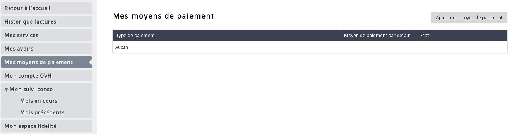
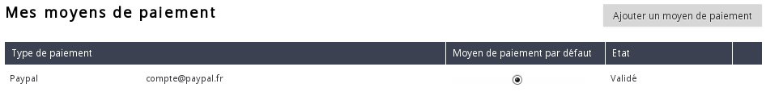

## Preambule
Le paiement des factures Public Cloud peut se faire de 2 façons :

- Grâce au crédit disponible sur le compte Public Cloud
- De manière automatique en configurant un moyen de paiement

Ce guide vous explique la procédure à suivre afin d'ajouter votre moyen de paiement automatique.

## Ajout du moyen de paiement
- Se connecter à l'espace client Public Cloud OVH
- Cliquer sur "Facturation" en haut à droite :

{.thumbnail}

- Cliquer sur "Mes moyens de paiements" à droite

{.thumbnail}

- Cliquer sur "Ajouter un moyen de paiement"

{.thumbnail}

3 moyens de paiements automatiques sont disponibles :

|---|---|---|
|Compte Paypal|Compte Bancaire|Carte Bancaire|

Dans le cas où vous souhaitez ajouter un compte bancaire, certains documents seront à renvoyer par voie postale afin d'autoriser les prélèvements.

- Une fois le moyen de paiement ajouté, cliquer sur la case "Moyen de paiement par défaut" afin d'activer celui ci.

{.thumbnail}