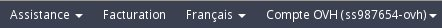
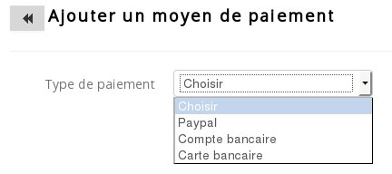

## 
Per il saldo delle tue fatture Public Cloud, puoi scegliere fra 2 modalità:

- utilizzare il credito disponibile sul tuo conto Public Cloud
- impostare l'addebito automatico configurando una modalità di pagamento

Questa guida ti mostra la procedura da seguire per aggiungere una modalità di pagamento automatica.

## 

- Accedi allo Spazio Cliente Public Cloud OVH
- Clicca su "Fatturazione", in alto a destra:

{.thumbnail}

- Clicca su "I miei metodi di pagamento"

{.thumbnail}

- Clicca su "Aggiungi un metodo di pagamento"

{.thumbnail}
Scegli tra le 2 mmodalità di pagamento automatico disponibili:

|Paypal|Carta di credito|

Una volta aggiunta la modalità di pagamento, attivala cliccando su "Metodo di pagamento predefinito".

{.thumbnail}

## 
[Ritorna all'indice delle guide Cloud]({legacy}1785)

