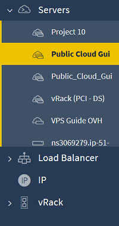
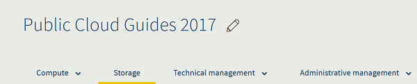
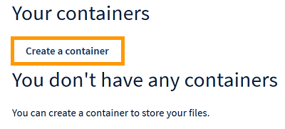
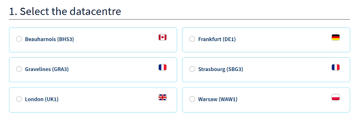
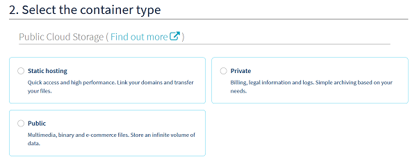
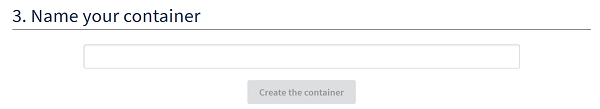

**Last updated 6/03/2019**

## Objective

[Public Cloud Storage](https://www.ovhcloud.com/en-au/public-cloud/storage/) offers an unlimited storage solution with simple billing that can be adapted to suit your needs.

Our object containers include:

- static hosting (for static websites)
- private storage (for example, for storing personal data)
- public storage (for storing anything that is publicly accessible)

**This guide will show you how to add external storage space to your Public Cloud Instance.**

## Requirements

- access to the [OVHcloud Control Panel](https://ca.ovh.com/auth/?action=gotomanager)
- a [Public Cloud project](https://www.ovhcloud.com/en-au/public-cloud/) in your OVHcloud account

## Instructions

First, log in to the [OVHcloud Control Panel](https://ca.ovh.com/auth/?action=gotomanager) and click on `Public Cloud`{.action}.

{.thumbnail}

Next, select your project from the list of servers.

{.thumbnail}

Now select the `Storage`{.action} tab.

{.thumbnail}

Click the `Create a container`{.action} button.

{.thumbnail}

You will now be presented with several configuration options for your container. First, select a data centre from the list, as shown in the screenshot below:

{.thumbnail}

Next, select the container type.

{.thumbnail}

Next, select whether or not you would like to archive and secure your data.

> [!primary]
>
This step is optional. You can find out more about this feature on our [Cloud Archive](https://www.ovhcloud.com/en-au/public-cloud/cloud-archive/) page.
>

{.thumbnail}

Finally, name your container and click the `Create the container`{.action} button.

{.thumbnail}

## Go further

[Create and configure an additional disk on an instance](../create_and_configure_an_additional_disk_on_an_instance/)

Join our community of users on <https://community.ovh.com/en/>.