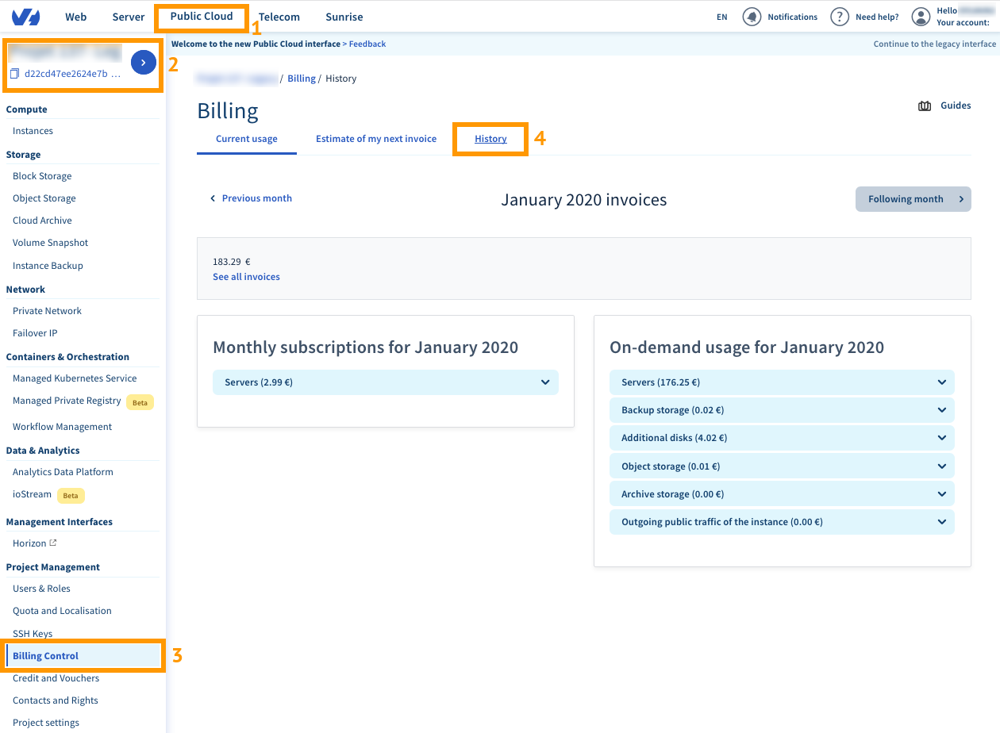

**Última actualización: 06/01/2020**

## Introducción
Las soluciones cloud funcionan en base al principio de pago por uso (en inglés, «pay-as-you-go»).

El modo de facturación clásico para el alquiler de recursos informáticos se basa en un contrato con una duración predeterminada (normalmente de 12 meses) y, por lo tanto, conlleva un compromiso por parte de ambas partes durante este período de tiempo. Las soluciones cloud, sin embargo, ofrecen mayor flexibilidad, ya que permiten **pagar al final del mes por el tiempo durante el que se han utilizado los recursos**.

Este mecanismo es similar al de algunos operadores telefónicos que facturan a final de mes los minutos de comunicación consumidos. En nuestro caso, OVHcloud factura las horas de uso del servidor, del espacio de almacenamiento o de cualquier otro elemento del servicio.

Esta guía analiza los distintos elementos de la facturación de la solución Public Cloud.

## Principio general
OVHcloud busca ofrecer un tipo de facturación lo más adaptada posible al uso que los clientes hacen del servicio. Para ello, proponemos un tipo de facturación granular, en la que la unidad de tiempo utilizada en la mayoría de los casos es la hora.

Al crear un recurso con este tipo de facturación, se activa un contador por horas, que posteriormente se desactiva al eliminar el recurso. Cada período de facturación comenzado (cada hora en este caso) deberá abonarse completo.

Al final de mes, se multiplica cada contador por el precio por horas del recurso en cuestión. Para obtener el importe total, se suman todos los contadores que se hayan activado durante el mes.

Cada proyecto cloud tiene asignada su propia factura, emitida el primer día del mes siguiente, en la que se incluyen todos los recursos facturados durante el mes en curso.

## Caso práctico
El siguiente ejemplo explica el funcionamiento de la facturación cloud:

- un usuario activa una instancia B2-15 el día 4 del mes a las 9:40;
- el día 8 del mismo mes, a las 10:00, añade 250 GB de espacio adicional (volumen Classic);
- el día 12 del mismo mes, a las 16:30, elimina ambos recursos.

Para la instancia, desde el día 4 del mes a las 9:40 hasta el día 12 del mismo mes a las 16:30, se contabilizan un total de 176 horas comenzadas. Estas horas se facturan con un precio de 0,1111 €/hora.

En el caso del volumen de almacenamiento, desde el día 8 a las 10:00 hasta el día 12 del mismo mes a las 16:30, se contabilizan un total de 103 horas comenzadas. El precio del volumen Classic es de 0,04 €/mes por GB (0,0000555556 €/hora).

Al final de mes, la factura incluirá:

- 176 x 0,111
- 103 x 250 x 0,0000555556

El importe total será de 20,97 euros.

> [!primary]
>
> Los precios mostrados no son contractuales y solo se incluyen a modo
> de ejemplo.
> 

## Consultar una factura
Para consultar las facturas de un proyecto, acceda al universo `Public Cloud`{.action} (1) del área de cliente de OVHcloud y seleccione el proyecto cloud correspondiente en el menú de la izquierda (2). A continuación, acceda a la sección `Billing Control`{.action} (3) y seleccione `Historial`{.action} (4).

{.thumbnail}

Desde esta página puede:

- consultar la información de los recursos desplegando cada sección;
- acceder a la información del mes anterior o del mes siguiente.

## Consumo actual
Puede consultar su consumo actual (es decir, el consumo correspondiente al mes en curso) en la sección `Mi consumo actual`{.action}.

{.thumbnail}

La columna **Ya facturado** incluye los recursos con facturación mensual (ver la sección dedicada a las instancias con facturación mensual más abajo). Estos recursos son la excepción al pago por uso, ya que se contratan con un compromiso mensual y se pagan por adelantado: es decir, el primer día de cada mes el cliente paga para utilizar estos recursos durante los treinta días siguientes. Con este tipo de facturación, el cliente consigue un descuento sobre el precio de la solución. Los recursos que aparecen en esta primera columna ya han sido abonados por el cliente el primer día del mes en curso.

La columna **Facturación pendiente** incluye todos los recursos con pago por uso y permite consultar el consumo desde el inicio del mes hasta la fecha actual.

También es posible consultar una `Estimación de mi próxima factura`{.action}, que se emitirá el primer día del mes siguiente. Esta estimación consiste en una proyección hasta final de mes basada en el consumo actual.

> [!primary]
>
> Esta estimación es orientativa y
> puede cambiar en cualquier momento si el cliente modifica su proyecto (adición o supresión de
> recursos, por ejemplo).
> 

{.thumbnail}

La opción `Alerta de consumo bajo demanda`{.action} permite crear una alerta basada en la proyección de consumo hasta final de mes.  Así pues, cuando la proyección supere el umbral establecido, el cliente recibirá un mensaje de correo electrónico.

## Instancias
Es posible consultar el precio de las instancias cloud (o servidores cloud) en el área de cliente de OVHcloud, antes de iniciarlas. También puede consultar el precio directamente en el [sitio web de OVHcloud](https://www.ovhcloud.com/es/public-cloud/prices/){.external}.

> [!primary]
>
> El ancho de banda de las instancias no se factura.
> 

Cada modelo de instancias está disponible con facturación mensual o por horas.

### Precio por hora
Esta tarificación sigue el modelo de pago por uso explicado anteriormente.

Así pues, el precio de las instancias se abonará el primer día del mes siguiente en función de las horas consumidas durante el mes en curso.

### Precio mensual
Esta tarificación permite disfrutar de un descuento del 50% con respecto al modo de facturación por horas, y es la excepción a la facturación cloud clásica.

El precio de las instancias se abona el primer día de cada mes y corresponde al alquiler de la instancia hasta el primer día del mes siguiente. El importe correspondiente al alquiler de un mes se abona de forma anticipada, aunque la instancia se elimine antes del final de mes.

Al contratar una instancia con facturación mensual, se generará una primera factura única por la parte proporcional correspondiente al período de tiempo entre la contratación y el final del mes.

> \[!alert]
>
> La facturación de una instancia se detiene cuando esta se elimina
> de forma definitiva. Los estados «detenida», «en pausa» o «interrumpida», entre otros,
> no detendrán la facturación, que seguirá activa hasta que la instancia se elimine definitivamente.
> Independientemente del tipo de facturación elegido, cualquier unidad de tiempo comenzada deberá abonarse completa.
> 

## Almacenamiento
Las soluciones de almacenamiento suelen indicar el precio mensual por GB. Para calcular el precio del GB por hora, solo hay que dividir el precio mensual entre 720 (número medio de horas en un mes). El resultado de esta operación nos permitirá conocer el precio de un elemento almacenado durante una hora.

El cálculo será el siguiente: (precio mensual del GB / 720) x número de horas x número de GB

El número de GB por hora corresponde a la cantidad máxima de GB almacenada durante una hora. Por ejemplo, si usted tiene almacenados 15 GB a las 16:20, 17 GB a las 16:40 y 14 GB a las 16:50, OVHcloud facturará 17 GB para el período que va de las 16:00 a las 17:00.

Puede consultar el precio del almacenamiento en el [sitio web de OVHcloud](https://www.ovhcloud.com/es-es/public-cloud/prices/#storage){.external}.

### Volúmenes adicionales
Los volúmenes adicionales se facturan por GB, con un precio diferente para cada gama.

### Backup de volúmenes adicionales
El backup de los volúmenes adicionales se factura del mismo modo que los volúmenes.

### Snapshot de volúmenes adicionales
El snapshot de los volúmenes adicionales se factura del mismo modo que los volúmenes.

### Snapshots e imágenes de instancias
Los snapshots de instancias como las imágenes (fuera del catálogo de imágenes de OVHcloud) se facturan con un precio fijo por GB/mes, independientemente de la instancia de origen o el tipo de imagen. Puede consultar el precio de las instancias en el [sitio web de OVHcloud](https://www.ovhcloud.com/es-es/public-cloud/prices/#compute){.external}.

### Object Storage
La facturación de la solución Object Storage tiene en cuenta dos elementos:

- el almacenamiento de los objetos en sí, es decir, el volumen de GB consumido;
- el tráfico saliente, es decir, la cantidad de datos salientes del servicio incluidos en el cuerpo de las peticiones (body HTTP).

> [!primary]
>
> El tráfico saliente entre el servicio de almacenamiento de objetos y las instancias
> se factura del mismo modo que si el destino fuera internet.
> 

> \[!alert]
>
> La consulta de objetos desde el área de cliente de OVHcloud se considera, asimismo,
> tráfico saliente.
> 

### Archivos
El almacenamiento de archivos tiene en cuenta tres elementos:

- el almacenamiento de los archivos en sí, es decir, el volumen en GB consumido;
- el tráfico entrante, es decir, la cantidad de datos entrantes en el servicio incluido en el cuerpo de las peticiones (body HTTP);
- el tráfico saliente, es decir, la cantidad de datos salientes del servicio incluidos en el cuerpo de las peticiones (body HTTP).

> [!primary]
>
> El tráfico saliente entre el servicio de archivado de objetos y las instancias
> se factura del mismo modo que si el destino fuera internet.
> 

## Más información
Interactúe con nuestra comunidad de usuarios en [ovh.es/community](https://www.ovh.es/community/){.external}.