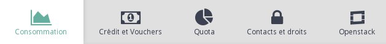
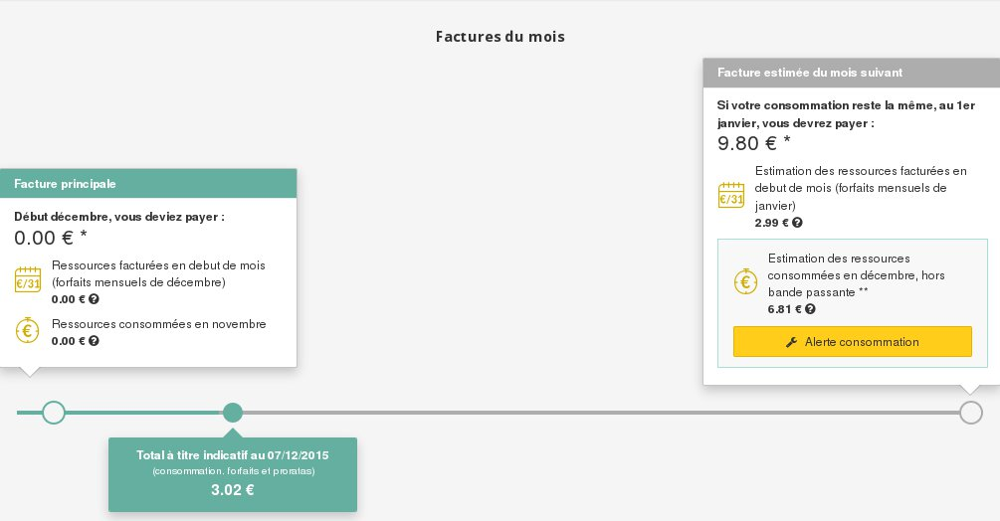
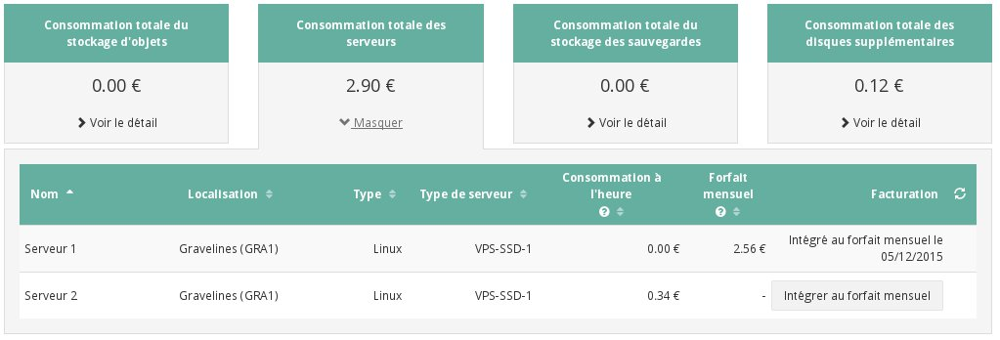

## 
Per le tue risorse Public Cloud OVH sono disponibili 2 tipi di fatturazione:

- fatturazione oraria
- fatturazione mensile

Puoi scegliere tra queste 2 modalità in base alle tue necessità e decidere di utilizzarle entrambe anche all'interno di uno stesso progetto.

Per una maggiore trasparenza della tua fatturazione, abbiamo implementato nel tuo Spazio Cliente OVH uno strumento che ne migliora la comprensione.

Questa guida descrive le 2 modalità di fatturazione offerte da OVH e ti mostra come utilizzare il nostro strumento per analizzare i tuoi consumi e gestire al meglio la tua fatturazione.

## Requisiti necessari

- Avere accesso allo Spazio Cliente OVH

## Fatturazione oraria
Questa soluzione ti permette di scegliere una fatturazione in base al tuo consumo di risorse e, in genere, è vantaggiosa per necessità di breve durata.

La fatturazione oraria viene applicata anche per altre funzionalità, ad esempio Object Storage, backup e dischi aggiuntivi.
I costi vengono visualizzati su base mensile per evitare di utilizzare importi inferiori al centesimo. 

Per questo motivo la fattura ti viene inviata il mese successivo a quello di utilizzo, dopo il calcolo dei tuoi consumi totali.

## Attenzione!
La fatturazione viene effettuata calcolando il tuo consumo di risorse: se spegni un'istanza, le risorse restano assegnate alla tua istanza e quindi vengono fatturate.

## Fatturazione mensile
Scegliendo questo tipo di fatturazione, ti impegni a mantenere le tue risorse almeno fino alla fine del mese in corso.
Questa soluzione è vantaggiosa nel lungo periodo perché ti permette di usufruire di uno sconto del 50% sulla tua fattura.

La fattura è generata immediatamente, calcolando il prorata temporis in base al giorno di attivazione del mese in corso.

## Attenzione!
Eliminare le tue risorse nel corso del mese non comporta una riduzione della tua fattura né una proroga della data di scadenza.

## Stima e dettagli
Per accedere alla sezione fatturazione del tuo Spazio Cliente OVH Cloud:

- clicca su Gestione e consumo del progetto:

{.thumbnail}

- clicca su Consumo:

{.thumbnail}
Si apre una nuova pagina, in cui sono disponibili le informazioni relative ai tuoi consumi.

Scegli il mese che vuoi analizzare (di default, visualizzi il mese in corso).

Sotto di esso trovi vari elementi:

{.thumbnail}
Sulla sinistra sono indicate le informazioni relative alle risorse fatturate all'inizio del mese, che includono:

- il rinnovo delle tue risorse fatturate mensilmente
- l'importo relativo al consumo orario delle tue risorse nel corso del mese precedente

La barra di avanzamento sottostante indica il totale della tua fattura in un istante T, che corrisponde all'importo da pagare in caso di cancellazione immediata delle risorse soggette a fatturazione, cioè:

- istanze
- backup
- dischi aggiuntivi
- Object Storage

Sulla destra, visualizzi la stima della fattura che verrà generata all'inizio del mese successivo.
Questo importo viene calcolato in base alle risorse esistenti e non prende in considerazione il costo della banda passante in uscita per l'Object Storage e l'aggiunta di risorse supplementari.

È anche possibile impostare una soglia massima di fatturazione, per ricevere una notifica se l'importo stimato supera questa soglia.

Sotto la barra di avanzamento sono presenti dei riquadri con l'importo della tua fatturazione per tipo di risorse:

{.thumbnail}
L'importo indicato non corrisponde a una stima, ma al costo dei tuoi consumi nell'istante T.
Per visualizzare la lista delle risorse create durante il mese selezionato, clicca su Visualizza dettagli.

## Informazioni
Se elimini un'istanza, viene visualizzato l'ID dell'istanza, non il suo nome.

## Imposta un alert
Per impostare un alert e ricevere una notifica quando l'importo stimato della tua fattura supera una certa soglia, clicca sul tasto Alert consumo.

Visualizzi un nuovo menu:

{.thumbnail}
Da qui puoi configurare:

- l'indirizzo email che riceverà l'alert
- la soglia a partire dalla quale vuoi ricevere un alert

Una volta superata questa soglia, ricevi una notifica ogni 90 minuti.

## Attenzione:
L'impostazione di un alert comporta esclusivamente l'invio di notifiche via email al momento del superamento dell'importo indicato, senza nessun blocco delle tua attività.

## 

- [Aggiungi una modalità di pagamento]({legacy}1984)
- [Aggiungi credito Cloud al tuo progetto]({legacy}1907)

## 
[Ritorna all'indice delle guide Cloud]({legacy}1785)

