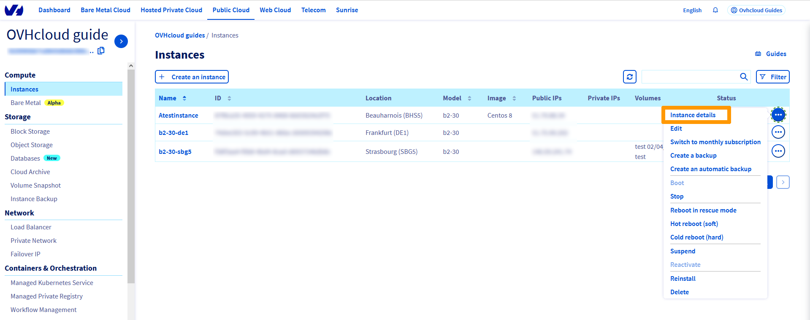

**Last updated 24th March 2022**

## Objective

To perform certain administrative functions on your server (e.g. installing packages), you'll need to have a high level of user access. On Linux servers, this access is called "root".

**This guide explains how to become the root user and create a password for the root account.**

## Requirements

- A [Public Cloud instance](https://docs.ovh.com/us/en/public-cloud/public-cloud-first-steps/#create-instance) in your OVHcloud account
- Access to the [OVHcloud Control Panel](https://ca.ovh.com/auth/?action=gotomanager&from=https://www.ovh.com/world/&ovhSubsidiary=we){.external}

## Instructions

### Setting the root password <a name="settingtherootpassword"></a>

First, establish an [SSH connection](https://docs.ovh.com/us/en/public-cloud/public-cloud-first-steps/#step-4-connecting-to-your-instance) to your server with your default user.

At the command line, set a password for the root user (for security reasons, the password will not be shown as you type it):

```bash
~$ sudo passwd root
Enter new UNIX password:
Retype new UNIX password:
passwd: password updated 
successfully
```

### Update the system (Debian/Ubuntu)

To update the installed software packages on your server, type the following command at the command line:

```bash
~$ sudo apt update && sudo apt upgrade -y
```

### Update the system (CentOS/Fedora)

To update your server's operating system, type the following command at the command line:

```bash
~$ sudo yum update
```

### Become root

To become the root user, type the following command at the command line:

```bash
~$ sudo su -
~#
```

Next, enter the root password.


### Enable root login and password authentication

#### For connections via the built-in VNC console in the OVHcloud Control Panel

First, [set the root password](#settingtherootpassword).

Next, access the VNC console on the manager:

Click on the `...`{.action} button next to the corresponding instance and then click on `Instance details`{.action}. 

{.thumbnail} 

Switch to the tab `VNC console`{.action}. At the command prompt, enter your login as **root**, then enter your password.

{.thumbnail} 

#### For connections using Linux terminals

First, [set the root password](#settingtherootpassword).

Next, enable root login and password authentication in your **sshd_config** file:

```bash
~$ sudo sed -i 's/#PermitRootLogin prohibit-password/PermitRootLogin yes/g' /etc/ssh/sshd_config

~$ sudo sed -i 's/PasswordAuthentication no/PasswordAuthentication yes/g' /etc/ssh/sshd_config
```

Restart the SSH service:

```bash
~$ service sshd restart
```

Once done, you should be able to access your server with the root user and password set.

#### For connections using Putty

First, [set the root password](#settingtherootpassword).

Next, enable root login and password authentication in your **sshd_config** file:

```bash
~$ sudo sed -i 's/#PermitRootLogin prohibit-password/PermitRootLogin yes/g' /etc/ssh/sshd_config

~$ sudo sed -i 's/PasswordAuthentication no/PasswordAuthentication yes/g' /etc/ssh/sshd_config
```

Restart the SSH service:

```bash
~$ service sshd restart
```

In the Putty authentication agent (pageant key list), remove your private SSH key.

{.thumbnail}

Once done, you should be able to access your server with the root user and password set.

## Go further

Join our community of users on <https://community.ovh.com/en/>.