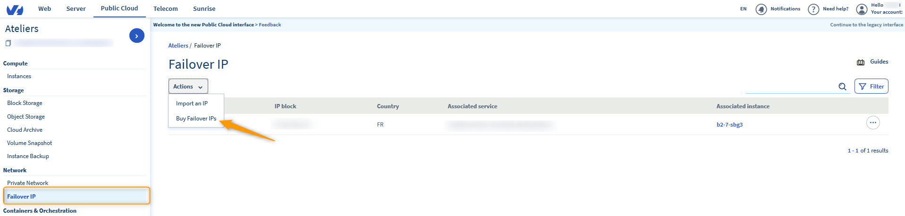
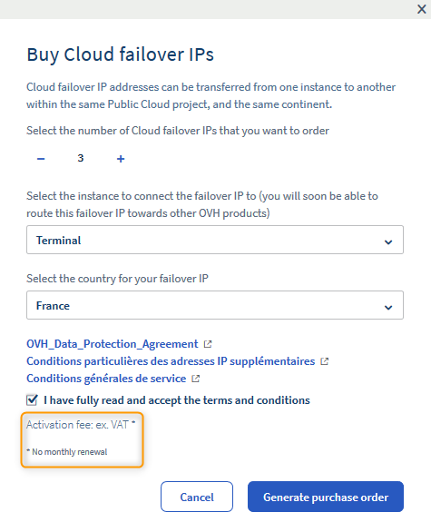
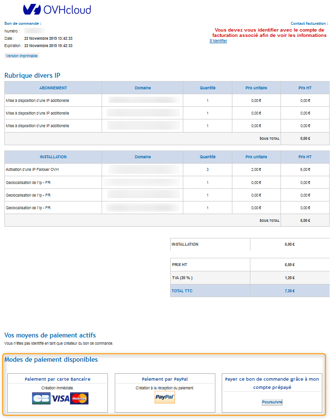
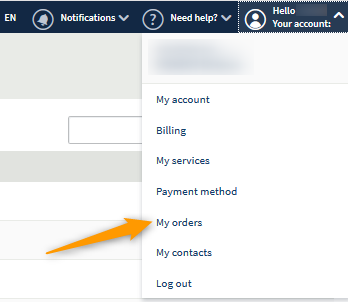

**Last updated 02nd January 2020**

## Objective

You may need to configure a failover IP address on your instances for different reasons. For example, you may be:

- hosting several websites on your instance
- hosting international projects

To meet these needs, you can order a failover IP address for your Public Cloud instances.

These failover IP addresses can only be migrated to instances in the same project.

This guide explains how to buy a failover IP for an OVHcloud Public Cloud project.

## Requirements
- at least one instance (please refer to our guide on [Creating an instance in the OVHcloud Control Panel](../create_an_instance_in_your_ovh_customer_account/))

## Instructions

First of all, click on the `Failover IP`{.action} menu in the OVHcloud Public Cloud Control Panel, then click `Buy failover IPs`{.action} in the actions list:

{.thumbnail}

The following page will then open:

{.thumbnail}

Enter the following information:

* The number of failover IPs you want to order (IP blocks are not currently available).
* The instance on which the IPs will be routed.
* The location of the IPs.

You will also need to accept the General Terms and Conditions of Service.

They are available in the following locations in Europe:

|          |          |          |           |                    |
|:--------:|:--------:|:--------:|:---------:|:------------------:|
| Belgium | Finland |  France  | Germany | Czech Republic |
|  Ireland |  Italy  | Lithuania |  Netherlands |     United Kingdom    |
| Portugal |  Spain |  Poland |  Lithuania |                    |

> [!primary] **Availability**
> 
> Some of the countries listed above may not be listed, depending on the 
> availability of IP addresses.
> 

> [!primary] **Location**
>
> Location is only based on benchmark organisations.
> 
> For example, for RIPE blocks: [https://www.ripe.net/](https://www.ripe.net/){.external}
>
> If you need to check this for other organisations, please contact them directly. OVHcloud cannot be involved in this regard.

A purchase order is then generated. Please allow pop-ups in order to be redirected automatically to the purchase order.

{.thumbnail}

You will also find the purchase order in the OVHcloud Control Panel by going to `My account`{.action}, then `My orders`{.action}.

{.thumbnail}

## Go further

Join our community of users on <https://community.ovh.com/en/>.
