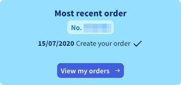

**Última actualización: 21/11/2019**

## Objetivo

Es posible que necesite configurar una dirección IP failover en sus instancias por diferentes razones:

- Tiene varios sitios en su instancia.
- Aloja proyectos internacionales.

Para satisfacer estas necesidades, puede comprar una dirección IP failover para sus instancias Public Cloud.

Estas direcciones IP failover solo pueden migrar a las instancias de un mismo proyecto.

Esta guía explica cómo comprar una IP failover para su proyecto Public Cloud OVHcloud.

## Requisitos
- Disponer al menos de una instancia. A tal efecto, consulte [la guía para crear una instancia desde el área de cliente](../crear_una_instancia_desde_el_area_de_cliente_de_ovh/).

## Procedimiento

En primer lugar, seleccione el menú `«IP failover»`{.action} de su área Public Cloud y, seguidamente, elija `«Comprar IP failover»`{.action} entre las acciones propuestas:

{.thumbnail}

Se abrirá esta página:

{.thumbnail}

Introduzca la siguiente información:

* El número de direcciones IP failvover (IPFO) deseadas (los bloques de IP no están disponibles por el momento).
* La instancia en la que se enrutarán las IP.
* La geolocalización de las IP.

Asimismo, deberá aceptar las condiciones generales de servicio.

Cada IP le costará 2 € (impuestos no incluidos). Luego, se renovarán de forma gratuita y automática cada mes.

Geolocalizaciones disponibles en Europa:

|          |          |          |           |                    |
|:--------:|:--------:|:--------:|:---------:|:------------------:|
| Bélgica | Finlandia |  Francia  | Alemania | República Checa |
|  Irlanda |  Italia  | Lituania |  Países Bajos |     Reino Unido    |
| Portugal |  España |  Polonia |  Lituania |                    |

> [!primary] **Disponibilidad**
> 
> La presencia de los países mencionados anteriormente
> está sujeta a las disponibilidades de las direcciones IP.
> 

> [!primary] **Geolocalización**
>
> La geolocalización solo se basa en los organismos de referencia.
> 
> Por ejemplo, en el caso de RIPE: [https://www.ripe.net/](https://www.ripe.net/){.external}
>
> En caso de verificar en otras bases, comuníquese directamente con los organismos correspondientes. OVHcloud no mediará entre las partes.

Se generará un recibo de pedido. Asegúrese de autorizar la visualización de las ventanas emergentes para posibilitar la redirección automáticamente al recibo de pedido.

{.thumbnail}

También podrá encontrar el recibo de pedido en el área de cliente seleccionando `«Panel de control»,`{.action} y, seguidamente, `«Ver mis pedidos»`{.action}.

{.thumbnail}

## Más información

Interactúe con nuestra comunidad de usuarios en <https://community.ovh.com/en/>.
