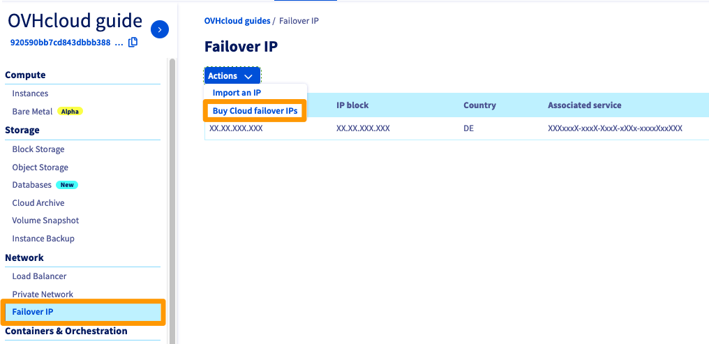

**Dernière mise à jour le 06/10/2022**

> [!primary]
>
> Depuis le 6 octobre 2022, notre solution "IP Failover" s'appelle désormais [Additional IP](https://www.ovhcloud.com/fr-ca/network/additional-ip/). Cela n'a aucun impact sur ses fonctionnalités ou le fonctionnement de vos services.
>

## Objectif

Vous pouvez avoir besoin de configurer une adresse Additional IP sur vos instances pour différentes raisons :

- Vous avez plusieurs sites sur votre instance.
- Vous hébergez des projets internationaux.

Pour répondre à ces besoins, vous pouvez acheter une adresse Additional IP pour vos instances Public Cloud. 
Ces adresses Additional IP ne pourront être migrées que vers les instances d'un même projet.

**Ce guide explique comment acheter une Additional IP pour votre projet Public Cloud OVHcloud.**

## Prérequis

- Être connecté à l’[espace client OVHcloud](https://ca.ovh.com/auth/?action=gotomanager&from=https://www.ovh.com/ca/fr/&ovhSubsidiary=qc){.external}.
- Disposer d'au moins une instance. Consultez à cet effet [le guide pour créer une instance depuis l'espace client](https://docs.ovh.com/ca/fr/public-cloud/premiers-pas-instance-public-cloud/).

## En pratique

Connectez-vous à l'[espace client OVHcloud](https://ca.ovh.com/auth/?action=gotomanager&from=https://www.ovh.com/ca/fr/&ovhSubsidiary=qc), accédez à la section `Public Cloud`{.action} et sélectionnez le projet Public Cloud concerné. 
Dans le menu de gauche, cliquez sur `Additional IP`{.action} dans la section `Network`.

Cliquez ensuite sur le bouton `Actions`{.action} puis choisissez `Acheter des Additional IPs Cloud`{.action}.

{.thumbnail}

Un nouveau menu apparaîtra alors :

{.thumbnail}

Renseignez les informations suivantes :

* Le nombre d'Additional IP souhaitées (les blocs d'IP ne sont pas disponibles pour le moment).
* L'instance sur laquelle seront routées les adresses IP.
* La géolocalisation des adresses IP.

Vous devrez également accepter les conditions générales de service.

Chaque Additional IP vous coûtera 2€ HT à l'achat. Elles seront ensuite renouvelées gratuitement et automatiquement chaque mois.

Les géolocalisations disponibles en Europe sont :

|          |          |          |           |                    |
|:--------:|:--------:|:--------:|:---------:|:------------------:|
| Belgique | Finlande |  France  | Allemagne | République Tchèque |
|  Irlande |  Italie  | Lituanie |  Pays-bas |     Royaume-Uni    |
| Portugal |  Espagne |  Pologne |  Lituanie |                    |

> [!primary] **Disponibilité**
> 
> Il est possible que certains des pays ci dessus ne soient pas présents en fonction des disponibilités des adresses IP.
> 

> [!primary] **Géolocalisation**
>
> La géolocalisation se base uniquement sur les organismes de référence.
> 
> Par exemple, pour RIPE : [https://www.ripe.net/](https://www.ripe.net/){.external}
>
> En cas de vérification sur d'autres bases, merci de vous rapprocher directement des organismes en question. OVHcloud n'interviendra pas auprès de ceux-ci.

Cliquez sur `Générer le bon de commande`{.action} pour être redirigé automatiquement vers celui-ci (l'affichage des pop-ups doit être autorisé sur votre navigateur).

Vous pourrez également retrouver le bon de commande dans votre espace client, en vous rendant dans le `Tableau de bord`{.action} puis en cliquant sur `Voir mes commandes`{.action}.

Consultez notre guide sur la [gestion des commandes OVHcloud](https://docs.ovh.com/ca/fr/billing/gerer-ses-commandes-ovh/) pour plus de détails.

## Aller plus loin

[Configurer une Additional IP](https://docs.ovh.com/ca/fr/public-cloud/configurer_une_ip_failover/)

Échangez avec notre communauté d'utilisateurs sur <https://community.ovh.com>.
