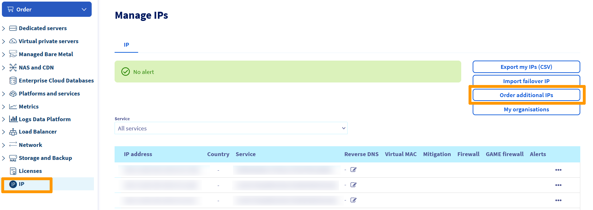
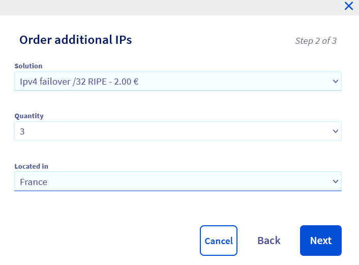
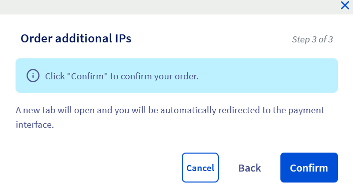

**Dernière mise à jour le 23/02/2022**

## Objectif

Vous pouvez avoir besoin de configurer une adresse IP fail-over sur vos instances pour différentes raisons :

- Vous avez plusieurs sites sur votre instance.
- Vous hébergez des projets internationaux.

Pour répondre à ces besoins, vous pouvez acheter une adresse IP fail-over pour vos instances Public Cloud. 
Ces adresses IP fail-over ne pourront être migrées que vers les instances d'un même projet.

**Ce guide explique comment acheter une IP fail-over pour votre projet Public Cloud OVHcloud.**

## Prérequis

- Être connecté à l’[espace client OVHcloud](https://www.ovh.com/auth/?action=gotomanager&from=https://www.ovh.com/fr/&ovhSubsidiary=fr){.external}.
- Disposer d'au moins une instance. Consultez à cet effet [le guide pour créer une instance depuis l'espace client](https://docs.ovh.com/fr/public-cloud/premiers-pas-instance-public-cloud/).

## En pratique

### Etape 1

Connectez-vous à l'[espace client OVHcloud](https://www.ovh.com/auth/?action=gotomanager&from=https://www.ovh.com/fr/&ovhSubsidiary=fr), accédez à la section ` Bare Metal Cloud`{.action}. 
Dans le menu de gauche, cliquez sur `IP`{.action} dans la section `Network` puis choisissez `Commander des IP additionnelles`{.action}.

{.thumbnail}

### étape 2

Un nouveau menu apparaîtra alors :

{.thumbnail}

### étape 3

Sélectionnez le service pour lequel vous désirez acheter des IPs supplémentaires

{.thumbnail}

### étape 4

*Sélectionnez l'offre,chaque IP fail-over vous coûtera 2€ HT à l'achat. Elles seront ensuite renouvelées gratuitement et automatiquement chaque mois.
* Le nombre d'IP fail-over souhaitées (les blocs d'IP ne sont pas disponibles pour le moment).
* La géolocalisation des adresses IP.

{.thumbnail}

Les géolocalisations disponibles en Europe sont :

|          |          |          |           |                    |
|:--------:|:--------:|:--------:|:---------:|:------------------:|
| Belgique | Finlande |  France  | Allemagne | République Tchèque |
|  Irlande |  Italie  | Lituanie |  Pays-bas |     Royaume-Uni    |
| Portugal |  Espagne |  Pologne |  Lituanie |                    |

### étape 5

Cliquez ensuite sur le bouton `Confirmer`{.action}
{.thumbnail}

> [!primary] **Disponibilité**
> 
> Il est possible que certains des pays ci dessus ne soient pas présents en fonction des disponibilités des adresses IP.
> 

> [!primary] **Géolocalisation**
>
> La géolocalisation se base uniquement sur les organismes de référence.
> 
> Par exemple, pour RIPE : [https://www.ripe.net/](https://www.ripe.net/){.external}
>
> En cas de vérification sur d'autres bases, merci de vous rapprocher directement des organismes en question. OVHcloud n'interviendra pas auprès de ceux-ci.

Cliquez sur `Générer le bon de commande`{.action} pour être redirigé automatiquement vers celui-ci (l'affichage des pop-ups doit être autorisé sur votre navigateur).

Vous pourrez également retrouver le bon de commande dans votre espace client, en vous rendant dans le `Tableau de bord`{.action} puis en cliquant sur `Voir mes commandes`{.action}.

Consultez notre guide sur la [gestion des commandes OVHcloud](https://docs.ovh.com/fr/billing/gerer-ses-commandes-ovh/) pour plus de détails.

## Aller plus loin

[Configurer une IP fail-over](https://docs.ovh.com/fr/public-cloud/configurer_une_ip_failover/)

Échangez avec notre communauté d'utilisateurs sur <https://community.ovh.com>
