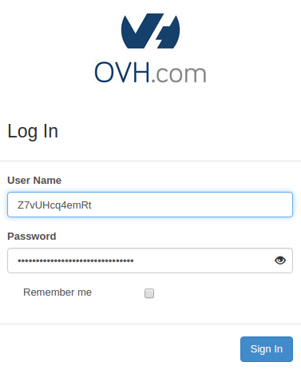
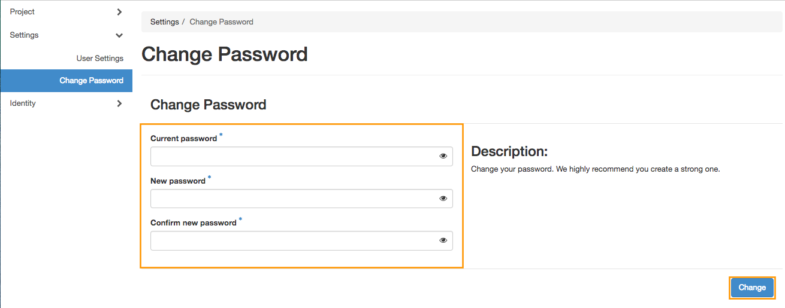

**Dernière mise à jour le 22/02/2018**

## Objectif

Dans le guide [créer un accès à Horizon](https://docs.ovh.com/fr/public-cloud/creer-un-acces-a-horizon/){.external}, il vous a été expliqué comment créer et supprimer un utilisateur OpenStack et générer un mot de passe d’accès.

À l’aide du panneau Horizon, il est possible de définir un mot de passe pour chaque utilisateur. Attention, le changement de mot de passe d’un compte utilisateur entraîne l’annulation des identifiants actifs au moment du changement.

**Ce guide vous explique comment personnaliser un mot de passe utilisateur depuis votre interface Horizon.**

## Prérequis

- Avoir créé un compte utilisateur OpenStack Horizon.

## En pratique

La création d’un mot de passe OpenStack est possible après vous être connecté à [OpenStack Horizon](https://horizon.cloud.ovh.net){.external} :

{.thumbnail}

L’identifiant de l’utilisateur Horizon se trouve dans le coin supérieur droit de l'interface Horizon. Cliquez sur votre identifiant pour faire apparaître un menu avec les options disponibles.
Sélectionnez `Paramètres`{.action}, puis sur la gauche, `Changer le mot de passe`{.action} :

{.thumbnail}

Entrez votre mot de passe actuel dans le premier champ et votre nouveau mot de passe dans les deux champs suivants.

> [!primary]
>
> Lors du changement de mot de passe, nous vous invitons vivement à prendre en compte ces quelques conseils :
 >
> - le mot de passe doit comporter au minimum 8 caractères ;
> - le mot de passe doit comporter au maximum 30 caractères ;
> - le mot de passe doit comporter au moins une lettre majuscule ;
> - le mot de passe doit comporter au moins une lettre minuscule ;
> - le mot de passe doit comporter au moins un chiffre ;
> - le mot de passe doit comporter uniquement des chiffres et des lettres.
>

Confirmez ensuite la création du nouveau mot de passe en cliquant sur `Changer`{.action}.

{.thumbnail}

Veuillez noter que le changement de mot de passe du compte d’utilisateur entraîne l’annulation immédiate des identifiants utilisés précédemment.

## Aller plus loin

Échangez avec notre communauté d'utilisateurs sur <https://community.ovh.com>.
