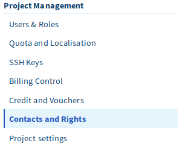
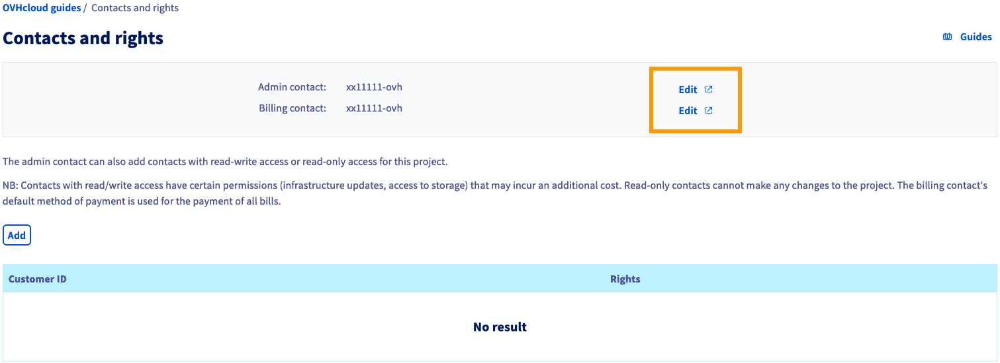
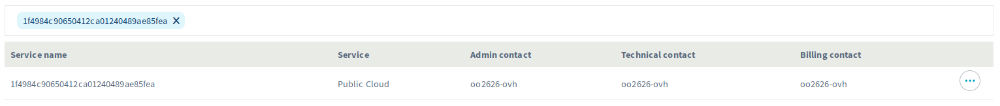
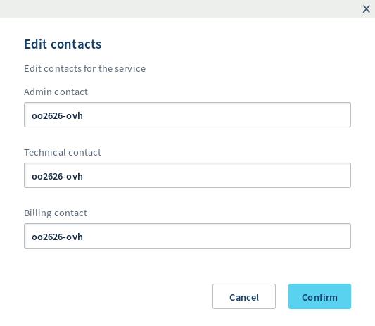
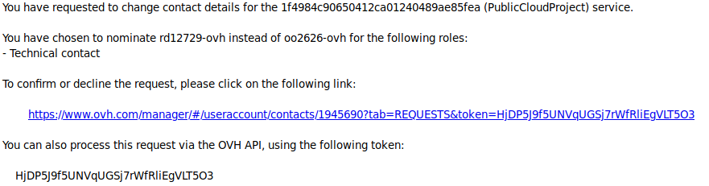
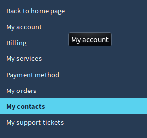
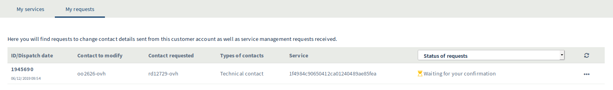

**Letzte Aktualisierung am 03.12.2019**

## Ziel

Mit der OVHcloud Public Cloud können Sie die Kontakte für die Abrechnung und Projektverwaltung ändern.
Dies bedeutet, dass Sie den OVHcloud Kunden-Account, der Ihre Rechnungen verwaltet, vom OVHcloud Kunden-Account, der Ihre verschiedenen Instanzen verwaltet, trennen können.

**In dieser Anleitung wird erläutert, wie Sie Ihre Public Cloud-Kontakte bearbeiten.**

## Voraussetzungen

- Sie verfügen über ein [Public Cloud Projekt](https://www.ovhcloud.com/de/public-cloud).
- Sie haben Zugriff auf Ihr [OVHcloud Kundencenter](https://www.ovh.com/auth/?action=gotomanager) für beide Kennungen.
- Sie haben sichergestellt, dass sowohl Administrator- als auch Rechnungskontakte derselben OVHcloud Filiale angehören.

## In der praktischen Anwendung

### Schritt 1: Kontaktänderung

Um Ihre Projektkontakte zu ändern, wechseln Sie zunächst mit Klick auf `Contacts and Rights`{.action} in der Projektverwaltung zur Sektion "Kontakte und Berechtigungen" .

{.thumbnail}

Sie sehen nun Ihre aktuellen Admin- und Rechnungskontakte.

{.thumbnail}

Wenn Sie auf `Ändern`{.action} klicken, werden Sie zu einer neuen Seite weitergeleitet, auf der Sie Ihre Kontakte ändern können:

{.thumbnail}

Klicken Sie dann auf `...`{.action} rechts neben dem Public Cloud Projekt und dann auf `Kontakte ändern`{.action}. Ein neues Fenster wird angezeigt, in dem Sie die Kontakte eintragen können.

{.thumbnail}

Sobald Sie die neuen Kontakte bestätigt haben, erhalten beide OVHcloud Kunden-Accounts eine E-Mail mit einem Code, mit dem sie diese Änderung bestätigen können:

{.thumbnail}

Der Vorgang muss in beiden Konten bestätigt werden.

### Schritt 2: Bestätigung der Änderung

Zu diesem Zweck wechseln Sie in Ihrem [OVHcloud Kundencenter](https://www.ovh.com/manager/dedicated/#/contacts/services) zum Bereich "Verwaltung der Kontakte".

{.thumbnail}

 Klicken Sie dort auf `Meine Anfragen`{.action} (in beiden Kundenkennungen).

{.thumbnail}

Klicken Sie rechts auf `...`{.action} und bestätigen Sie die Anfrage. Ein neues Fenster wird angezeigt. 

{.thumbnail}

Sie müssen nun noch den Code, den Sie per E-Mail erhalten haben, in das angezeigte Fenster einfügen, nachdem Sie den Vorgang von beiden Accounts aus bestätigt haben.

Danach werden die Kontakte wie gewünscht geändert.

## Weiterführende Informationen

Für den Austausch mit unserer User Community gehen Sie auf [https://community.ovh.com/en](https://community.ovh.com/en).

