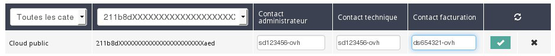
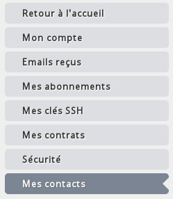

## Preambule
Le Public Cloud d'OVH vous propose désormais la possibilité de modifier le contact de facturation et administrateur de vos projets. Cela peut vous permettre de dissocier le compte OVH qui se chargera de payer vos factures, et le compte OVH qui se chargera de gérer et administrer vos différentes instances.

Ce guide vous explique la procédure à suivre afin de modifier vos contacts.

### Prérequis
- 2 Comptes OVH
- Un projet Public Cloud

## Changement de contacts
Afin de modifier les contacts de votre projet, vous pouvez dans un premier temps accéder a l'onglet  **Gestion et conso. du projet** .

{.thumbnail}

Puis depuis cette nouvelle page, vous pouvez vous rendre dans le menu **Contacts et droits** .

{.thumbnail}

Vous verrez alors vos contacts administrateur et facturation actuels.

{.thumbnail}

En cliquant sur  **Modifier** , vous serez réorienté vers une nouvelle page qui vous permettra alors de modifier vos contacts :

{.thumbnail}

Une fois les nouveaux contacts configurés, les 2 comptes OVH recevront un mail contenant un code permettant de valider le changement de contact :

{.thumbnail}

Il faudra alors valider la procédure sur les 2 différents comptes.

Pour cela, rendez vous dans les propriétés de votre compte, puis sélectionner mes contacts sur la droite :

{.thumbnail}

Pour le contact d'origine, il faudra se rendre dans la partie  **Mes demandes envoyées** , pour le nouveau contact, cela sera  **Mes demandes recues** Une ligne sera alors présent et se présentera sous la forme suivante :

{.thumbnail}

Il suffira ensuite d'insérer le code que vous avez reçu par mail dans la fenêtre qui est apparu suite à la validation de la procédure pour chacun des comptes.