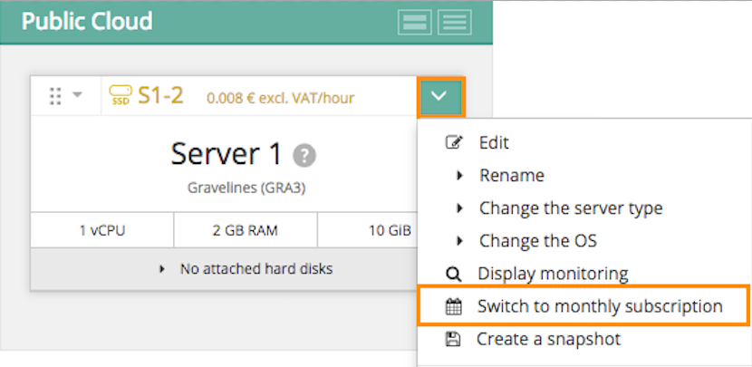
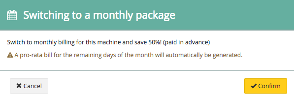

**Päivitetty 19.3.2018**

## Tavoite

Kun luot Public Cloud -instanssin, on mahdollista valita tuntiperusteinen laskutus tai kuukausiperusteinen laskutus. “Tunti-instanssien” laskutus tapahtuu *pay-as-you-go*-periaatteella eli niin, että asiakas maksaa kuun lopussa käytettyjen tuntien mukaisesti. “Kuukausi-instansseissa” tuleva kuukausi maksetaan etukäteen ja ne ovat edullisempia (50 % halvempi). Jos aluksi valittiin tuntilaskutus, se on mahdollista muuttaa kuukausilaskutukseksi milloin tahansa.

**Tässä ohjeessa kerrotaan, kuinka tuntilaskutuksesta siirrytään kuukausilaskutukseen.**

> [!warning]
>
> Kuukausilaskutuksesta ei voida siirtyä tuntilaskutukseen. Kuukausilaskutuksessa oleva instanssi on poistettava ja luotava uusi tuntiperusteisesti laskutettava instanssi.
>

## Edellytykset

- Olet luonut [Public Cloud -instanssin](https://www.ovh-hosting.fi/public-cloud/instances/){.external}.
- Olet kirjautunut [hallintapaneeliin](https://www.ovh.com/auth/?action=gotomanager){.external}.

## Käytännössä

Valitse [hallintapaneelissa](https://www.ovh.com/auth/?action=gotomanager){.external} instanssi, jonka laskutustapaa haluat muokata ja avaa sen valinnat. Näet nyt painikkeen `Vaihda kuukausilaskutukseen`{.action}:

{.thumbnail}

Nyt muutos on enää vahvistettava:

{.thumbnail}

Tämän muokkauksen jälkeen laaditaan lasku kuukauden loppuun jäljellä oleville päiville. Kuun lopussa maksettava lasku sisältää kuun aikana käytettyjen instanssien tuntiperusteisen hinnan sekä seuraavan kuukauden kuukausiperusteisen maksun.

## Lue lisää aiheesta

Viesti käyttäjäyhteisömme kanssa osoitteessa: <https://community.ovh.com/en/>.