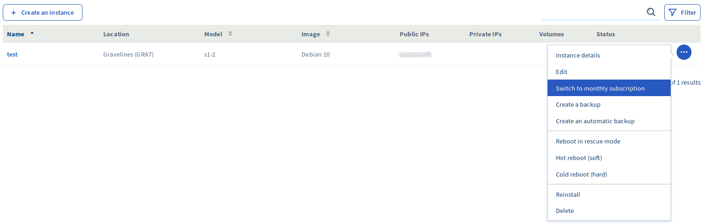

**Dernière mise à jour le 6 décembre 2019**

## Objectif

En créant une instance Public Cloud, il est possible de choisir entre une facturation à l'heure ou une facturation mensuelle. Les instances « à l'heure » sont facturées en *pay-as-you-go*, c'est-à-dire que l'utilisateur paie en fin de mois la somme des heures consommées. Les instances « mensuelles », elles, doivent être réglées à l'avance pour le mois à venir et sont moins onéreuses (50 % de réduction). Si la facturation à l'heure a été initialement choisie, il est cependant possible de la modifier en facturation mensuelle à tout moment.

**Ce guide explique comment passer d'une facturation à l'heure vers une facturation mensuelle.**

> [!warning]
>
> Le passage d'une facturation mensuelle vers une facturation à l'heure n'est pas possible. Si vous voulez passer à la facturation à l'heure, il vous faudra supprimer l’instance facturée mensuellement, puis créer une nouvelle instance et choisir la facturation à l'heure. Dans ce cas, nous vous conseillons de suivre ces étapes :
>
>- Créez un <i>snapshot </i>de votre instance actuelle ;
>
>- Créez une nouvelle instance à partir de ce <i>snapshot </i>;
>
>- Supprimez l’instance à facturation mensuelle.
>

## Prérequis

- Vous devez avoir créé une [instance Public Cloud](https://www.ovhcloud.com/fr/public-cloud/){.external}.
- Vous devez être connecté à votre [espace client OVHcloud](https://www.ovh.com/auth/?action=gotomanager){.external}.

## En pratique

Dans [votre espace client](https://www.ovh.com/auth/?action=alleraugestionnaire){.external}, cliquez sur `Public cloud`{.action}, choisissez le projet Public cloud concerné puis cliquez sur `Instances`{.action} dans le menu `Compute`. Cliquez sur le bouton `...`{.action} à droite de l'instance pour laquelle vous souhaitez modifier la facturation. Vous verrez alors le bouton `Passer au forfait mensuel`{.action} :

{.thumbnail}

Il vous faudra ensuite confirmer que vous souhaitez modifier le mode de facturation :

{.thumbnail}

Suite à cette modification, une facture sera émise d’un montant correspondant au nombre de jours restant jusqu’à la fin du mois. À la fin du mois, la facture intègrera le coût des heures de l'instance du mois écoulé en configuration « horaire », mais également le coût du mois à venir en configuration « mensuelle ».

## Aller plus loin

Échangez avec notre communauté d'utilisateurs sur <https://community.ovh.com>.
