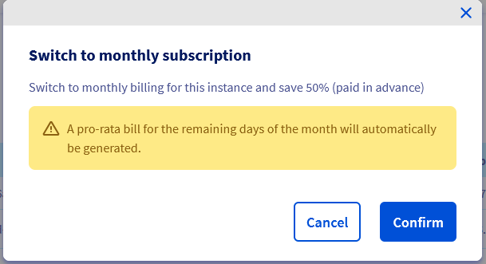

**Última atualização: 21/03/2022**

## Sumário

Ao criar uma instância Public Cloud, é possível escolher entre uma faturação à hora e uma faturação ao mês. As instâncias «à hora» são faturadas como *pay-as-you-go*, ou seja, o utilizador paga ao fim do mês a soma das horas utilizadas. Já as instâncias «ao mês» devem ser pagas antecipadamente quanto ao mês seguinte e são menos onerosas (até 50% de desconto). Se escolher inicialmente a faturação à hora, em qualquer momento poderá optar pela faturação ao mês.

**Este guia explica como passar de uma faturação à hora para uma faturação ao mês.**

> [!warning]
>
> Não é possível passar de uma faturação mensal para uma faturação horária. Se pretende uma faturação horária, será necessário eliminar a instância de faturação mensal e criar uma nova, selecionando a faturação horária. Neste caso, sugerimos que proceda da seguinte forma:
>
>- Crie um snapshot da sua instância atual;
>
>- Crie uma nova instância com base neste snapshot;
>
>- Elimine a instância mensal.
>


## Requisitos

- Ter criado uma [instância Public Cloud](https://www.ovh.pt/public-cloud/instances/){.external}.
- Aceder à [Área de Cliente OVHcloud](https://www.ovh.com/auth/?action=gotomanager&from=https://www.ovh.pt/&ovhSubsidiary=pt){.external}.


## Instruções

### Desde à Área de Cliente OVHcloud

Na [Área de Cliente OVHcloud](https://www.ovh.com/auth/?action=gotomanager&from=https://www.ovh.pt/&ovhSubsidiary=pt){.external}, escolha a instância para a qual deseja mudar o modo de faturação e abra o respetivo menu de opções clicando nos 3 pontos do lado direito da Instância. Terá então acesso ao botão `Passar para o plano mensal`{.action}:

{.thumbnail}

Em seguida, tem de confirmar que pretende mudar o modo de faturação:

{.thumbnail}

Depois de confirmar a sua escolha, receberá imediatamente uma factura mensal rateada. A factura seguinte incluirá a parte do mês com a taxa horária (1º do mês até à mudança) e a nova taxa mensal.

### Desde a API OpenStack

Ao criar uma instância com a ajuda da API OpenStack, a menos que tal esteja indicado no script de criação, a instância será automaticamente criada com uma subscrição horária. Para passar a uma subscrição mensal, execute o seguinte comando:

```bash
openstack server set --property ovh-monthly-instance=1 "InstanceID"
```

Substitua "InstanceID" pelo ID da instância correspondente. Este identificador pode ser obtido a partir da Área de Cliente ou da API OVHcloud.

### Desde a API OVHcloud

Aceda à[interface API OVHcloud](https://eu.api.ovh.com/) conforme o [guia apropriado](https://docs.ovh.com/pt/api/first-steps-with-ovh-api/) e siga os passos abaixo.

Utilize a seguinte chamada:

> [!api]
>
> @api {POST} /cloud/project/{serviceName}/instance/{instanceId}/activeMonthlyBilling
>

## Quer saber mais?

Fale com a nossa comunidade de utilizadores: <https://community.ovh.com/en/>.