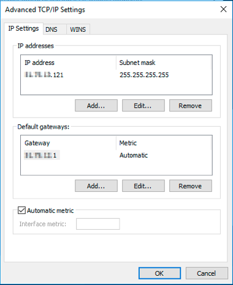
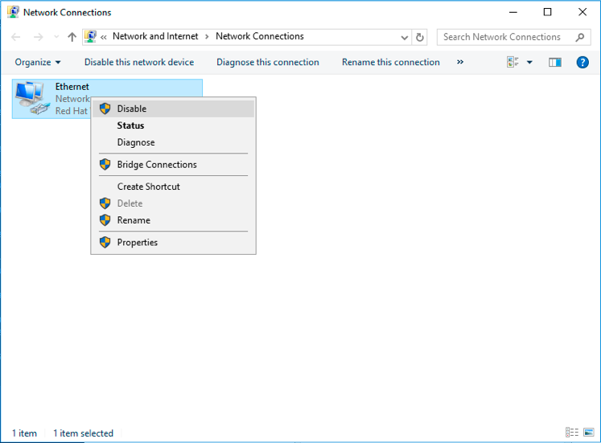
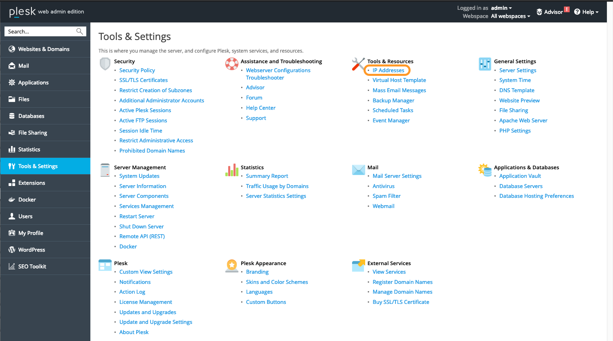
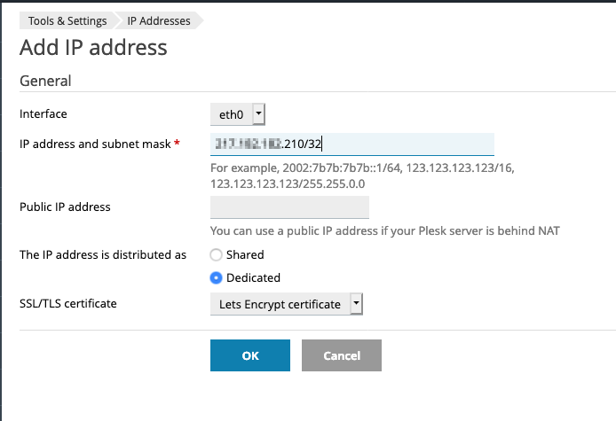

> [!primary]
> Diese Übersetzung wurde durch unseren Partner SYSTRAN automatisch erstellt. In manchen Fällen können ungenaue Formulierungen verwendet worden sein, z.B. bei der Beschriftung von Schaltflächen oder technischen Details. Bitte ziehen Sie beim geringsten Zweifel die englische oder französische Fassung der Anleitung zu Rate. Möchten Sie mithelfen, diese Übersetzung zu verbessern? Dann nutzen Sie dazu bitte den Button «Mitmachen» auf dieser Seite.
>

**Letzte Aktualisierung am 06.10.2022**

> [!primary]
>
> Seit dem 6. Oktober 2022 heißt unser Dienst "Failover-IP" nun [Additional IP](https://www.ovhcloud.com/de/network/additional-ip/). Dies hat keine weiteren Auswirkungen auf dessen Eigenschaften oder die Funktionalität Ihrer Dienstleistungen.
>


## Ziel

Es kann nowendig werden, Additional IPs auf Ihren Instanzen konfigurieren, zum Beispiel, wenn Sie eine große Anzahl an Websites oder internationale Projekte hosten. Mit den Additional IPs von OVHcloud können Sie mehrere IP-Adressen einem einzigen Netzwerkinterface zuweisen.

**In dieser Anleitung erfahren Sie, wie Sie Additional IPs zu Ihrer Netzwerkkonfiguration hinzufügen.**

> [!warning]
> OVHcloud stellt Ihnen Dienstleistungen zur Verfügung, für die Sie die alleinige Verantwortung tragen. Da wir keinen Zugriff auf diese Dienste haben, können wir hierfür keinerlei Administrator-Aufgaben übernehmen oder sonstige Hilfeleistung anbieten. Es liegt daher in Ihrer Verantwortung, das Softwaremanagement und die tägliche Sicherheit zu gewährleisten.
>
> Wir stellen Ihnen diese Anleitung zur Verfügung, um Ihnen bei der Bewältigung alltäglicher Verwaltungsaufgaben zu helfen. Wir empfehlen Ihnen jedoch, sich an einen [spezialisierten Dienstleister](https://partner.ovhcloud.com/de/directory/) zu wenden, wenn Sie Schwierigkeiten oder Zweifel hinsichtlich der Verwaltung, Nutzung oder Sicherheit eines Dienstes haben. Sie können sich auch jederzeit an unsere [Community](https://community.ovh.com/en/) wenden, um sich mit anderen Benutzern auszutauschen.
>

## Voraussetzungen

- Sie haben eine [Public Cloud Instanz](https://www.ovhcloud.com/de/public-cloud/) in Ihrem OVHcloud Account.
- Sie verfügen über eine [Additional IP](https://www.ovhcloud.com/de/bare-metal/ip/)-Adresse oder einen Additional IP-Block.
- Sie haben administrativen Zugriff (Root) auf Ihre Instanz über SSH oder GUI. 
- Sie haben Grundkenntnisse in Administration und Netzwerkkonfiguration.

## In der praktischen Anwendung

Die folgenden Abschnitte enthalten die Konfigurationen für die am häufigsten verwendeten Distributionen/Betriebssysteme. Der erste Schritt ist immer die Anmeldung auf Ihrer Instanz über SSH oder einen GUI-Login (VNC für eine Windows-Instanz). Die folgenden Beispiele setzen voraus, dass Sie als Benutzer mit erhöhten Berechtigungen (Administrator/sudo) angemeldet sind.

> [!primary]
>
Bitte beachten Sie, dass sich bei unterschiedlichen Distributionen die korrekte Vorgehensweise zur Konfiguration Ihrer Netzwerkschnittstelle sowie die Dateinamen geändert haben können. Wir empfehlen Ihnen, bei Problemen die Dokumentationen und Wissensressourcen der jeweiligen Betriebssystemversionen zu konsultieren. 
>

**Bitte beachten Sie die Terminologie, die in den nachfolgenden Codebeispielen und Anweisungen dieser Anleitung verwendet wird:**

|Bezeichnung|Beschreibung|Beispiele|
|---|---|---|
|ADDITIONAL_IP|Ihrem Dienst zugewiesene Additional IP|169.254.10.254|
|NETWORK_INTERFACE|Name des Netzwerkinterfaces|*eth*, *ens3*|
|ID|ID der Additional IP, beginnend mit *0* (abhängig von der Anzahl der zu konfigurierenden zusätzlichen IP-Adressen)|*0*, *1*|

### Debian 11

#### Schritt 1: Automatische Netzwerkkonfiguration deaktivieren

Öffnen Sie diesen Dateipfad mit einem Texteditor:

```bash
sudo nano /etc/cloud/cloud.cfg.d/99-disable-network-config.cfg
```

Fügen Sie die folgende Zeile ein, speichern Sie und schließen Sie dann den Editor.

```bash
network: {config: disabled}
```

Die Erstellung dieser Konfigurationsdatei verhindert die automatische Ausführung von Änderungen an der Konfiguration Ihres Netzwerks.

#### Schritt 2: Netzwerkkonfigurationsdatei bearbeiten

Um den Namen Ihres Netzwerkinterfaces zu überprüfen, verwenden Sie folgenden Befehl:

```bash
ip a
```

Öffnen Sie die Netzwerkkonfigurationsdatei zur Bearbeitung:

```bash
sudo nano /etc/network/interfaces.d/50-cloud-init
```

Fügen Sie folgende Zeilen hinzu:

```bash
auto NETWORK_INTERFACE:ID
iface NETWORK_INTERFACE:ID inet static
address ADDITIONAL_IP
netmask 255.255.255.255
```

#### Schritt 3: Interface neu starten

Wenden Sie die Änderungen mit folgendem Befehl an:

```bash
sudo systemctl restart networking
```

### Ubuntu 22.04

Die Konfigurationsdatei für Ihre Additional IPs befindet sich in `/etc/netplan/`. In diesem Beispiel heißt sie "50-cloud-init.yaml". Bevor Sie Änderungen vornehmen, überprüfen Sie am besten den tatsächlichen Dateinamen in diesem Ordner. Jede Additional IP benötigt in der Datei eine eigene Zeile.

#### Schritt 1: Automatische Netzwerkkonfiguration deaktivieren

Öffnen Sie diesen Dateipfad mit einem Texteditor:

```bash
sudo nano /etc/cloud/cloud.cfg.d/99-disable-network-config.cfg
```

Fügen Sie die folgende Zeile ein, speichern Sie und schließen Sie dann den Editor.

```bash
network: {config: disabled}
```

Die Erstellung dieser Konfigurationsdatei verhindert die automatische Ausführung von Änderungen an der Konfiguration Ihres Netzwerks.

#### Schritt 2: Konfigurationsdatei bearbeiten

Um den Namen Ihres Netzwerkinterfaces zu überprüfen, verwenden Sie folgenden Befehl:

```bash
ip a
```

Öffnen Sie die Netzwerkkonfigurationsdatei zur Bearbeitung:

```bash
sudo nano /etc/netplan/50-cloud-init.yaml
```

Ändern Sie nicht die vorhandenen Zeilen in der Datei; fügen Sie Ihre Additional IP wie folgt hinzu:

```yaml
network:
    version: 2
    ethernets:
        NETWORK_INTERFACE:
            dhcp4: true
            match:
                macaddress: fa:xx:xx:xx:xx:63
            set-name: NETWORK_INTERFACE
            addresses:
            - ADDITIONAL_IP/32
```

> [!warning]
>
> Es ist wichtig, dass die Zeilenausrichtung jedes Elements dieser Datei, wie im Beispiel dargestellt, eingehalten wird. Verwenden Sie nicht die Tabulationstaste, um den Abstand zu erzeugen.
>

Speichern und schließen Sie die Datei.

#### Schritt 3: Neue Netzwerkkonfiguration anwenden

Sie können Ihre Konfiguration mit folgendem Befehl testen:

```bash
sudo netplan try
```

Ist die Änderung korrekt, verwenden Sie folgenden Befehl, um sie anzuwenden:

```bash
sudo netplan apply
```

Wiederholen Sie diesen Vorgang für jede Additional IP.

### Windows Server (2016)

Loggen Sie sich in Ihrem [OVHcloud Kundencenter](https://www.ovh.com/auth/?action=gotomanager&from=https://www.ovh.de/&ovhSubsidiary=de) ein. Gehen Sie zum Bereich  `Public Cloud`{.action} und wählen Sie Ihr Projekt aus.

Öffnen Sie im linken Menü `Instances`{.action} und klicken Sie dann auf den Namen der betreffenden Instanz. Wechseln Sie zum Tab `VNC Konsole`{.action}.

#### Schritt 1: Netzwerkkonfiguration überprüfen

Klicken Sie mit der rechten Maustaste auf das `Startmenü`{.action} und öffnen Sie `Ausführen`{.action}.

Geben Sie `cmd` ein und klicken Sie auf `OK`{.action}, um die Kommandozeilenanwendung zu öffnen.

{.thumbnail}

Um die aktuelle IP-Konfiguration anzuzeigen, geben Sie `ipconfig` in der Eingabeaufforderung ein.

{.thumbnail}

#### Schritt 2: IPv4 Eigenschaften ändern

Die IP-Eigenschaften müssen nun zu einer statischen Konfiguration geändert werden.

Öffnen Sie die Adaptereinstellungen in der Windows-Systemsteuerung und öffnen Sie die `Eigenschaften`{.action} von `Internet Protocol Version 4 (TCP/IPv4)`{.action}.

{.thumbnail}

Wählen Sie in den IPv4-Eigenschaften `Folgende IP-Adresse verwenden`{.action}. Geben Sie die IP-Adresse ein, die Sie im ersten Schritt ausgelesen haben, und klicken Sie dann auf `Erweitert`{.action}.

#### Schritt 3: Die Additional IP in "Erweiterte TCP/IP Einstellungen" hinzufügen

Klicken Sie im neuen Fenster auf `Hinzufügen...`{.action} unter "IP-Adressen". Geben Sie Ihre Additional IP und die Subnetzmaske (255.255.255.255) ein.

{.thumbnail}

Bestätigen Sie, indem Sie auf `Hinzufügen`{.action} klicken.

{.thumbnail}

#### Schritt 4: Netzwerk-Interface neu starten

Wieder in der Systemsteuerung (`Netzwerkverbindungen`{.action}), klicken Sie mit der rechten Maustaste auf Ihr Netzwerkinterface und wählen Sie `Deaktivieren`{.action}.

{.thumbnail}

Um es neu zu starten klicken Sie mit der rechten Maustaste darauf und wählen Sie `Aktivieren`{.action}.

{.thumbnail}

#### Schritt 5: Überprüfung der neuen Netzwerkkonfiguration

Öffnen Sie die Eingabeaufforderung (cmd) und geben Sie `ipconfig` ein. Die Konfiguration sollte nun die neue Additional IP enthalten.

{.thumbnail}

### cPanel (CentOS 7) / RedHat Derivate

#### Schritt 1: Netzwerkkonfigurationsdatei bearbeiten

Um den Namen Ihres Netzwerkinterfaces zu überprüfen, verwenden Sie folgenden Befehl:

```bash
ip a
```

Öffnen Sie die Netzwerkkonfigurationsdatei zur Bearbeitung:

```bash
sudo nano /etc/sysconfig/network-scripts/ifcfg-NETWORK_INTERFACE:ID
```

Fügen Sie folgende Zeilen hinzu:

```bash
DEVICE=NETWORK_INTERFACE:ID
BOOTPROTO=static
IPADDR=ADDITIONAL_IP
NETMASK=255.255.255.255
BROADCAST=ADDITIONAL_IP
ONBOOT=yes
```

#### Schritt 2: Interface neu starten

Wenden Sie die Änderungen mit folgendem Befehl an:

```bash
sudo systemctl restart networking
```

### Plesk

#### Schritt 1: Auf die IP-Verwaltung von Plesk zugreifen

Wählen Sie im Plesk Konfigurationspanel `Tools & Settings`{.action} im linken Menü aus.

{.thumbnail}

Klicken Sie auf `IP Addresses`{.action} unter **Tools & Resources**.

#### Schritt 2: Die zusätzliche IP-Information hinzufügen

Klicken Sie in diesem Abschnitt auf den Button `Add IP Address`{.action}.

{.thumbnail}

Geben Sie Ihre Additional IP in der Form `xxx.xxx.xxx.xxx/32` in das Feld "IP address and subnet mask" ein und klicken Sie dann auf `OK`{.action}.

{.thumbnail}

#### Schritt 3: Aktuelle IP-Konfiguration überprüfen

Überprüfen Sie im Bereich "IP Addresses" ob die Additional IP korrekt hinzugefügt wurde.

{.thumbnail}

### Diagnose

Starten Sie zunächst Ihre Instanz neu, über das Betriebssystem oder im [OVHcloud Kundencenter](https://www.ovh.com/auth/?action=gotomanager&from=https://www.ovh.de/&ovhSubsidiary=de). Wenn Sie dann immer noch keine Verbindung zwischen dem öffentlichen Netzwerk und Ihrer Additional IP-Adresse herstellen können und ein Netzwerkproblem vermuten, ist es notwendig, die Instanz im [Rescue-Modus neu zu starten](../umstellung_einer_instanz_auf_den_rescue-modus/). Anschließend können Sie die Additional IP direkt auf der Instanz konfigurieren.

Wenn Sie über SSH im Rescue-Modus eingeloggt sind, geben Sie folgenden Befehl ein:

```bash
ifconfig ens3:0 ADDITIONAL_IP netmask 255.255.255.255 broadcast ADDITIONAL_IP up
```

Um die Verbindung zu testen senden Sie einfach von außerhalb einen Ping an Ihre Additional IP. Wenn sie im Rescue-Modus antwortet, bedeutet dies wahrscheinlich, dass ein Konfigurationsfehler vorliegt. Wenn die IP jedoch noch nach wie vor nicht funktioniert, informieren Sie bitte unsere Support-Teams, indem Sie ein Support-Ticket über Ihr [OVHcloud Kundencenter](https://www.ovh.com/auth/?action=gotomanager&from=https://www.ovh.de/&ovhSubsidiary=de) erstellen.

## Weiterführende Informationen

[Additional IP importieren](../import_einer_failover-ip/)

[Wechsel einer Additional IP](../umzug_einer_failover-ip/)

Für den Austausch mit unserer User Community gehen Sie auf <https://community.ovh.com/en/>
