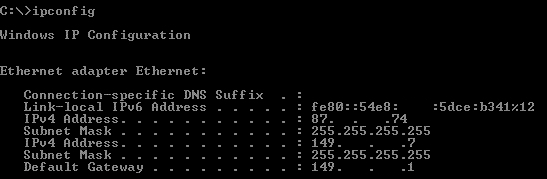
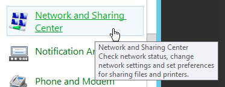
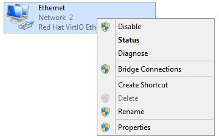
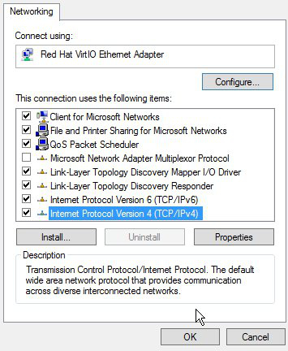
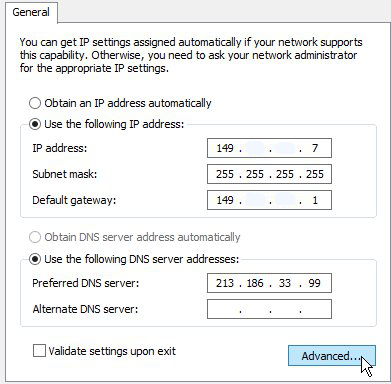
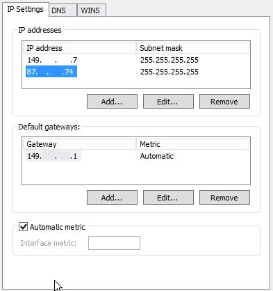

## Introduction
To maintain your instance in the long term, it would be a good idea to configure your failover IP addresses so that they are persistent. This way, you don't have to reconfigure it every time you restart. This guide explains how to configure a failover IP permanently on an instance.


### Requirements
- an OVH Public Cloud instance
- a failover IP imported on to the Public Cloud project
- SSH access to the server


## Configure the failover IP.

### For Debian/Ubuntu
- Edit the configuration file with the following command:

```bash
vi /etc/network/interfaces
```

- Add to the end of the file:

```bash
auto ethX:Y
iface ethX:Y inet static
        address xxx.xxx.xxx.xxx
        netmask 255.255.255.255
        broadcast xxx.xxx.xxx.xxx
```


|Settings|Values|
|---|---|
|X|primary interface number (usually eth0)|
|xxx.xxx.xxx.xxx|failover IP to configure|
|Y|alias number (starting from 0, then 1, etc., depending on the number of IPs to configure)|

Values


> [!success]
>
> If you need to add several IPs, always add them on the same lines
> by incrementing the Y value (alias number).
> 

- Restart the network services with the following command:

```bash
service networking restart
```


### For CentOS/Fedora
- Edit the configuration file with the following command:

```bash
vi /etc/sysconfig/network-scripts/ifcfg-ethX:Y
```


|Settings|Values|
|---|---|
|X|primary interface number (usually eth0)|
|Y|alias number (starting from 0, then 1, etc., depending on the number of IPs to configure)|

- Add the following into the file:

```bash
DEVICE="ethX:Y"
BOOTPROTO=static
IPADDR="xxx.xxx.xxx.xxx"
NETMASK="255.255.255.255"
BROADCAST="xxx.xxx.xxx.xxx"
ONBOOT=yes
```

- Restart the network services with the following command:

```bash
ifup ethX:Y
```


### For Windows
Windows does not accept the failover IP address configuration in addition to the primary IP address configuration in DHCP. You will need to reconfigure your network adapter with a manually supplied IP.

- Retrieve the network information using "ipconfig":


{.thumbnail}

- Go to the Windows Control Panel, then to Network and Sharing Center, and share:


{.thumbnail}

- Change the adapter’s settings:


{.thumbnail}

- Access your interface properties:


{.thumbnail}

- Access the TCP/IPv4 protocol configuration


{.thumbnail}

- Switch your configuration to manual, and use a configuration similar to the one shown below by entering the IP addresses you retrieved using "ipconfig". Next, click “Advanced”:


{.thumbnail}

- Add your failover IP as follows:


{.thumbnail}