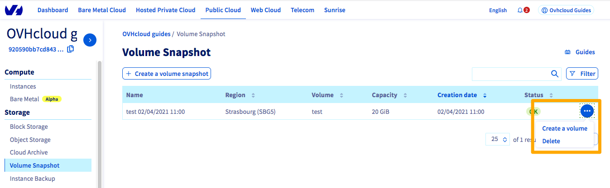
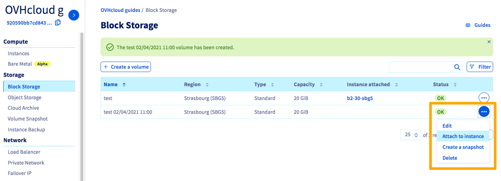
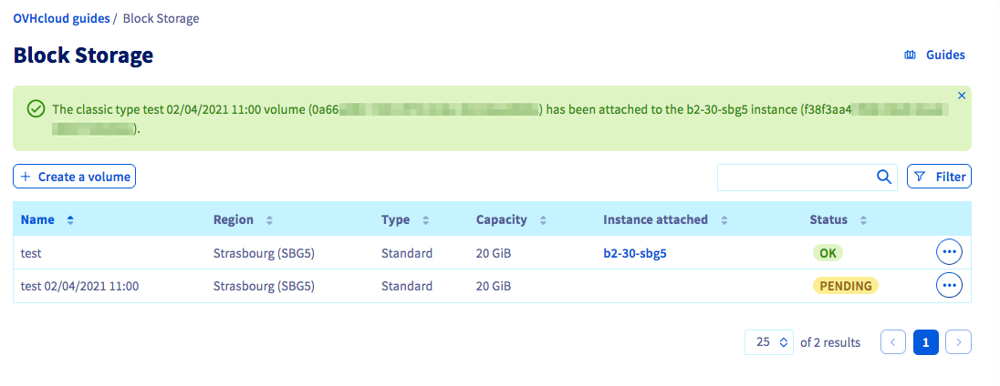

> [!primary]
> Esta traducción ha sido generada de forma automática por nuestro partner SYSTRAN. En algunos casos puede contener términos imprecisos, como en las etiquetas de los botones o los detalles técnicos. En caso de duda, le recomendamos que consulte la versión inglesa o francesa de la guía. Si quiere ayudarnos a mejorar esta traducción, por favor, utilice el botón «Contribuir» de esta página.
> 

**Última actualización: 02/04/2021**

## Objetivo

Puede crear discos adicionales para sus instancias de Public Cloud guardando un disco adicional.

Esto puede ser útil en los siguientes casos:

- Si desea restaurar los datos del disco adicional.
- Si desea disponer de un espacio de almacenamiento de alta disponibilidad y buen rendimiento con sus datos.
- Si desea transferir sus datos a otra instancia.

**Cómo crear y configurar un disco adicional en una de sus instancias desde la copia de seguridad de un disco.**

## Requisitos

- Estar conectado al [área de cliente de OVHcloud](https://www.ovh.com/auth/?action=gotomanager&from=https://www.ovh.es/&ovhSubsidiary=es){.external}.
- Tener una [instancia de Public Cloud](https://www.ovhcloud.com/es-es/public-cloud/){.external} en su cuenta de OVHcloud.
- Tener una copia de seguridad del disco en la misma región de OpenStack.
- Tener acceso a su instancia por SSH como administrador (root).

## Procedimiento

### Crear el disco a partir de un snapshot

Conéctese al [área de cliente de OVHcloud](https://www.ovh.com/auth/?action=gotomanager&from=https://www.ovh.es/&ovhSubsidiary=es), acceda a la sección `Public Cloud`{.action} y seleccione el proyecto de Public Cloud correspondiente. En la barra de navegación izquierda, haga clic en `Volume Snapshot`{.action} y seleccione `Storage`.

A la derecha de la copia de seguridad que desee, haga clic en el botón `...`{.action} y, seguidamente, en `Crear un volumen`{.action}.

{.thumbnail}

Asigne un nombre al nuevo disco y su capacidad y haga clic en `Crear volumen`{.action}.

{.thumbnail}

La creación del disco puede tardar unos minutos, en función del tamaño del mismo.

### Asociar el disco a una instancia

Una vez creado el disco, puede asociarlo a una instancia. Para ello, haga clic en `Block Storage`{.action} en la barra de navegación de la izquierda en `Storage`.

A la derecha del volumen que desee, haga clic en el botón `...`{.action} y, seguidamente, en `Asociar a la instancia`{.action}.

{.thumbnail}

A continuación, seleccione la instancia y haga clic en `Confirmar`{.action} para asociar el disco.

{.thumbnail}

El proceso de vinculación del disco a la instancia comenzará en ese momento y puede tardar unos minutos.

{.thumbnail}

> [!warning]
Debe evitar la navegación fuera de la pestaña en curso al asociar el disco. Esto puede interrumpir el proceso.
>

Una vez realizado el apego, puede seguir los siguientes pasos [en Linux](../crear_y_configurar_un_disco_adicional_en_una_instancia/#con-linux) o [Windows](../crear_y_configurar_un_disco_adicional_en_una_instancia/#con-windows).

## Más información

Interactúe con nuestra comunidad de usuarios en <https://community.ovh.com/en/>.
