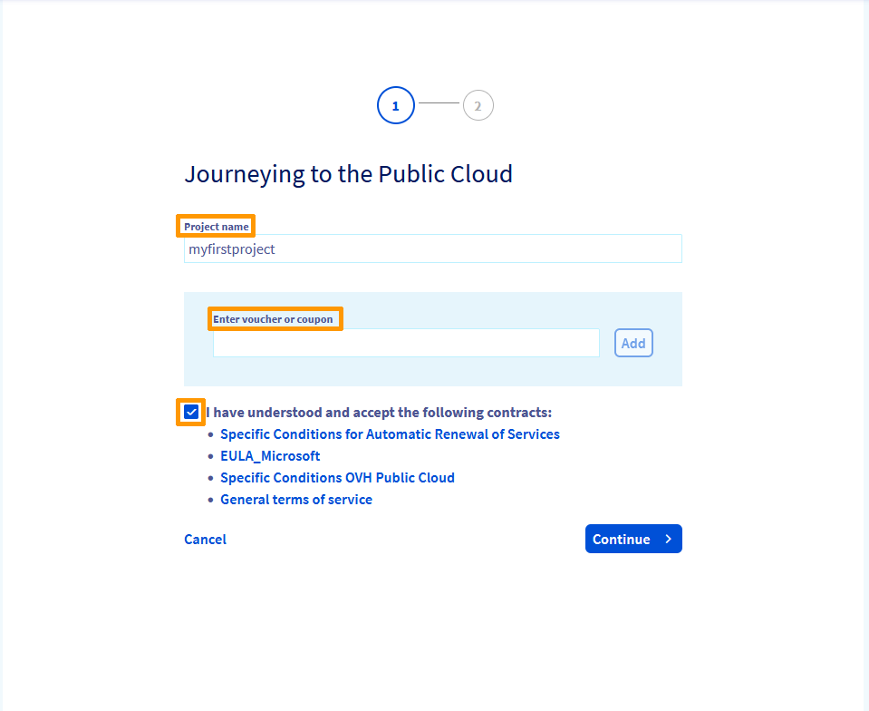
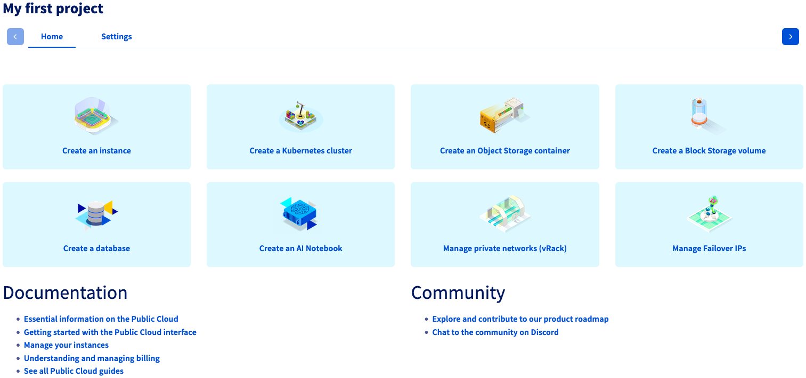

**Letzte Aktualisierung am 12.10.2021**

> [!primary]
> Diese Übersetzung wurde durch unseren Partner SYSTRAN automatisch erstellt. In manchen Fällen können ungenaue Formulierungen verwendet worden sein, z.B. bei der Beschriftung von Schaltflächen oder technischen Details. Bitte ziehen Sie beim geringsten Zweifel die englische oder französische Fassung der Anleitung zu Rate. Möchten Sie mithelfen, diese Übersetzung zu verbessern? Dann nutzen Sie dazu bitte den Button «Mitmachen» auf dieser Seite.
>

## Ziel

Das Erstellen eines Projekts ist die Voraussetzung, um [Public Cloud Instanzen](https://www.ovhcloud.com/de/public-cloud/) verwenden zu können.

**Diese Anleitung erklärt die Schritte zur Erstellung Ihres ersten Public Cloud Projekts.**

## Voraussetzungen

- Sie haben Zugriff auf Ihr [OVHcloud Kundencenter](https://www.ovh.com/auth/?action=gotomanager&from=https://www.ovh.de/&ovhSubsidiary=de).

## In der praktischen Anwendung

Loggen Sie sich in Ihrem [OVHcloud Kundencenter](https://www.ovh.com/auth/?action=gotomanager&from=https://www.ovh.de/&ovhSubsidiary=de) ein. Klicken Sie oben auf der Seite auf `Public Cloud`{.action} und klicken Sie auf `Erstellen Sie Ihr erstes OVH Public Cloud Projekt`{.action}.

Sie können jetzt einen Gutschein hinzufügen, falls vorhanden. Beachten Sie, dass Gutscheine niederlassungsabhängig sind (OVHcloud Subsidiary).

> [!warning]
> Wenn Sie bereits ein Public Cloud-Projekt in Ihrem Konto erstellt und gelöscht haben, können Sie den Gutschein nicht verwenden.
>

Geben Sie Ihrem Projekt einen Namen, lesen Sie die Verträge und akzeptieren Sie sie, und klicken Sie dann auf `Weiter`{.action}.

{.thumbnail}

Im zweiten Schritt können Sie **eine Zahlungsart hinterlegen**, falls Sie noch keine haben. Dies ist auch zur Beantragung eines Gutscheins notwendig.

Wählen Sie eine Zahlungsart aus und klicken Sie dann auf `Hinzufügen`{.action}.

{.thumbnail}

Anschließend startet die Projekterstellung.

{.thumbnail}

Sobald der Prozess abgeschlossen ist, steht Ihr neues Public Cloud Projekt im Bereich `Public Cloud`{.action} Ihres OVHcloud Kundencenters zur Verfügung.

{.thumbnail}

## Weiterführende Informationen

Für den Austausch mit unserer User Community gehen Sie auf <https://community.ovh.com/en/>.
