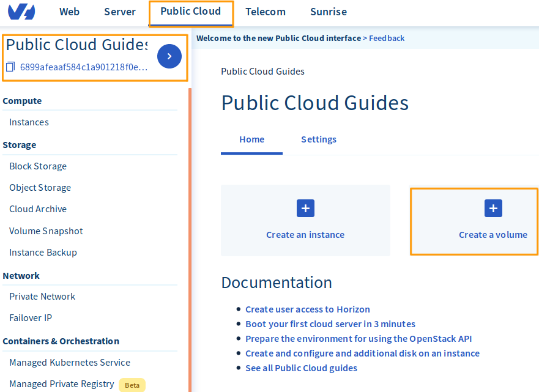
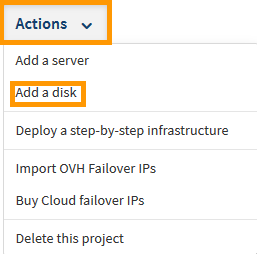
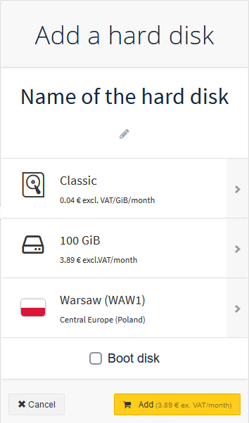
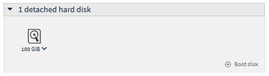
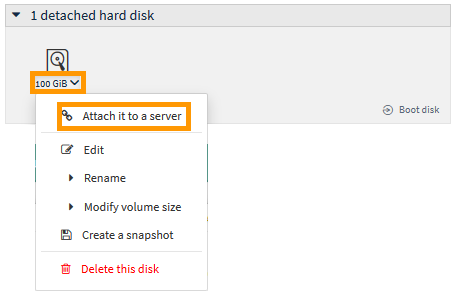
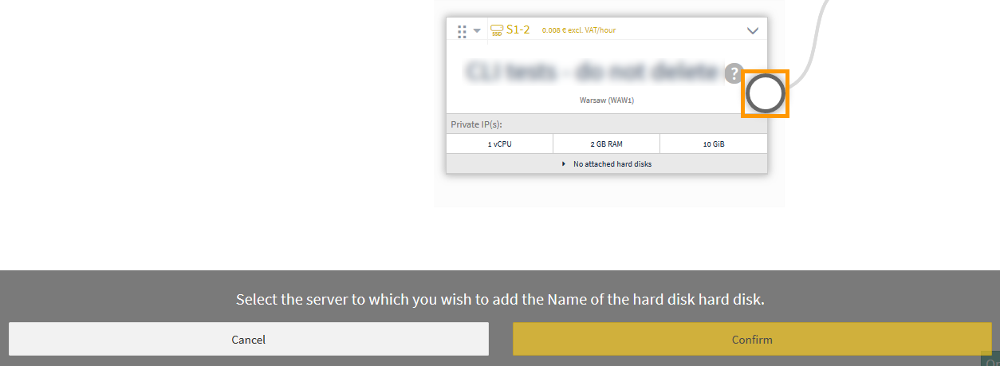
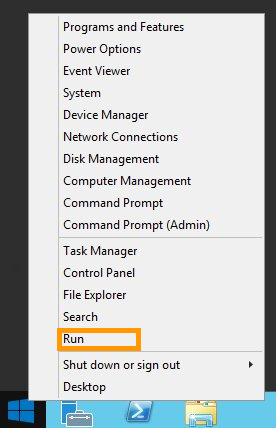
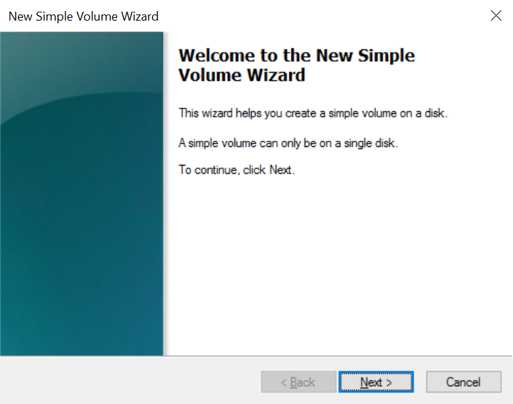
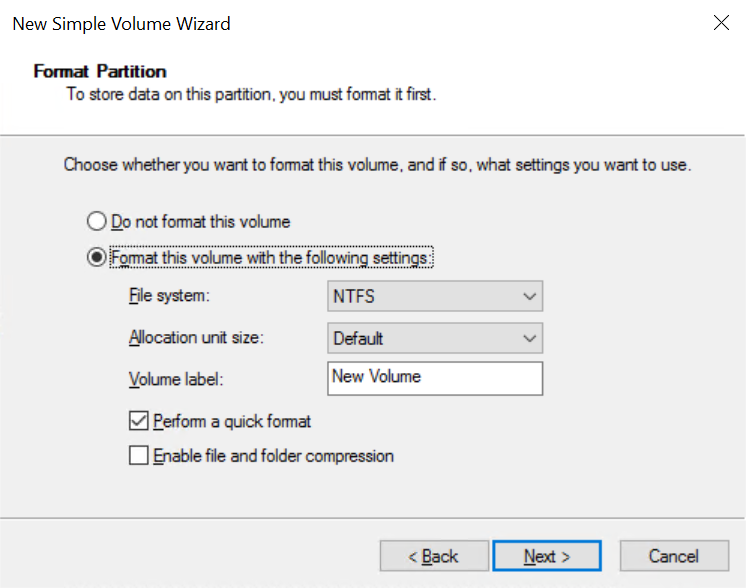

**Letzte Aktualisierung am 09.01.2020**

## Ziel

Es ist möglich, zusätzliche Festplatten für Ihre OVHcloud Public Cloud Instanzen zu erstellen. Das kann in folgenden Fällen hilfreich sein:

- Sie möchten Ihre Speicherkapazität erhöhen, ohne das Instanzmodell zu verändern.
- Sie benötigen hochverfügbaren und leistungsfähigen Speicherplatz.
- Sie möchten sowohl Ihren Storage als auch Ihre Daten in eine andere Instanz verschieben.

**In dieser Anleitung wird erläutert, wie Sie einer Public Cloud Instanz eine zusätzliche Festplatte hinzufügen und diese konfigurieren.**

## Voraussetzungen

- Sie haben Zugriff auf Ihr [OVHcloud Kundencenter](https://www.ovh.com/auth/?action=gotomanager).
- Sie verfügen über eine [Public Cloud-Instanz](https://www.ovhcloud.com/de/public-cloud).
- Sie haben administrativen Zugriff (Root) auf Ihre Instanz über SSH (nur Linux).
- Sie haben Administratorzugriff auf Ihre Instanz über RDP (nur Windows).

## In der praktischen Anwendung

Loggen Sie sich in Ihrem [OVHcloud Kundencenter](https://www.ovh.com/auth/?action=gotomanager) ein und klicken Sie Sie oben auf der Seite auf `Public Cloud`{.action}. Wählen Sie links zunächst das Projekt aus, in dem Sie die Festplatte erstellen möchten.

Klicken Sie hier auf die Schaltfläche `Volume erstellen`{.action}.

{.thumbnail}

Konfigurieren Sie nun die Optionen für den Volume-Typ, die Festplattengröße und den Speicherort. Sobald Sie den Vorgang abgeschlossen haben, bestätigen Sie mit `Volume erstellen`{.action}.

{.thumbnail}

Das neue Volume wird jetzt in Ihrem OVHcloud Kundencenter angezeigt.

{.thumbnail}

Um die Festplatte an eine Instanz anzuhängen, klicken Sie rechts auf `...`{.action} und dann `Mit Instanz verbinden`{.action}

{.thumbnail}

Wählen Sie jetzt die Instanz und klicken Sie auf die Schaltfläche `Bestätigen`{.action}, um die Festplatte anzuhängen.

{.thumbnail}

Das Verbinden der Festplatte mit Ihrer Instanz wird nun gestartet. Es kann einige Minuten dauern, bis der Vorgang abgeschlossen ist.

{.thumbnail}

> [!warning]
Achten Sie darauf, nicht vom aktuellen Bereich weg zu navigieren, während die Festplatte angehängt wird. Der Vorgang könnte unterbrochen werden.
>

### Unter Linux

Stellen Sie zunächst eine SSH-Verbindung zu Ihrer Instanz her und verwenden Sie dann den folgenden Befehl, um die Festplatten der Instanz aufzulisten.

```
# admin@serveur-1:~$ lsblk

NAME MAJ:MIN RM SIZE RO TYPE MOUNTPOINT
vda 254:0 0 10G 0 disk
└─vda1 254:1 0 10G 0 part /
vdb 254:16 0 10G 0 disk

```

> [!primary]
>
VDA bezieht sich normalerweise auf die Standardfestplatte Ihrer Instanz. VDB bezieht sich auf die zusätzliche Festplatte.
>

Als nächstes erstellen Sie eine Partition auf der zusätzlichen Festplatte mithilfe des folgenden Befehls.

```
# admin@serveur-1:~$ sudo fdisk /dev/vdb

Welcome to fdisk (util-linux 2.25.2).
Changes will remain in memory only, until you decide to write them.
Be careful before using the write command.

Device does not contain a recognized partition table.
Created a new DOS disklabel with disk identifier 0x95c4adcc.
```


```
Command (m for help): n

Partition type
p primary (0 primary, 0 extended, 4 free)
e extended (container for logical partitions)
Select (default p):
Using default response p.
Partition number (1-4, default 1):
First sector (2048-20971519, default 2048):
Last sector, +sectors or +size{K,M,G,T,P} (2048-20971519, default 20971519):

Created a new partition 1 of type 'Linux' and of size 10 GiB.

```


```
Command (m for help): w

The partition table has been altered.
Calling ioctl() to re-read partition table.
Syncing disks.
```

Anschließend formatieren Sie die Partition mit dem folgenden Befehl:

```
# admin@serveur-1:~$ sudo mkfs.ext4 /dev/vdb1
mke2fs 1.42.12 (29-Aug-2014)
Creating filesystem with 2621184 4k blocks and 655360 inodes
Filesystem UUID: 781be788-c4be-462b-b946-88429a43c0cf
Superblock backups stored on blocks:
32768, 98304, 163840, 229376, 294912, 819200, 884736, 1605632

Allocating group tables: done
Writing inode tables: done
Creating journal (32768 blocks): done
Writing superblocks and filesystem accounting information: done
```

Als nächstes mounten Sie die Partition:

```
admin@serveur-1:~$ sudo mkdir /mnt/disk
admin@serveur-1:~$ sudo mount /dev/vdb1 /mnt/disk/
```


Schließlich überprüfen Sie den Mountpoint mit dem nachfolgendem Befehl: 

```
admin@serveur-1:~$ df -h

Filesystem Size Used Avail Use% Mounted on
/dev/vda1 9.8G 840M 8.6G 9% /
udev 10M 0 10M 0% /dev
tmpfs 393M 5.2M 388M 2% /run
tmpfs 982M 0 982M 0% /dev/shm
tmpfs 5.0M 0 5.0M 0% /run/lock
tmpfs 982M 0 982M 0% /sys/fs/cgroup
/dev/vdb1 9.8G 23M 9.2G 1% /mnt/disk
```

Wenn Sie einen dauerhaften Mountpoint erstellen möchten, müssen Sie die /etc/fstab bearbeiten. Verwenden Sie zuerst den folgenden Befehl, um die Block-ID abzurufen.

```
admin@serveur-1:~$ sudo blkid

/dev/vda1: UUID="51ba13e7-398b-45f3-b5f3-fdfbe556f62c" TYPE="ext4" PARTUUID="000132ff-01"
/dev/vdb1: UUID="2e4a9012-bf0e-41ef-bf9a-fbf350803ac5" TYPE="ext4" PARTUUID="95c4adcc-01"
```

Mit der ID können Sie die Datei /etc/fstab entsprechend anpassen:

```
admin@serveur-1:~$ vim /etc/fstab

/etc/fstab: static file system information.

# Use 'blkid' to print the universally unique identifier for a
# device; this may be used with UUID= as a more robust way to name devices
# that works even if disks are added and removed. See fstab(5).
#
# <file system> <mount point> <type> <options> <dump> <pass>
UUID=51ba13e7-398b-45f3-b5f3-fdfbe556f62c / ext4 defaults 0 0
UUID=2e4a9012-bf0e-41ef-bf9a-fbf350803ac5 /mnt/disk ext4 nofail 0 0
```

### Unter Windows

Wenn Sie sich angemeldet haben, öffnen Sie mit einem Rechtsklick auf das Windows-Symbol das Kontextmenü und wählen Sie dann `Datenträgerverwaltung`{.action}.

{.thumbnail}

Im Datenträgerverwaltungstool wird Ihre neue Festplatte wie im Bild zu sehen als unbekanntes Volume mit nicht zugewiesenem Speicherplatz angezeigt.

{.thumbnail}

#### Initialisieren der Festplatte mit der Datenträgerverwaltung

Wenn die Festplatte als “Offline” angezeigt wird, liegt das wahrscheinlich an einer die Instanz betreffenden Richtlinie. In diesem Fall klicken Sie mit der rechten Maustaste auf die Festplatte und wählen Sie “Online”.

{.thumbnail}

Klicken Sie dann erneut mit der rechten Maustaste und wählen Sie diesmal `Datenträgerinitialisierung`{.action}.

{.thumbnail}

Als nächstes wählen Sie `MBR`{.action} und klicken Sie auf `OK`{.action}.

{.thumbnail}

#### Initialisierung der Festplatte mithilfe von DISKPART

Öffnen Sie mit einem Rechtsklick auf das Windows-Symbol das Kontextmenü und wählen Sie dann `Ausführen`{.action}.

{.thumbnail}

Als nächstes geben Sie `cmd` in die Eingabeaufforderung ein und klicken Sie auf `OK`{.action}

{.thumbnail}

Geben Sie in der Kommandozeile den folgenden Befehl ein, um das Programm DISKPART zu öffnen.

```
C:\> diskpart
```

Danach ändern Sie die SAN Policy mit den folgenden Befehlen.

```
DISKPART> san

SAN Policy : Offline Shared
```

```
DISKPART> san policy = OnlineAll

DiskPart successfully changed the SAN policy for the current operating system . [/ Code]

- Implementation of the strategy on the extra disk:
[Code] DISKPART> list disk

Disk ### Status Size Free Dyn Gpt
-------- ------------- ------- ------- --- ---
Disk 0 Online 200 GB 0 B
* Disk 1 Offline 10 GB 1024 KB
```

```
DISKPART> select disk 1

Disk 1 is now the selected disk.
```

```
DISKPART> attributes disk clear readonly

Disk attributes cleared successfully.
```

```
DISKPART> attributes disk

Current Read-only State : No
Read-only : No
Boot Disk : No
Pagefile Disk : No
Hibernation File Disk : No
Crashdump Disk : No
Clustered Disk : No
```

```
DISKPART> online disk

DiskPart successfully onlined the selected disk.
```

#### Die Festplatte formatieren

Öffnen Sie die Datenträgerverwaltung erneut, klicken Sie mit der rechten Maustaste auf den Datenträger, und danach auf`Neues einfaches Volume...`{.action}

{.thumbnail}

Klicken Sie im Wizard auf `Weiter`{.action}.

{.thumbnail}

Konfigurieren Sie nun die gewünschte Festplattengröße. Normalerweise sollte diese 100% des verfügbaren Speichers einnehmen. Anschließend klicken Sie auf `Weiter`{.action}.

{.thumbnail}

Wählen Sie aus der Dropdown-Liste einen Laufwerksbuchstaben aus und klicken Sie dann auf`Weiter`{.action}.

{.thumbnail}

Wählen Sie die gewünschten Optionen für den Datenträger aus und klicken Sie dann auf `Weiter`{.action}, um den Formatierungsvorgang auszuführen.

{.thumbnail}

Schließlich klicken Sie auf `Fertigstellen`{.action}, um den Vorgang abzuschließen.

{.thumbnail}

Sobald die Festplatte formatiert ist, können Sie einfach über den Datei-Explorer darauf zugreifen.

## Weiterführende Informationen

Für den Austausch mit unserer User Community gehen Sie auf  <https://community.ovh.com/en/>.