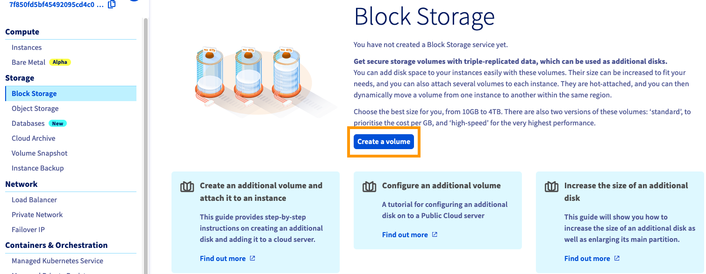
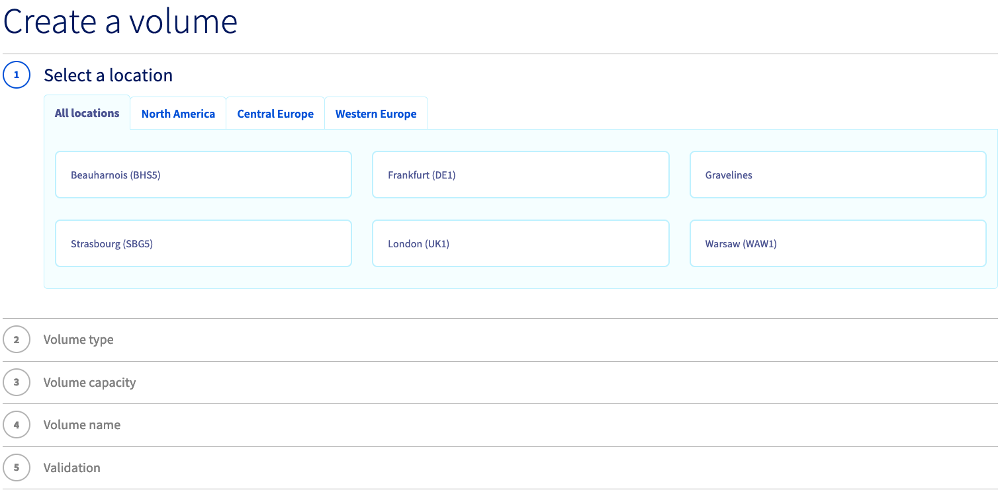
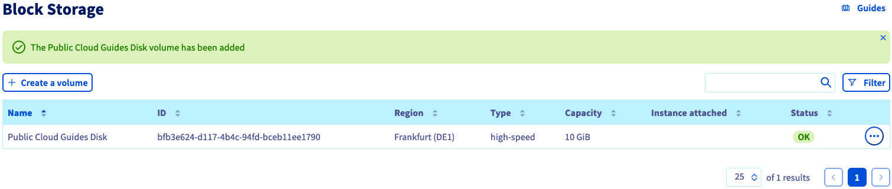

**Last updated 8th December 2021**

## Objective

It is possible to create additional disks for your Public Cloud instances.
This can be useful in cases where:

- You want to increase your storage capacity without changing the instance model.
- You want to have a highly available, high-performance storage.
- You want to move your storage as well as your data to another instance.

**This guide explains how to create an additional disk and configure it on your instance.**

## Requirements

- Access to the [OVHcloud Control Panel](https://www.ovh.com/auth/?action=gotomanager&from=https://www.ovh.co.uk/&ovhSubsidiary=GB)
- A [Public Cloud Instance](https://www.ovhcloud.com/en-gb/public-cloud/) in your OVHcloud account
- Administrative (root) access to your instance via SSH (Linux) or RDP (Windows)

## Instructions

### Attaching a new volume

Log in to the [OVHcloud Control Panel](https://www.ovh.com/auth/?action=gotomanager&from=https://www.ovh.co.uk/&ovhSubsidiary=GB) and open your `Public Cloud`{.action} project. Then open `Block Storage`{.action} in the left-hand menu.

In this section, click on the button `Create a volume`{.action}.

{.thumbnail}

Follow the configuration steps in order to select options for location, disk type and disk capacity. Then enter a name for the volume and confirm by clicking on `Create the volume`{.action}.

{.thumbnail}

The new disk will now be displayed in the Control Panel.

{.thumbnail}

To the right of the volume, click on the `...`{.action} button, then select `Attach to instance`{.action}.

{.thumbnail}

In the popup window, choose an instance from the list and click on `Confirm`{.action} to attach the disk.

{.thumbnail}

The process of attaching the disk to your instance will now begin. This may take a few minutes to complete.

> [!warning]
Make sure to not leave the current page in your OVHcloud Control Panel while the disk is being attached. This might interrupt the process.
>

### Configuring the new disk

The examples below presume you are logged in as a user with elevated permissions.

#### Using Linux

Establish an [SSH connection to your instance](../public-cloud-first-steps/#connect-to-instance), then use the command below to list the attached disks.

```bash
~$ admin@server-1:~$ lsblk

NAME MAJ:MIN RM SIZE RO TYPE MOUNTPOINT
vda 254:0 0 10G 0 disk
└─vda1 254:1 0 10G 0 part /
vdb 254:16 0 10G 0 disk
```

> [!primary]
>
`vda` in this example refers to the default disk of the instance. The additional disk will then be labelled `vdb`.
>

Create a partition on the additional disk using the commands below.

```bash
~$ admin@server-1:~$ sudo fdisk /dev/vdb

Welcome to fdisk (util-linux 2.25.2).
Changes will remain in memory only, until you decide to write them.
Be careful before using the write command.

Device does not contain a recognized partition table.
Created a new DOS disklabel with disk identifier 0x95c4adcc.
```

```bash
Command (m for help): n

Partition type
p primary (0 primary, 0 extended, 4 free)
e extended (container for logical partitions)
Select (default p):
Using default response p.
Partition number (1-4, default 1):
First sector (2048-20971519, default 2048):
Last sector, +sectors or +size{K,M,G,T,P} (2048-20971519, default 20971519):

Created a new partition 1 of type 'Linux' and of size 10 GiB.
```

```bash
Command (m for help): w

The partition table has been altered.
Calling ioctl() to re-read partition table.
Syncing disks.
```

Next, format the new partition `vdb1` using the command below.

```bash
~$ admin@server-1:~$ sudo mkfs.ext4 /dev/vdb1
mke2fs 1.42.12 (29-Aug-2014)
Creating filesystem with 2621184 4k blocks and 655360 inodes
Filesystem UUID: 781be788-c4be-462b-b946-88429a43c0cf
Superblock backups stored on blocks:
32768, 98304, 163840, 229376, 294912, 819200, 884736, 1605632

Allocating group tables: done
Writing inode tables: done
Creating journal (32768 blocks): done
Writing superblocks and filesystem accounting information: done
```

Mount the partition with the following commands:

```bash
admin@server-1:~$ sudo mkdir /mnt/disk
admin@server-1:~$ sudo mount /dev/vdb1 /mnt/disk/
```

Finally, check the mount point using this command:

```bash
~$ admin@server-1:~$ df -h

Filesystem Size Used Avail Use% Mounted on
/dev/vda1 9.8G 840M 8.6G 9% /
udev 10M 0 10M 0% /dev
tmpfs 393M 5.2M 388M 2% /run
tmpfs 982M 0 982M 0% /dev/shm
tmpfs 5.0M 0 5.0M 0% /run/lock
tmpfs 982M 0 982M 0% /sys/fs/cgroup
/dev/vdb1 9.8G 23M 9.2G 1% /mnt/disk
```

> [!primary]
>
The mounting is not persistent because the disk will be detached when the instance reboots. In order to automate the mounting process, the `fstab` file needs to be edited.
>

First, retrieve the UUID (block ID) of the new volume:

```bash
~$ admin@server-1:~$ sudo blkid

/dev/vda1: UUID="51ba13e7-398b-45f3-b5f3-fdfbe556f62c" TYPE="ext4" PARTUUID="000132ff-01"
/dev/vdb1: UUID="2e4a9012-bf0e-41ef-bf9a-fbf350803ac5" TYPE="ext4" PARTUUID="95c4adcc-01"
```

Open `/etc/fstab` with a text editor:

```
~$ sudo nano /etc/fstab
```

Add the line below to the file and replace the UUID with your own:

```console
UUID=2e4a9012-bf0e-41ef-bf9a-fbf350803ac5 /mnt/disk ext4 nofail 0 0
```

Save and exit the editor. The disk should be automatically mounted after every reboot from now on.


#### Using Windows

Establish a remote desktop (RDP) connection to your Windows instance.

Once logged in, right-click on the `Start Menu`{.action} button and open `Disk Management`{.action}.

{.thumbnail}

The new disk will be displayed as an unknown volume with unallocated space.

{.thumbnail}

If the disk is marked as offline here, it needs to be initialised first. You can use the [Windows GUI](#initDiskManagement) or the [DISKPART utility](#initDiskpart) to achieve this. Otherwise, proceed with [formatting the disk in Disk Management](#formatDiskManagement).

##### **Initialising the disk in Disk Management** <a name="initDiskManagement"></a>

Right-click on the disk and select `Online`{.action}. 

If the disk is marked as offline here, this is likely due to a policy in place on the instance. To fix this, right-click on the disk and select `Online`{.action}.

{.thumbnail}

Then right-click it again and this time select `Initialise Disk`{.action}.

{.thumbnail}

Next, select `MBR`{.action} and click `OK`{.action}.

{.thumbnail}

##### **Initialising the disk with DISKPART** <a name="initDiskpart"></a>

Right-click on the `Start Menu`{.action} button and open `Run`{.action}.

{.thumbnail}

Type `cmd` and click `OK`{.action} to open the command line application.

{.thumbnail}

At the command prompt, open DISKPART:

```
C:\> diskpart
```

Use the following series of DISKPART commands to set the disk to `online`:

```
DISKPART> san

SAN Policy : Offline Shared
```

```
DISKPART> san policy = OnlineAll

DiskPart successfully changed the SAN policy for the current operating system .

- Implementation of the strategy on the extra disk:
[Code] DISKPART> list disk

Disk ### Status Size Free Dyn Gpt
-------- ------------- ------- ------- --- ---
Disk 0 Online 200 GB 0 B
* Disk 1 Offline 10 GB 1024 KB
```

``` 
DISKPART> select disk 1

Disk 1 is now the selected disk.
```

```
DISKPART> attributes disk clear readonly

Disk attributes cleared successfully.
```

```
DISKPART> attributes disk

Current Read-only State : No
Read-only : No
Boot Disk : No
Pagefile Disk : No
Hibernation File Disk : No
Crashdump Disk : No
Clustered Disk : No
```

```
DISKPART> online disk

DiskPart successfully onlined the selected disk.
```

##### **Formatting the disk** <a name="formatDiskManagement"></a>

In `Disk Management`{.action}, right-click on the new disk and select `New Simple Volume...`{.action}.

{.thumbnail}

In the wizard, click `Next`{.action} to specify the volume size. It should be set to maximum by default. Click `Next`{.action} to continue.

{.thumbnail}

Leave the new drive letter at default or select a different one, then click `Next`{.action}.

{.thumbnail}

Label the volume (optional) and confirm the formatting options by clicking `Next`{.action}.

{.thumbnail}

In the last window, click `Finish`{.action} to format the disk.

{.thumbnail}

The disk will be available as a drive in File Explorer after the operation.


### Detaching a volume

If you wish to detach a volume from your instance, the best practice is to unmount the volume from within the instance before detaching it from your control panel.

Establish an [SSH connection to your instance](../public-cloud-first-steps/#connect-to-instance), then use the command below to list the attached disks.

```bash
~$ admin@server-1:~$ lsblk

NAME MAJ:MIN RM SIZE RO TYPE MOUNTPOINT
vda 254:0 0 10G 0 disk
└─vda1 254:1 0 10G 0 part /
vdb       8:0    0   10G  0 disk
└─vdb1    8:1    0   10G  0 part /mnt/disk
```

Unmount the partition using the command below:

```bash
~$ admin@server-1:~$ sudo umount /dev/sdb1
```

Remove the device ID from the fstab to complete the unmount process, if this is not done, the partition will be mounted right back after a reboot.

```bash
~$ admin@server-1:~$ sudo nano /etc/fstab
``` 


## Go further

Join our community of users on <https://community.ovh.com/en/>.
