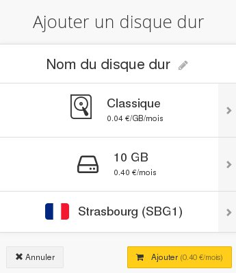
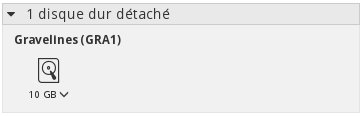
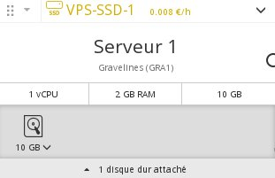
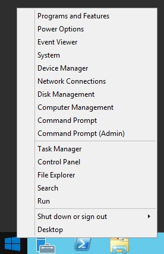
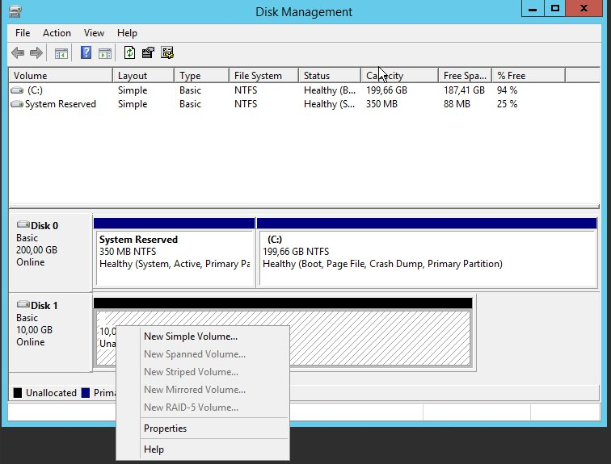

## 
Voit luoda lisälevyä Public Cloud intansseja varten. Tämä voi olla hyödyllistä jos:

- Haluat kasvataa tallennuskapasiteettia muuttamatta kuitenkaan instanssimallia.
- Haluat suorituskykyisen ja korkean käytettävyyden tallennustilan.
- Haluat siirtää tallennustilasi sekä sen sisältämät tiedot toiseen instanssiin.


Tässä ohjeessa kerrotaan, kuinka luot lisälevyn ja konfiguroit sen yhdelle instansseistasi.


## Edellytykset

- Instanssi


## 

- Kirjaudu [hallintapaneeliin](https://www.ovh.com/manager/cloud/)
- Klikkaa painiketta "Lisää" ja valitse "Lisää levy"


{.thumbnail}
Tässä uudessa valikossa voit:

- Nimetä levyn
- Valita levyn tyypin:

|Klassinen|Taattu 200 IOPS|
|High performance|Jopa 3000 IOPS|


- Valita levyn kapasiteetin: alkaen 10 GB
- Valita levyn alueen
- Vahvistaa levyn luomisen


Näkyviin tulee uusi ikkuna, jossa levysi näkyy:

{.thumbnail}
Seuraavaksi voit liittää lisälevysi instanssiin:

- Raahamalla levyn instanssiin
- Klikkaamalla nuolta levyn alaoikealla ja valitsemalla "Liitä palvelimeen".


Kun tämä on tehty, levy näkyy instanssisi alapuolella:

{.thumbnail}


## Linux-instanssissa

- Listaa levyt

```
admin@serveur-1:~$ lsblk

NAME MAJ:MIN RM SIZE RO TYPE MOUNTPOINT
vda 254:0 0 10G 0 disk
└─vda1 254:1 0 10G 0 part /
vdb 254:16 0 10G 0 disk
```


VDA vastaa normaalisti instanssin levyä, VDB on siis lisälevy.

- Osiojaon tekeminen

```
admin@serveur-1:~$ sudo fdisk /dev/vdb

Welcome to fdisk (util-linux 2.25.2).
Changes will remain in memory only, until you decide to write them.
Be careful before using the write command.

Device does not contain a recognized partition table.
Created a new DOS disklabel with disk identifier 0x95c4adcc.
```


code]Command (m for help): n

Partition type
p primary (0 primary, 0 extended, 4 free)
e extended (container for logical partitions)
Select (default p):
Using default response p.
Partition number (1-4, default 1):
First sector (2048-20971519, default 2048):
Last sector, +sectors or +size{K,M,G,T,P} (2048-20971519, default 20971519):

Created a new partition 1 of type 'Linux' and of size 10 GiB.[/code]


```
Command (m for help): w

The partition table has been altered.
Calling ioctl() to re-read partition table.
Syncing disks.
```


- Muokkaa osiojaon formaattia:

code]admin@serveur-1:~$ sudo mkfs.ext4 /dev/vdb1
mke2fs 1.42.12 (29-Aug-2014)
Creating filesystem with 2621184 4k blocks and 655360 inodes
Filesystem UUID: 781be788-c4be-462b-b946-88429a43c0cf
Superblock backups stored on blocks:
32768, 98304, 163840, 229376, 294912, 819200, 884736, 1605632

Allocating group tables: done
Writing inode tables: done
Creating journal (32768 blocks): done
Writing superblocks and filesystem accounting information: done[/code]


- Alusta osiojako

```
admin@serveur-1:~$ sudo mkdir /mnt/disk
admin@serveur-1:~$ sudo mount /dev/vdb1 /mnt/disk/
```


- Alustuksen tarkistus

code]
admin@serveur-1:~$ df -h

Filesystem Size Used Avail Use% Mounted on
/dev/vda1 9.8G 840M 8.6G 9% /
udev 10M 0 10M 0% /dev
tmpfs 393M 5.2M 388M 2% /run
tmpfs 982M 0 982M 0% /dev/shm
tmpfs 5.0M 0 5.0M 0% /run/lock
tmpfs 982M 0 982M 0% /sys/fs/cgroup
/dev/vdb1 9.8G 23M 9.2G 1% /mnt/disk
[/code]
Pysyvän levyn alustusta varten on muokattava tiedostoa /etc/fstab:


- Hae lohkon ID

```
admin@serveur-1:~$ sudo blkid

/dev/vda1: UUID="51ba13e7-398b-45f3-b5f3-fdfbe556f62c" TYPE="ext4" PARTUUID="000132ff-01"
/dev/vdb1: UUID="2e4a9012-bf0e-41ef-bf9a-fbf350803ac5" TYPE="ext4" PARTUUID="95c4adcc-01"
```


- Lisää levysi tiedostoon /etc/fstab:  

```
admin@serveur-1:~$ vim /etc/fstab

/etc/fstab: static file system information.

# Use 'blkid' to print the universally unique identifier for a
# device; this may be used with UUID= as a more robust way to name devices
# that works even if disks are added and removed. See fstab(5).
#
# <file system> <mount point> <type> <options> <dump> <pass>
UUID=51ba13e7-398b-45f3-b5f3-fdfbe556f62c / ext4 defaults 0 0
UUID=2e4a9012-bf0e-41ef-bf9a-fbf350803ac5 /mnt/disk ext4 nofail 0 0
```


## Windows-instanssissa

- Mene levyn hallintatyökaluun


{.thumbnail}

- Formatoi levy


{.thumbnail}
Huom:
Jos näkyyviin tulee viesti "offline (the disk is offline because of policy set by an administrator)" täytyy muokata levyjen atribuutteja klikkaamalla levyn kohdalla hiiren oikeaa näppäintä ja valitsemalla "Online" ja sitten "Intialize" tai käyttämällä Diskpartia: 


- Käynnistä Powershell tai komentokutsu
- Sovellettavan strategian tarkistus:

```
PS C:\> diskpart
DISKPART> san

SAN Policy : Offline Shared
```


- Muuta strategiaa:

```
DISKPART> san policy=OnlineAll

DiskPart successfully changed the SAN policy for the current operating system.
```


- Strategian soveltaminen lisälevyllä:

```
DISKPART> list disk

Disk ### Status Size Free Dyn Gpt
-------- ------------- ------- ------- --- ---
Disk 0 Online 200 GB 0 B
* Disk 1 Offline 10 GB 1024 KB
```


```
DISKPART> select disk 1

Disk 1 is now the selected disk.
```


```
DISKPART> attributes disk clear readonly

Disk attributes cleared successfully.
```


```
DISKPART> attributes disk

Current Read-only State : No
Read-only : No
Boot Disk : No
Pagefile Disk : No
Hibernation File Disk : No
Crashdump Disk : No
Clustered Disk : No
```


```
DISKPART> online disk

DiskPart successfully onlined the selected disk.
```


- Alusta levy levyjen hallinnasta ja siirry sitten levyn formatointiin.


Kun levy on formatoitu, voi päästä siihen yksinkertaisesti tiedostohakijasta (file explorer).

{.thumbnail}


## 
[Paluu pilvituotteiden ohjeiden hakemistoon]({legacy}1785)

