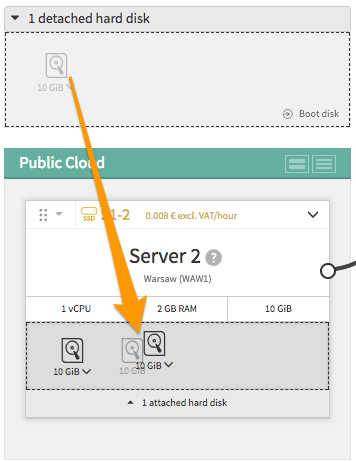
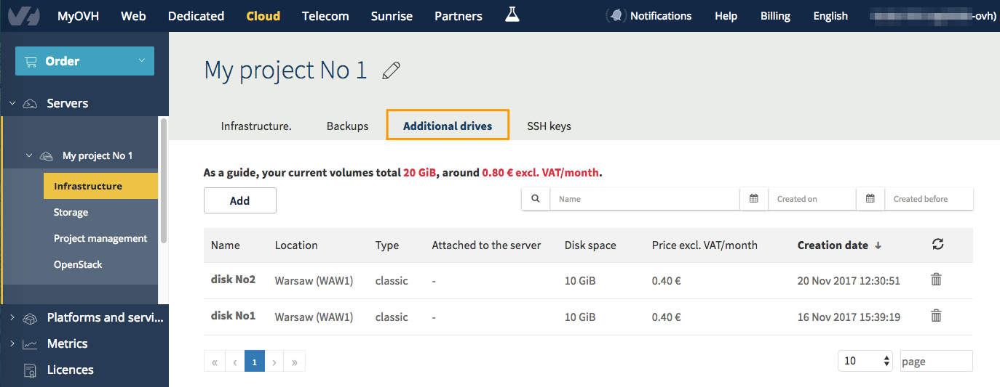
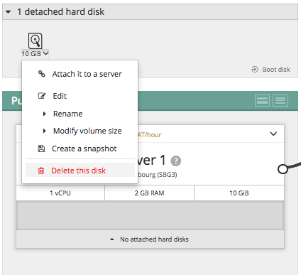

**Ostatnia aktualizacja dnia 2018-01-17**

## Wprowadzenie

Dodatkowe dyski (wolumeny) pozwalają  uzyskać dodatkową, większą przestrzeń dyskową bez konieczności zmiany modelu instancji. 
Do jednej instancji można podłączyć wiele dysków. Dyski i instancja muszą znajdować się w tym samym Regionie, aby mogły być ze sobą połączone.
Regionem jest miejsce alokacji instancji lub dysku i jest oznaczony na przykład jako: WAW1 dla Warszawy, SBG3 dla Strasburga. 
Wolumen można połączyć jednocześnie tylko z jedną instancją, ale można go przenosić pomiędzy instancjami (w ramach tego samego Reegionu).

## Wymagania początkowe

- Instancja Public Cloud
- Uruchomiona usługa vRack
- Utworzona sieć prywatna vLan w projekcie
- Projekt przypisany do usługi vRack

## W praktyce

### Tworzenie wolumenu
 
W menu po lewej stronie, rozwiń sekcję `Serwery`{.action} i wskaż odpowiedni Projekt.
Następnie, również w lewym menu, wybierz sekcję `Infrastruktura`{.action}. Na widocznym poniżej zrzucie ekranu zostały oznaczone potrzebne opcje i pola.

{.thumbnail}

Kliknij przycisk `Dodaj`{.action} i wybierz opcję `Dodaj dysk`{.action} (zaznaczenie nr 1) lub kliknij na przycisk oznaczony numerem 2 w polu dysków. Pojawi się okno konfiguracji wolumenu. Dostępne w nim opcje zostały przedstawione w kolejnym akapicie. Zaznaczenie nr 3 wskazuje zakładkę zarządzania dodatkowymi dyskami

### Wybór parametrów wolumenu.

Nadanie własnej nazwy ułatwi identyfikację dysku, nazwę tę można wielokrotnie zmieniać.
Dyski dostępne są w dwóch wersjach: wersji klasycznej o wydajności dysku talerzowego oraz wysokowydajnej, porównywalnej do dysku SSD.
Upewnij się, że uruchamiasz dysk o żądanej wielkości: od 10 GB do 10 TB. Ta wartość może zostać zmieniona po zainstalowaniu dysku, co znajdziesz w innym przewodniku - link znajduje się w dole strony.
Kolejna opcja pozwala na wybranie `Regionu`{.action}, w której dysk ma zostać zainstalowany - na liście są wyświetlane dostępne lokalizacje. Ważne, aby dysk został zainstalowany w tym samym regionie, co instancja, dla której jest przeznaczony. Zmiana regionu dla dysku nie jest możliwa po instalacji. 
Aktywacja opcji `Dysk bootowalny`{.action} pozwala na wykorzystanie wolumenu jako dysk, z którego może być uruchomiony system operacyjny.

{.thumbnail}

Po zatwierdzeniu wyboru żądanych parametrów, dysk będzie widoczny wśród dostępnych, niepodłączonych dysków:

{.thumbnail}

Aby przypisać dysk do danej instancji wystarczy metodą "przeciągnij - upuść" przesunąć ikonę dysku w pole instancji.

{.thumbnail}

Pełna lista wszystkich zainstalowanych dysków, z możliwością ich wyszukiwania i sortowania bezpośrednio w tabeli znajduje się w zakładce `Dodatkowe dyski`{.action}.
Przechodząc do tej zakładki uzyskujemy poniższy widok:

{.thumbnail}

Kolejnym etapem jest podmontowanie przestrzeni dyskowej do systemu plików na instancji, szczegółowo opisane w przewodniku: [Montowanie i odmontowanie wolumenu](https://docs.ovh.com/pl/public-cloud/montowanie-odmontowanie-wolumenu-OSinstancji/){.external}

### Usuwanie wolumenu

Przed usunięciem wolumenu należy odmontować dysk w systemie operacyjnym. W przeciwnym wypadku system operacyjny instancji może zwracać komunikat o uszkodzonej przestrzeni dyskowej.

Należy pamiętać, że dla samego mechanizmu usuwania wolumenu fakt podmontowania dysku w systemie operacyjnym nie jest istotny i dysk zostanie usunięty bez dodatkowego ostrzeżenia.

Operacja usuwania dodatkowego dysku jest dostępna w sekcji `Cloud`{.action} w części `Infrastruktura`{.action} danego Projektu:

{.thumbnail}

Dysk można usunąć rozwijając menu wolumenu (dodatkowego dysku) i wybierając opcję `Usuń ten dysk`{.action} (dane z dysku zostaną bezpowrotnie usunięte wraz z nim).

Poniżej widoczne są sposoby wyświetlania menu: dla dysku przyłączonego oraz dla dysku nie przyłączonego do instancji:

{.thumbnail}

{.thumbnail}

Należy potwierdzić usuwanie dysku. Ta operacja jest nieodwracalna.

{.thumbnail}

## Sprawdź również

[Montowanie i odmontowanie wolumenu](https://docs.ovh.com/pl/public-cloud/montowanie-odmontowanie-wolumenu-OSinstancji/){.external}

Przyłącz się do społeczności naszych użytkowników na stronie <https://community.ovh.com>.