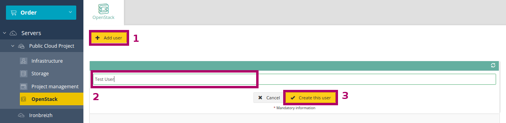
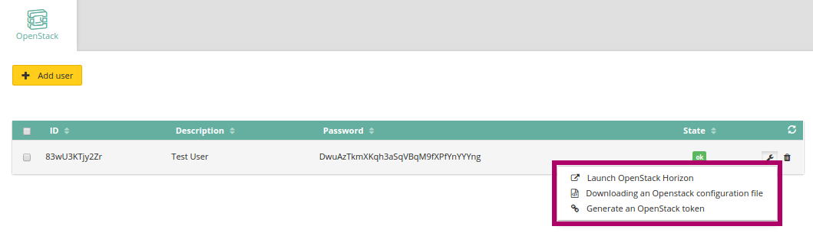
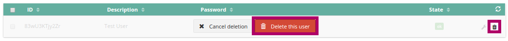

## Introduction
To use the Horizon or OpenStack APIs, you will need to create an OpenStack user. This guide will show you how to create and delete a user.

The number of OpenStack users is not limited.

### Requirements
A Public Cloud project, and it must be more than 7 days old if it is your first project (or contact the support team to check if you can unblock the project early) Other projects will not have this limitation.

## Create an OpenStack user.
In the OVH Control Panel, go to your Public Cloud project (Cloud → Servers → Name of your Public Cloud project). In the left-hand column, you will see the `OpenStack`{.action} section.

To create an OpenStack user, simply click `Add user`{.action}, then choose a description. The real name is auto-generated. You will need to confirm by clicking `Create this user`{.action}:

{.thumbnail}

A few seconds later, the user will be added.

You get user access to:

- the user’s ID
- the name you have chosen, which will appear in the Description
- the password

{.thumbnail}

> [!primary]
>
> The password in the OVH Control Panel will only be visible until
> the page is refreshed.  If you do not note it down or memorise it, you will need
> to generate a new one.
> 

By clicking on the spanner icon at the end of the line, you can:

- Launch OpenStack Horizon
- Download an OpenStack configuration file
- Generate an OpenStack token

## Delete an OpenStack user
You can delete an OpenStack user directly in the OVH Control Panel (Cloud → Servers → Name of your Public Cloud project). In the OpenStack section, on the right you will find a small recycle bin icon:

{.thumbnail}

Simply click on it, and the user will be deleted in a few seconds.

> [!alert]
>
> Any user deletion is permanent, and will invalidate all
> associated tokens, even those with an expiry date that has not yet been exceeded.