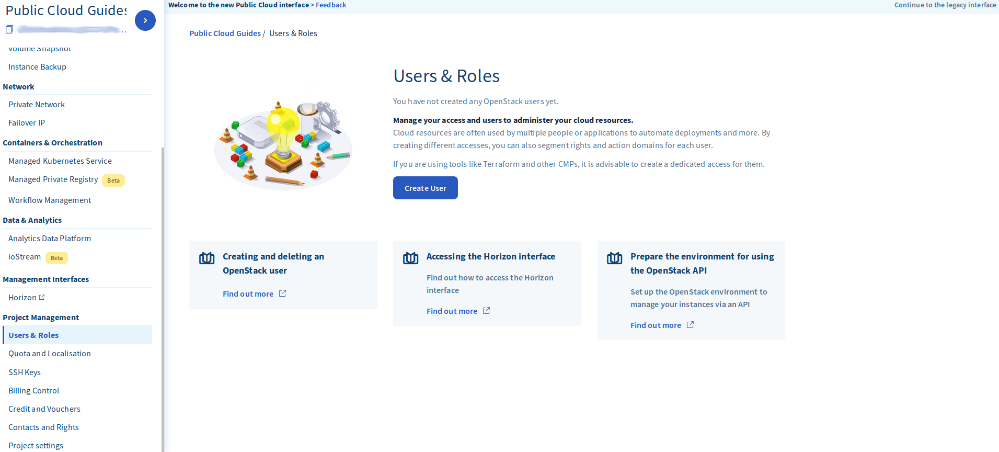
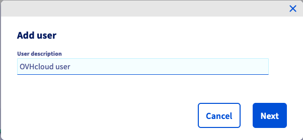
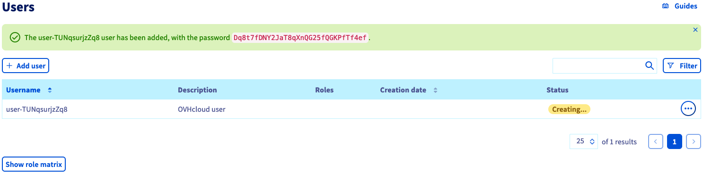
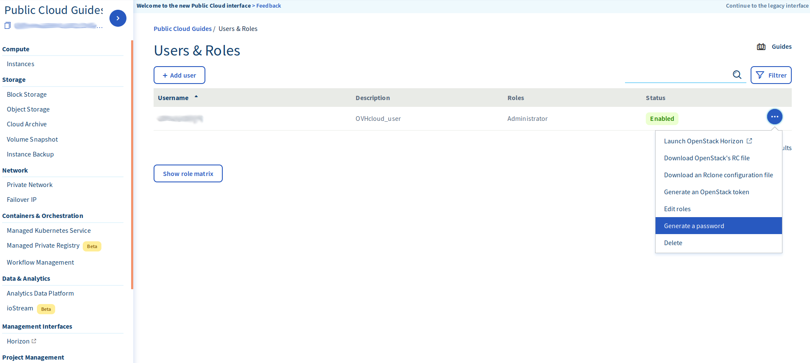
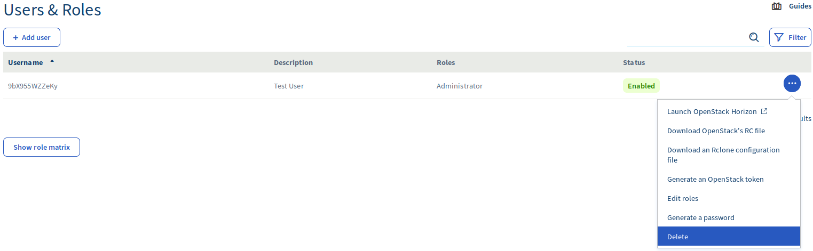

**Última atualização: 6 de dezembro de 2019**

## Introdução
Para usar o Horizon ou as API OpenStack precisa de criar um utilizador OpenStack. Este guia mostra como criar e eliminar um utilizador.

O número de utilizadores OpenStack não é limitado.

### Requisitos
Ter criado um projeto Public Cloud há mais de 7 dias, se for o seu primeiro projeto (ou contacte o Apoio ao Cliente para verificar se se é possível desbloquear o projeto mais cedo). Os restantes projetos não têm esta limitação.

## Criar um utilizador OpenStack
Antes de mais, para aceder à interface Horizon, é necessário criar uma conta de utilizador OpenStack. Para isso, faça login na sua Área de Cliente e vá para a secção `Public Cloud`{.action} no canto superior esquerdo da página. No ecrã seguinte, clique na `seta `{.action}ao lado do nome do seu projeto no canto superior esquerdo do ecrã.

{.thumbnail}

Em “Gestão de projetos” na barra lateral esquerda, selecione `Utilizadores e funções`{.action}.

{.thumbnail}

Clique em `Criar utilizador`{.action} para gerar o pop-up seguinte.

{.thumbnail}

A descrição do utilizador não é o nome de utilizador. É apenas um descritivo para o ajudar a recordar de que tipo de utilizador se trata. O ecrã seguinte permite-lhe conceder permissões de utilizador. Para cada caixa de permissões que marcar, o utilizador terá os privilégios correspondentes, como se pode ver na seguinte tabela:

{.thumbnail}

Clique no botão `Confirmar`{.action} após concluir, e será apresentado o seguinte ecrã:

{.thumbnail}

Certifique-se de que guarda a sua palavra-passe agora, pois este é o único momento em que a poderá recuperar. No entanto, se a perder pode sempre criar uma senha nova ao clicar nas reticências (...) no menu seguinte e selecionar `Gerar palavra-passe:`{.action}

{.thumbnail}

Uma vez criado o seu utilizador, pode usar estas credenciais para iniciar uma sessão na interface Horizon utilizando o botão `Horizon`{.action} na barra lateral esquerda.

## Eliminar um utilizador OpenStack
Pode eliminar um utilizador OpenStack diretamente na Área de Cliente OVH (Cloud → Servidores → Nome do seu projeto Public Cloud). Na secção OpenStack, à direita, irá encontrar o ícone do caixote do lixo:

{.thumbnail}

Basta clicar nele e o utilizador será eliminado em apenas alguns segundos.

> [!alert]
>
> Qualquer eliminação de utilizador é permanente e irá invalidar todos os
> tokens associados, mesmo aqueles com uma data de expiração que ainda não foi excedida.

## Más información

Interactúe con nuestra comunidad de usuarios en <https://community.ovh.com/en/>.
