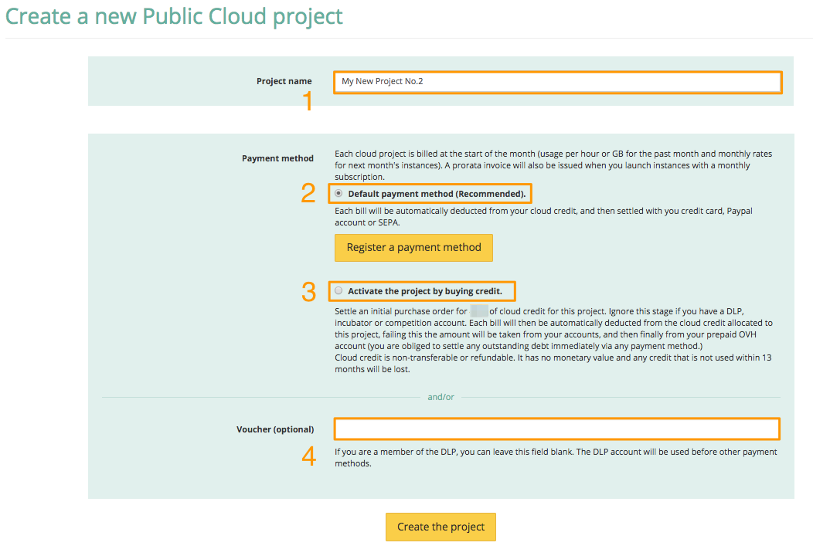
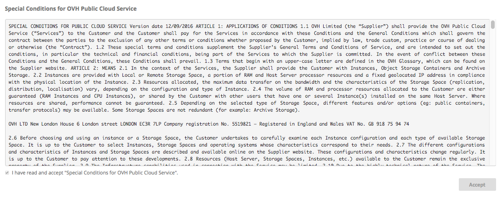

**Ostatnia aktualizacja dnia 2018-03-09**

## Wprowadzenie

Utworzenie projektu jest niezbędnym krokiem podczas uruchamiania infrastruktury w chmurze [Public Cloud](https://www.ovh.pl/public-cloud/){.external}.

Dzięki projektom możesz oddzielić zasoby przydzielane różnym aplikacjom lub zespołom w Twojej organizacji, a także w prosty sposób śledzić i rozdzielać wydatki na infrastrukturę.

Założenie projektu wiąże się z koniecznością dokonania początkowego zasilenia konta przedpłaconego. Cała suma będzie przeznaczona na uruchamiane w projekcie usługi. Kwota konieczna do rozpoczęcia projektu może być inna w różnych okresach, np. ze względu na promocje.

Domyślnie możesz utworzyć 3 projekty, jeśli będziesz chciał utworzyć ich więcej skontaktuj się z naszym Działem Wsparcia Klienta, otwierając zgłoszenie w Panelu klienta.

Zapoznaj się także z innymi przewodnikami dotyczącymi Public Cloud, w sekcji "Sprawdź również" na końcu tego przewodnika.

## Wymagania początkowe

- Dostęp do [Panelu klienta](https://www.ovh.com/auth/?action=gotomanager){.external}

## W praktyce

### Tworzenie projektu

Po zalogowaniu do Panelu klienta przejdź do sekcji `Cloud`{.action} widocznej na górnym pasku Panelu:

{.thumbnail}

W menu po lewej stronie znajduje się przycisk `Zamów`{.action} , kliknij na niego, aby rozwinęło się widoczne poniżej menu, następnie wybierz `Cloud projekt`{.action}.

{.thumbnail}

Zostanie wyświetlona informacja o sposobach płatności i aktywacji usług.

Nadaj projektowi nazwę (zaznaczenie nr 1), będziesz mógł ją później zmodyfikować, oraz wybierz jedną z trzech dostępnych form zapłaty. W przypadku uruchamiania nowego projektu obowiązuje przedpłata w wysokości podanej w komunikacie na ekranie.

Wybierz opcję `Domyślny sposób płatności`, aby podłączyć konto PayPal do konta OVH (zaznaczenie nr 2). Płatności będą pobierane automatycznie z konta PayPal. Płatności w standardzie SEPA zostaną udostępnione dla polskich klientów w przyszłości.

{.thumbnail}

Następnie wybierz `Uruchom projekt zasilając konto Cloud.` (zaznaczenie nr 3). Przy uruchomieniu pierwszego projektu zostanie wygenerowane zamówienie, które znajdziesz w linku na ekranie, jak również w sekcji `Płatności`{.action}, którą znajdziesz na górnej belce Panelu. Z lewego menu wybierz `Metody płatności`{.action}, następnie `Moje zamówienia`{action} - w tabeli będą Twoje zamówienia.

Jeśli chcesz skorzystać z vouchera, wprowadź posiadany kod w dolnym polu (zaznaczenie numer 4).

Jeśli nie akceptowałeś jeszcze Szczegółowych warunków korzystania z usługi Public Cloud, wyświetlą się one w tej formie:

{.thumbnail}

Należy je przeczytać i zaakceptować zaznaczając pole `Zaakceptuj`{.action}.

### Sposoby płatności

Usługa Public Cloud jest płatna za wykorzystane zasoby. Po utworzeniu projektu będziesz mógł zamówić instancje, przestrzeń dyskową, itp.
Wybierz jeden ze sposobów płatności za usługę:

Sposób 1: wprowadzenie środka płatniczego

Jest to najprostsza metoda. Po zarejestrowaniu środka płatniczego, opłaty za zasoby będą pobierane automatycznie na początku miesiąca. Nie zapomnisz o odnowieniu usług. 

Dla polskich klientów jako automatyczny środek płatniczy dostępny jest Paypal.

{.thumbnail}

Sposób 2: zasilenie konta przedpłaconego Cloud

Jeśli nie dysponujesz kontem PayPal, możesz zasilić konto Cloud. Cała kwota zostanie przypisana do Twojego projektu. Pozwoli to na zakup wszystkich elementów usługi.
Zasilenia Cloud nie można przenieść na inne konto lub projekt. Nie podlega ono również zwrotowi. Zasilenie nie ma żadnej wartości pieniężnej, a niewykorzystane, w ciągu 13 miesięcy zostanie utracone.

{.thumbnail}

Sposób 3: aktywacja vouchera

Jeśli dysponujesz kodem promocyjnym (voucher), możesz go dodać w trakcie tego etapu. Czas ważności vouchera i jego wartość mogą być inne na przykład w zależności od warunków promocji.

Po utworzeniu, projekt będzie dostępny pod nadaną przez Ciebie nazwą, w menu po lewej stronie.

### Usuwanie projektu

W celu usunięcia projektu przejdź do sekcji `Infrastruktura`{.action} w tym projekcie.

Kliknij na przycisk `Operacje`{.action}, aby wyświetlić menu, następnie wybierz opcję `Usuń ten projekt`{.action}.

{.thumbnail}

Operacja wymaga dodatkowego potwierdzenia. W oknie jest wyświetlana informacja o aktualnym (przybliżonym) stanie wykorzystania zasobów i naliczonych opłatach.

{.thumbnail}

> [!primary]
>
> Operacja ta jest nieodwracalna. W ciągu 24 godzin otrzymasz e-mail dotyczący potwierdzenia definitywnego usunięcia wszystkich zasobów projektu. Przeczytaj uważnie treść maila i potwierdź operację usuwania klikając w odpowiedni link w wiadomości. 
>

> [!warning]
>
> Wszystkie dane oraz konta użytkowników OpenStack zostaną niezwłocznie i trwale usunięte.
>

Ostatnia faktura dotycząca zasobów wykorzystanych na zamówienie zostanie wystawiona w ciągu 24 godzin po zatwierdzeniu operacji.
Wraz z wystawieniem tej faktury, zasilenia i vouchery (kody) przypisane go tego projektu stracą ważność.

## Sprawdź również

[Korzystanie z vouchera](https://docs.ovh.com/pl/public-cloud/korzystanie-z-vouchera/){.external}

[Tworzenie i usuwanie instancji w Panelu klienta](https://docs.ovh.com/pl/public-cloud/tworzenie_instancji_w_panelu_klienta_ovh/){.external}

[Dodanie przestrzeni dyskowej](https://docs.ovh.com/pl/public-cloud/dodanie_przestrzeni_dyskowej/){.external}

[Dodanie sposobu płatności](https://docs.ovh.com/pl/public-cloud/dodanie_sposobu_platnosci/){.external}

[Połączenie instancji Public Cloud z innymi produktami OVH za pomocą vRack](https://docs.ovh.com/pl/public-cloud/polaczenie-vrack-public-cloud-inne-uslugi/){.external}

[Analizowanie płatności i zarządzanie nimi](https://docs.ovh.com/pl/public-cloud/analizowanie_platnosci_i_zarzadzanie_nimi/){.external}

Przyłącz się do społeczności naszych użytkowników na stronie <https://community.ovh.com/en/>.