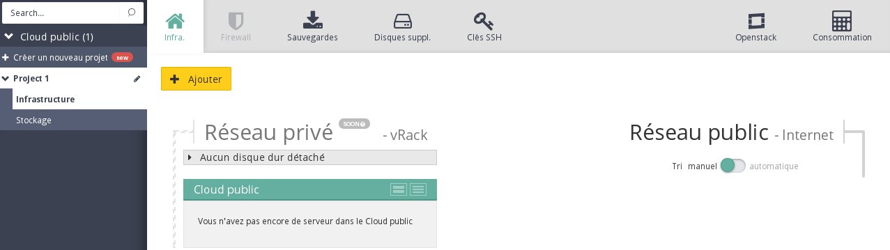
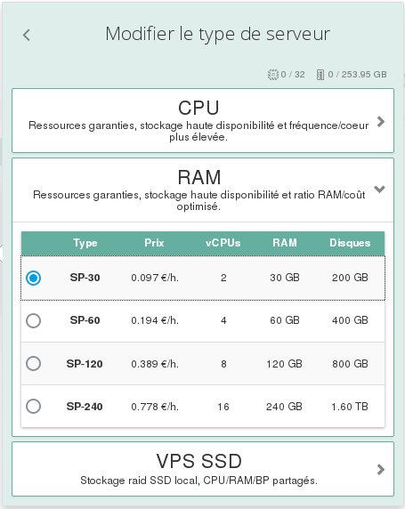
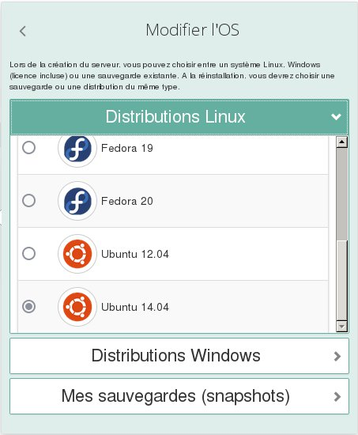
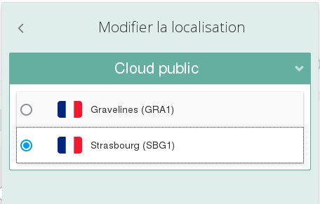
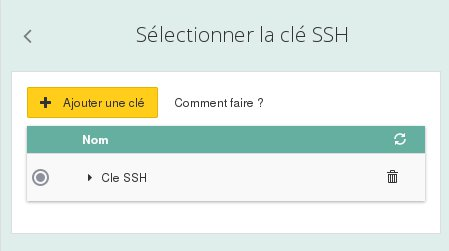

## 
Mit der Public Cloud können Sie jederzeit schnell und einfach mit einigen Klicks virtuelle Server (Instanzen) erstellen.
Diese Instanzen ähneln den [OVH VPS Angeboten](https://www.ovh.de/virtual_server/) der neuesten Generation, decken jedoch andere Anwendungsbereiche ab.

Die wichtigsten Unterschiede zwischen den VPS Angeboten und den Public Cloud Instanzen:

VPS:

- Einfaches Kundencenter
- Für einzelne Maschinen
- Große Auswahl an verfügbaren Distributionen

Public Cloud Instanzen:

- Wahl der Abrechnung: stündlich oder monatlich
- OpenStack API
- Zusammen arbeitende Instanzen

In dieser Anleitung wird die Vorgehensweise zur Erstellung einer Instanz beschieben.

## Voraussetzungen

- Eine Verbindung mit dem [OVH Kundencenter](https://www.ovh.com/manager/cloud/)
- Ein erstellter und im OVH Kundencenter konfigurierter SSH Schlüssel (siehe )

## Hinzufügen des Servers

- Klicken Sie links oben auf Hinzufügen

{.thumbnail}

- Wählen Sie Einen Server hinzufügen aus

{.thumbnail}

## Wahl des gewünschten Servers

- Wenn Sie auf den Pfeil rechts neben dem gewählten Modell klicken, erscheint ein neues Menü:

{.thumbnail}
Anschließend können Sie den Typ Ihrer Instanz auswählen:

- VPS SSD Reihe

|1 bis 2 vCores|2 bis 8 GB RAM|10 bis 40 GB Speicherplatz|

- CPU Reihe

|2 bis 32 vCores|7 bis 120 GB RAM|200 bis 1600 GB Speicherplatz|

- RAM Reihe

|2 bis 16 vCores|30 bis 240 GB RAM|200 bis 1600 GB Speicherplatz|

## Wahl des Betriebssystems

- Beispiel "Ubuntu 14.04"

{.thumbnail}

## Wahl des Rechenzentrums

- Beispiel "Straßburg"

{.thumbnail}

## Wahl des zu verwendenden SSH Schlüssels

- Beispiel:

{.thumbnail}

## Hinweis:
Bei der Erstellung einer Windows Instanz muss kein SSH Schlüssel konfiguriert werden.

## Benennung des virtuellen Servers und Start

- Vergeben Sie einen Namen für den virtuellen Server
- Wählen Sie aus, ob dieser stündlich oder monatlich abgerechnet werden soll

## Achtung:
Bei der Erstellung einer Instanz mit monatlicher Abrechnung verpflichten Sie sich, diese mindestens bis zum Ende des laufenden Monats zu behalten.

- Klicken Sie auf Jetzt starten

## 
[Zurück zum Index der Cloud Hilfen]({legacy}1785)

