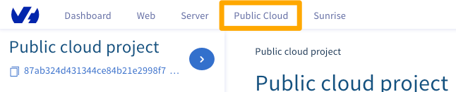
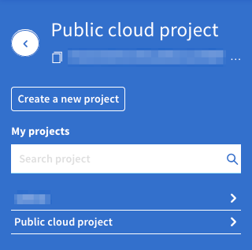
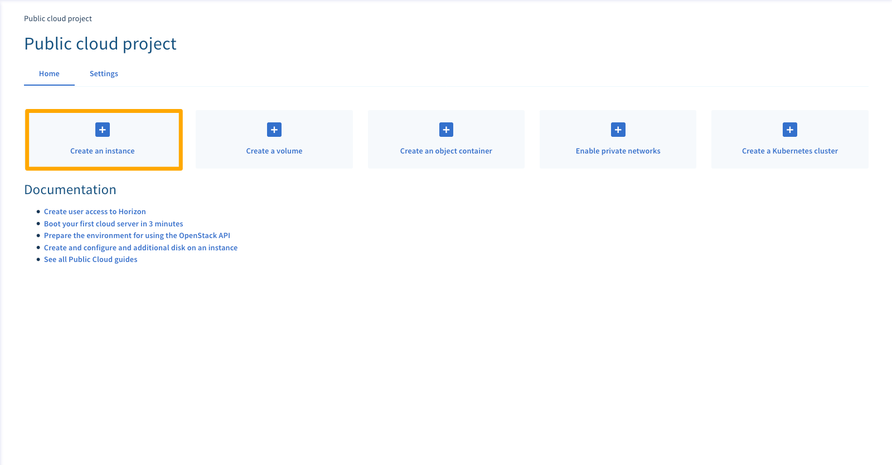
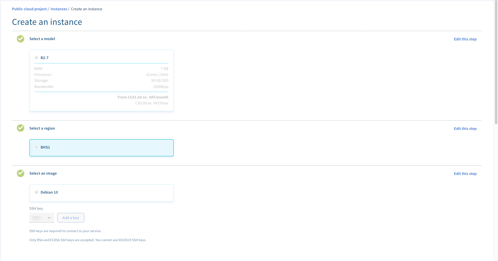
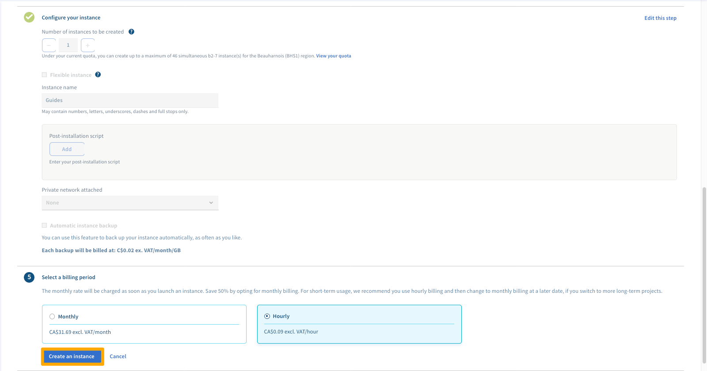
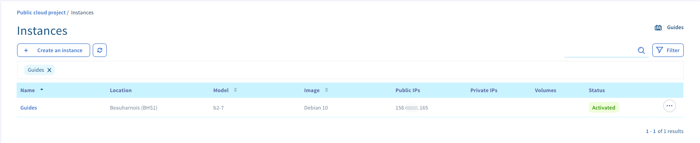

**Last updated 2018/09/21**

## Objective

The [Public Cloud](https://www.ovh.com.au/public-cloud/instances/){.external} lets you create instances (i.e. virtual servers) quickly and easily, in just a few clicks.

**This guide will show you how to create an instance in your Public Cloud account.**

## Requirements

* access to the [OVHcloud Control Panel](https://ca.ovh.com/auth/?action=gotomanager){.external}
* a [Public Cloud](https://www.ovh.com.au/public-cloud/instances/){.external} project created in your OVHcloud account
* an SSH key created in your OVHcloud customer account

## Intructions

### Add an instance

First, log in to the [OVHcloud Control Panel](https://ca.ovh.com/auth/?action=gotomanager){.external} and click on the `Public Cloud`{.action} menu.

{.thumbnail}

Next, select your cloud project under the menu options list on the left-hand side of the page.

{.thumbnail}

Next, click the `Create an instance`{.action} button.

{.thumbnail}

### Configure the instance

After clicking the `Create an instance`{.action} button, the configuration settings will appear as shown below.

{.thumbnail}

These settings allow you to configure:

* the datacentre and region where the instance will be hosted
* the server's operating system
* the server model
* an SSH key for security (not needed for Windows servers)
* several advanced options

> [!primary]
>
Please note that for Windows servers, authentication is password based, so SSH keys are not used at all.
>

When you have configured the options you want, decide whether you want the instance to be billed hourly or monthly.

Finally, click the `Launch now`{.action} button to create the instance.

{.thumbnail}

Your instance will now be created. It may take a few minutes to finalise.

The newly-created instance will now be visible in your account.

{.thumbnail}

> [!warning]
>
If you delete a instance that is billed monthly before the end of the month, no credit is given. It is best advised to delete the instance the day before the first day of the next month.
>

## Go further

Join our community of users on <https://community.ovh.com/en/>.
