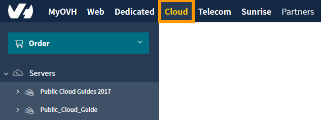
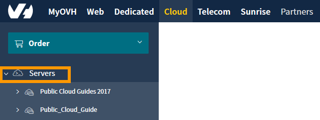
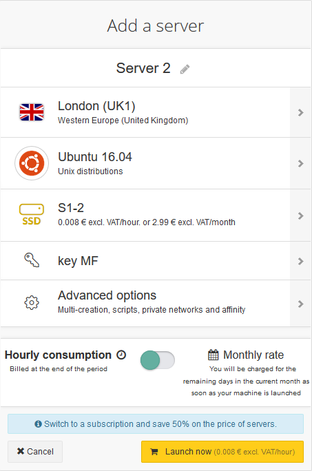
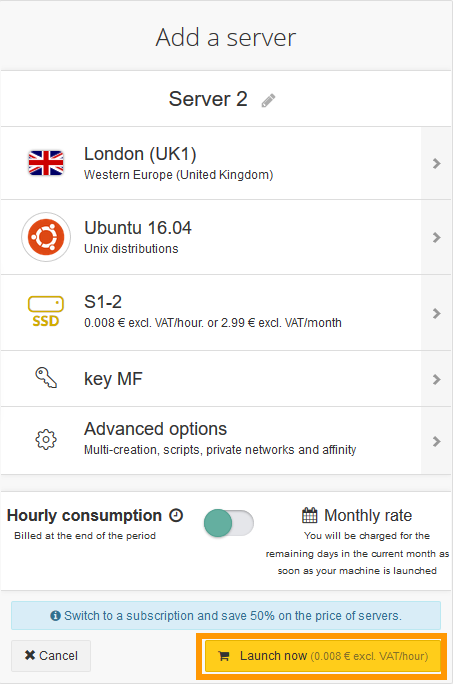
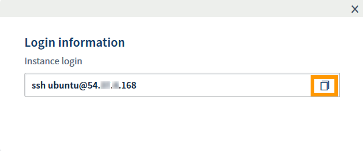
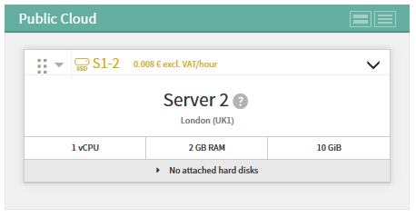

**Last updated 21st September 2018**

## Objective

The [Public Cloud](https://www.ovh.co.uk/public-cloud/instances/){.external} lets you create instances (i.e. virtual servers) quickly and easily, in just a few clicks.

**This guide will show you how to create an instance in your Public Cloud account.**

## Requirements

* access to the [OVH Control Panel](https://www.ovh.com/auth/?action=gotomanager){.external}
* a [Public Cloud](https://www.ovh.co.uk/public-cloud/instances/){.external} project created in your OVH account
* an SSH key created in your OVH customer account

## Intructions

> [!primary]
>
The rest of this guide assumes that you have set the view of your cloud project to `Infrastructure`{.action}. You can change the view with the toggle switch on the right-hand side of the page, as shown below:
>

{.thumbnail}

### Add an instance

First, log in to the [OVH Control Panel](https://www.ovh.com/auth/?action=gotomanager){.external} and click on the `Cloud`{.action} menu.

{.thumbnail}

Next, select your cloud project under the `Servers`{.action} list on the left-hand side of the page.

{.thumbnail}

After selecting your project, click the `Infrastructure`{.action} option.

{.thumbnail}

Now, click the `Actions`{.action} button.

{.thumbnail}

Next, click the `Add a server`{.action} button.

{.thumbnail}

### Configure the instance

After clicking the `Add a server`{.action} button, the configuration settings will appear as shown below.

{.thumbnail}

These settings allow you to configure:

* the datacentre and region where the instance will be hosted
* the server's operating system
* the server model
* an SSH key for security (not needed for Windows servers)
* several advanced options

> [!primary]
>
Please note that for Windows servers, authentication is password based, so SSH keys are not used at all.
>

When you have configured the options you want, decide whether you want the instance to be billed hourly or monthly and toggle the billing switch accordingly.

{.thumbnail}

Finally, click the `Launch now`{.action} button to create the instance.

{.thumbnail}

Your instance will now be created. It may take a few minutes to finalise.

Once the instance has been created, your login information will be displayed, which you can copy to your computer's clipboard by clicking the copy icon.

{.thumbnail}

The newly-created instance will now be visible in your account.

{.thumbnail}

> [!warning]
>
When you create an instance and choose to pay monthly, you must keep this instance for at least until the end of the current month.
>

## Go further

[Getting started with Public Cloud](https://docs.ovh.com/gb/en/public-cloud/getting_started_with_public_cloud_logging_in_and_creating_a_project/){.external}

Join our community of users on <https://community.ovh.com/en/>.