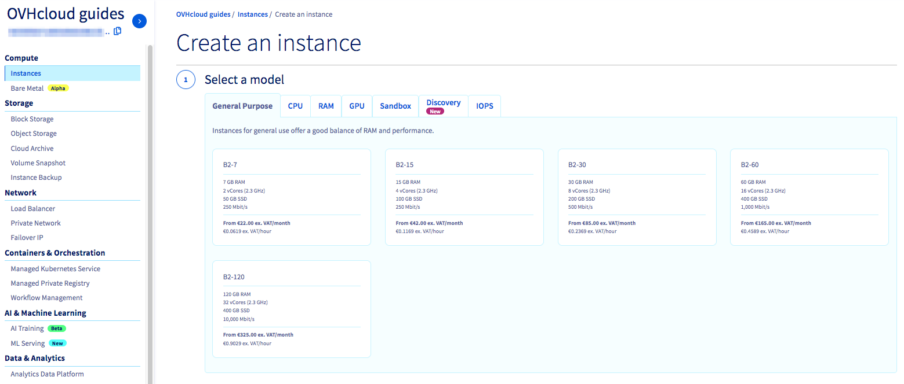

**Dernière mise à jour le 30/03/2021**

## Objectif

Le [Public Cloud](https://www.ovhcloud.com/fr-ca/public-cloud/){.external} OVHcloud vous permet de créer des instances (par exemple des serveurs virtuels) rapidement et facilement en quelques clics.

**Découvrez comment créer une instance depuis l’espace client Public Cloud OVHcloud.**

## Prérequis

* Être connecté à votre [espace client OVHcloud](https://ca.ovh.com/auth/?action=gotomanager&from=https://www.ovh.com/ca/fr/&ovhSubsidiary=qc){.external}.
* Un projet [Public Cloud](https://www.ovhcloud.com/fr-ca/public-cloud/){.external} créé dans votre compte OVHcloud
* Une clé SSH créée dans votre espace client OVHcloud

## En pratique

### Déployer une instance Public Cloud

Pour déployer une instance public cloud, connectez-vous à [l’espace client d’OVHcloud](https://ca.ovh.com/auth/?action=gotomanager&from=https://www.ovh.com/ca/fr/&ovhSubsidiary=qc){.external}. Cliquez sur `Public Cloud`{.action} en haut à gauche. Sur l’écran qui s’affiche, cliquez sur la flèche à côté du nom par défaut de votre projet, en haut à gauche. Sélectionnez le projet dans lequel vous souhaitez créer une nouvelle instance.

{.thumbnail}

Une fois que vous avez choisi votre projet, cliquez sur `Instances`{.action}dans la section «Compute» du menu latéral de gauche.

{.thumbnail}

Cliquez alors sur `Créer une instance`{.action}. Le menu suivant vous permettra de choisir l’instance que vous souhaitez créer.

{.thumbnail}

Le tableau suivant donne un aperçu des caractéristiques de chaque type d’instance:

| Type de serveur | Ressources garanties | Utilisation |
| :---         |     :---:      |          ---: |
| General Purpose   | ✓     | Serveurs de développement, applications web ou commerciales    |
| CPU     | ✓       | Encodage vidéo ou autres calculs haute performance      |
| RAM   | ✓     | Base de données, analyse et calculs en mémoire   |
| GPU     | ✓       | Calcul accéléré pour des applications spécifiques (rendering, transcodage vidéo, bio-informatique, Big Data, deep learning, etc.)      |
| Sandbox    | -       | Tests, recettes et environnements de développement.     |
| Discovery    | -       | Tests, recettes et environnements de développement.     |
| IOPS   | ✓     | Optimisé pour les transactions disque les plus rapides    |

> [!primary]
>
Vous aurez une limite initiale de 20 instances, 20 vCores et 20Go de RAM pour un projet donné. Pour augmenter la limite des ressources, vous devrez [créer un ticket](https://www.ovh.com/manager/dedicated/index.html#/ticket){.external} auprès du support client.
>

Suivez le menu pour choisir la région dans laquelle vous souhaitez situer vos instances public cloud. La troisième option correspond au choix de votre système d’exploitation.

> [!primary]
>
Si vous choisissez un système d’exploitation Windows, une licence sera automatiquement fournie et vous serez facturé mensuellement pour celle-ci.
>

{.thumbnail}

> [!primary]
>
Les instances Public Cloud qui fonctionnent sur un système d’exploitation basé sur Unix nécessitent une clé SSH pour pouvoir être ajoutées au serveur. Pour plus d’informations sur la création d’une clé SSH, consultez le guide [Créer des clés SSH](../creation-des-cles-ssh/){.external}.
>

Dans la quatrième partie du menu, vous pouvez choisir le nombre d’instances à créer, nommer votre instance et ajouter un réseau privé ou un script de post-installation, si vous le souhaitez.

{.thumbnail}

Finalement, vous devez indiquer si vous souhaitez une facturation mensuelle ou une facturation à l’heure.

> [!warning]
>
>Si vous choisissez une facturation à l’heure, vous serez facturés pendant toute l’existence de l’instance. La facturation s’arrête quand l’instance est supprimée définitivement. Donc vous serez facturés même si l’instance n’est pas utilisée.
>

Après avoir confirmé que toutes les informatons fournies sont correctes, cliquez sur `Créer une instance`{.action} pour terminer la création de votre nouvelle instance. Cette création peut prendre quelques minutes.

## Aller plus loin

[Création et connexion à une première instance Public Cloud](../premiers-pas-instance-public-cloud/)

Échangez avec notre communauté d'utilisateurs sur <https://community.ovh.com/>.
