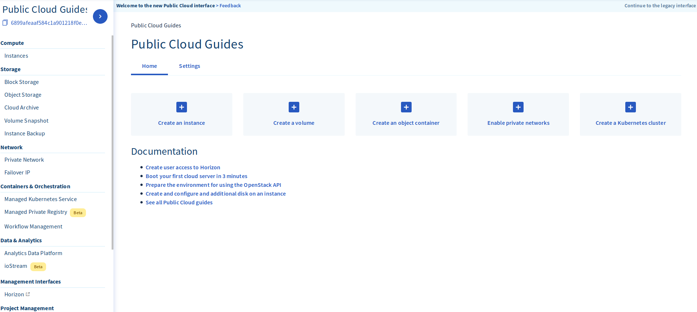
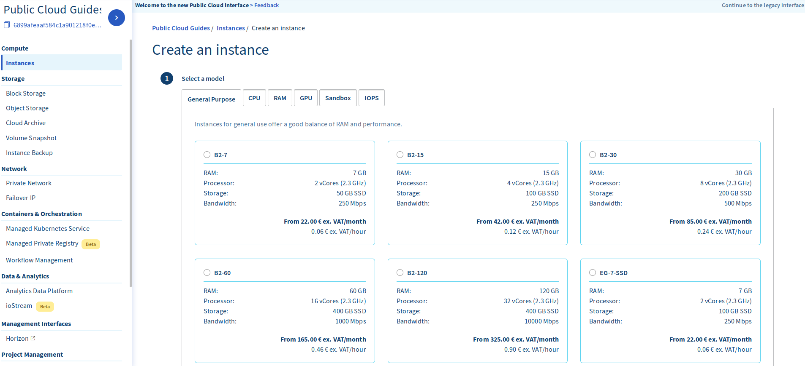
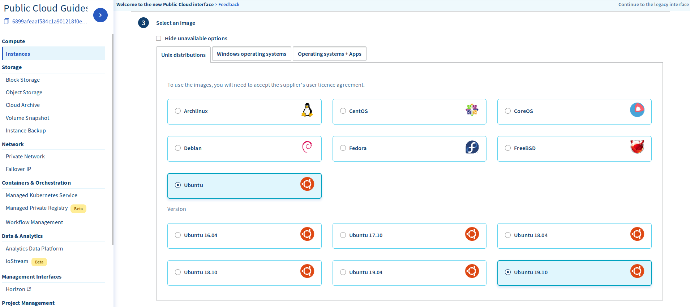
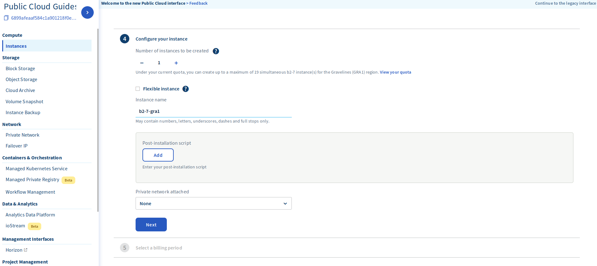

**Última atualização a 03 de Dezembro de 2019**

## Sumário

Pode utilizar a [Public Cloud](https://www.ovh.pt/public-cloud/){.external} OVHcloud para criar instâncias (ou seja, servidores virtuais) de forma rápida e fácil, com apenas alguns cliques.

**Saiba como criar uma instância na Área de Cliente Public Cloud OVHcloud**

## Requisitos

* acesso à [Área de Cliente OVHcloud](https://www.ovh.com/auth/?action=gotomanager){.external}
* um projeto [Public Cloud](https://www.ovh.pt/public-cloud/){.external} criado na sua conta OVHcloud
* uma chave SSH criada na Área de Cliente OVHcloud

### Com Implementar uma Instância Public Cloud

Para implementar uma instância Public Cloud, faça login na [Área de Cliente OVHcloud](https://www.ovh.com/auth/?action=gotomanager){.external}. Clique em `Public Cloud`{.action}no canto superior esquerdo da página. No ecrã seguinte, clique na seta ao lado do nome do seu projeto predefinido no canto superior esquerdo do ecrã. Agora selecione o projeto onde pretende criar uma nova instância.

{.thumbnail}

Depois de selecionar o projeto correto, clique no botão `Instances`{.action} na secção "Compute" na barra lateral à esquerda.

{.thumbnail}

Em seguida, clique em `Create an instance.`{.action} Irá passar ao menu seguinte, onde poderá selecionar a instância que pretende criar.

{.thumbnail}

A seguinte tabela explica sucintamente as diferenças entre os tipos de instâncias:

| Tipo de Servidor | Recursos Assegurados | Modo de utilização |
| :---         |     :---:      |          ---: |
| Utilização Geral   | ✓     | Servidores de desenvolvimento, aplicações web ou comerciais    |
| CPU     | ✓       | Codificação de vídeo ou outra computação de elevado desempenho      |
| RAM   | ✓     | Bases de dados, análise e cálculos in-memory    |
| Recursos Partilhados    | -       | Ambientes de teste e de desenvolvimento      |

> [!primary]
>
Inicialmente, estará limitado a 20 instâncias, 20 vCores e 40GB de RAM em qualquer projeto. Poderá solicitar um aumento do limite de recursos [enviando um ticket](https://www.ovh.com/manager/dedicated/index.html#/ticket){.external} para nossa equipa de Apoio ao Cliente.
>

Siga o menu para selecionar a região em que pretende que a sua instância public cloud fique localizada. A terceira opção é onde irá selecionar o seu sistema operativo.

> [!primary]
>
Se selecionar um sistema operativo Windows, a licença será provisionada automaticamente e ser-lhe-á faturada mensalmente.
>

{.thumbnail}

> [!primary]
>
As instâncias public cloud que executam um sistema operativo baseado no Unix requerem que uma chave SSH seja adicionada ao servidor. Para mais informações sobre como gerar uma chave SSH, veja o nosso artigo [Criar Chaves SSH](https://docs.ovh.com/pt/public-cloud/criacao-de-chaves-ssh/){.external}
>

Na quarta parte do menu, poderá escolher o número de instâncias a criar, nomear a sua instância e adicionar uma rede privada ou um script pós-instalação, caso opte por isso.

{.thumbnail}

Por fim, escolha se prefere faturação mensal ou à hora.

> [!warning]
>
>Se optar pela faturação à hora, continuará a ser cobrado enquanto a instância existir, independentemente de a instância estar a ser utilizada ou não.
>

Depois de confirmar que toda as informações introduzidas estão corretas, clique no botão `Create an instance`{.action} para concluir a criação da sua nova instância. A sua instância pode demorar alguns minutos a provisionar.

## Conclusão

Depois de ler este artigo, deverá ser capaz de provisionar uma instância no seu projeto public cloud a partir da Área de Cliente OVHcloud. Para ler mais sobre o que pode fazer com a sua instância, veja os nossos artigos na página de suporte  
[Serviços Public Cloud](https://docs.ovh.com/pt/public-cloud/){.external}

## Vá mais longe

[Primeiros passos com Public Cloud](https://docs.ovh.com/pt/public-cloud/comecar_com_o_public_cloud_identificar-se_e_criar_um_projeto/){.external}

Junte-se à nossa comunidade de utilizadores em <https://community.ovh.com/en/>.