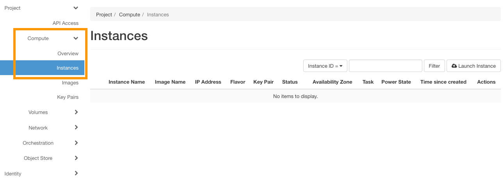
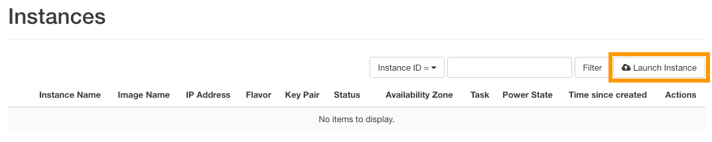

**Dernière mise à jour le 27/03/2018**

## Objectif

Vous avez la possibilité de créer des instances directement depuis l'interface Horizon. Ceci vous permet, par exemple, de créer des instances multiples ou encore de configurer un groupe de sécurité et de l'appliquer à vos instances.

**Apprenez à créer une instance depuis l'interface Horizon.**

## Prérequis

- Posséder un projet [Public Cloud](https://www.ovh.com/fr/public-cloud/instances/){.external} créé depuis votre compte OVH.
- [Être connecté à l'interface Horizon](https://docs.ovh.com/fr/public-cloud/creer-un-acces-a-horizon/){.external}. 

## En pratique

Pour lancer la création d'une instance, connectez-vous à l'interface Horizon. Si vous avez besoin d'aide pour réaliser cette manipulation, reportez-vous à notre documentation « [Accéder à l’interface Horizon](https://docs.ovh.com/fr/public-cloud/creer-un-acces-a-horizon/){.external} ».

Cliquez ensuite sur `Compute`{.action} dans le menu de gauche, puis sur `Instances`{.action}.

{.thumbnail}

La page qui s'affiche permet de visualiser les instances lancées actuellement. Pour en démarrer une nouvelle, cliquez sur le bouton `Lancer une instance`{.action}.

{.thumbnail}

Vous devez alors compléter différentes informations. Si nécessaire, aidez-vous du tableau ci-dessous afin de renseigner les champs. Notez que celui-ci n'est pas exhaustif. 

|Information|Détails|
|---|---|
|Zone de disponibilité|Laissez « nova » (choix par défaut)|
|Nom de l'instance|Indiquez le nom souhaité pour l'instance à créer|
|Gabarit|Sélectionnez le type d'instance à créer|
|Nombre d'instances|Indiquez le nombre d'instance à créer|
|Source de démarrage de l'instance|Sélectionnez la source pour la création de l'instance (comme « Démarrage depuis une image » ou « Démarrage depuis un instantané »)|
|Nom de l'image|Sélectionnez l'image de l'instance (uniquement dans le cas d'un démarrage depuis une image)|
|Instantané d'instance|Choisissez un instantané d'une instance (uniquement dans le cas d'un démarrage en instantané)|
|Paire de clés|Sélectionnez une clé SSH pour vous connecter par la suite à l'instance (la création d'une clé peut être faite en cliquant sur le signe « + »|
|Groupes de sécurité|Indiquez le groupe de sécurité pour l'instance (autorisation d'ouverture de ports)|
|Réseaux sélectionnés|Sélectionnez le ou les réseaux pour l'instance à créer dans la liste des réseaux disponibles|
|Source de script personnalisé|Précisez la source entre une « entrée directe » ou un « fichier »|
|Donnée de script|Indiquez le code du script dans le champ de saisie (maximum 16 ko)|
|Fichier de script|Cliquez sur parcourir pour sélectionner le script de post-installation|
|Partitionnement du disque|Choisissez entre « automatique » ou « manuel »|
|Disque de configuration|Configurez OpenStack pour écrire les métadonnées sur un disque de configuration spécifique qui sera attaché à l'instance au moment de son lancement|

Dès que vous êtes prêt à lancer la ou les instances souhaitées, cliquez sur le bouton `Démarrer`{.action}.

{.thumbnail}

## Aller plus loin

Échangez avec notre communauté d'utilisateurs sur <https://community.ovh.com>.