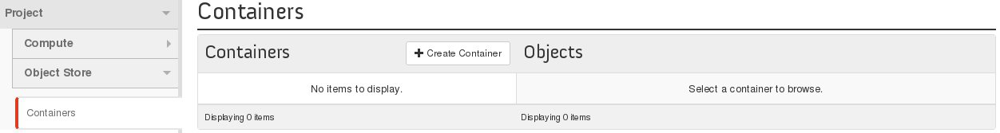
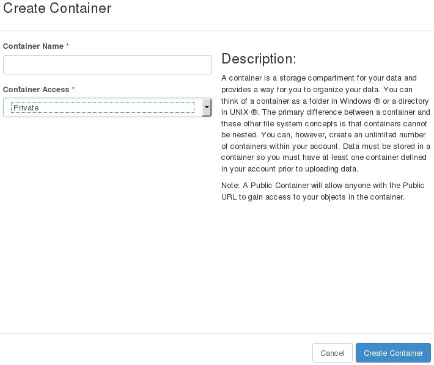
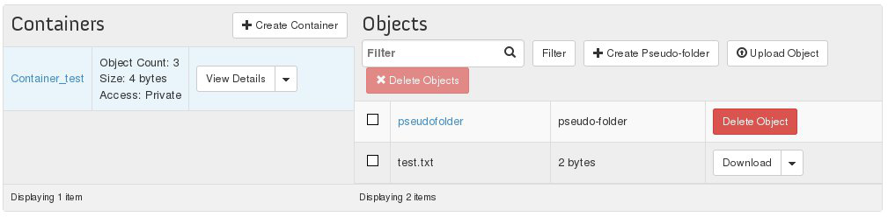

## Preambule
La première étape afin d'utiliser la solution de stockage proposé par le Public Cloud est la création d'un conteneur qui regroupera vos fichiers. Ce guide explique comment le créer depuis l'interface Horizon d'Openstack

### Prérequis
- [Créer un accès à Horizon]({legacy}1773){.ref}

## Création du conteneur
- Se connecter à Horizon
- Sélectionner "Objet Store" sur la gauche

{.thumbnail}

- Cliquer sur "Create Container"

Une nouvelle fenêtre apparait :

{.thumbnail}

Vous pouvez depuis celle ci :

- Nommer votre conteneur
- Sélectionner le type du conteneur

Public Accessible par tout le monde Privé Uniquement accessible en s'authentifiant Public Suite a cela, votre conteneur apparait et de nouvelles opérations sont désormais disponibles :

{.thumbnail}

Vous pouvez :

- Voir les détails de votre conteneur
- Le rendre public ou privé
- Le supprimer

En cliquant sur le nom de votre conteneur vous pouvez aussi :

- Créer un pseudo dossier

> [!success]
>
> En effet, les données déposées sur l'Object Storage ne sont pas stockées selon une arborescence classique (Dossier > Sous-Dossier...)
> Elles sont toutes stockées au même niveau, cela réduit notamment le temps d'accès aux fichiers.
> Ces pseudo-dossiers se présenteront donc sous la forme de préfixe et pourront donc vous permettre d'organiser vos données d'une différente manière.
> 

- Envoyer vos fichiers
- Supprimer vos fichiers et pseudo-dossiers
- Télécharger vos fichiers
- Copier vos fichiers
- Voir les détails de vos fichiers
