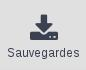
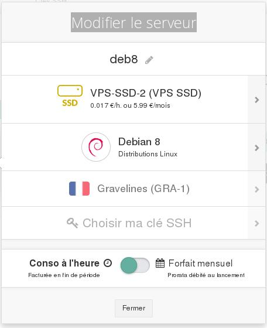
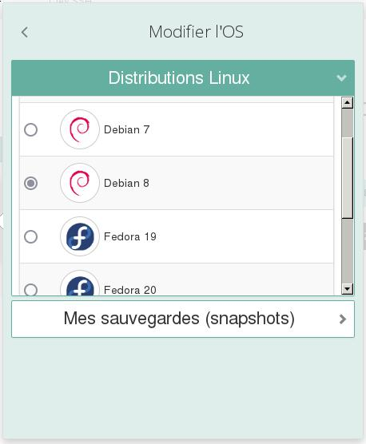
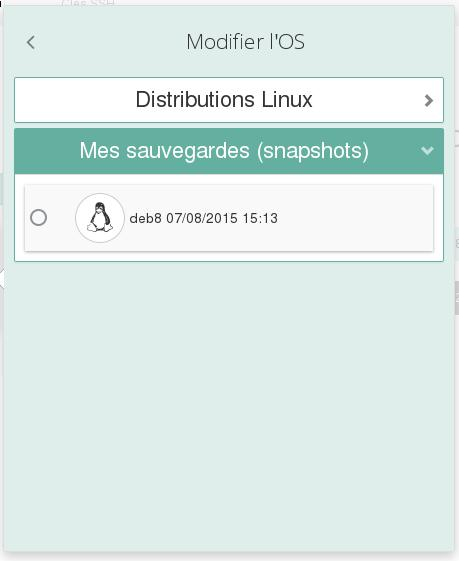

## 
Probablemente encuentre situaciones en las que tenga que restaurar una instancia tal como se encontraba en un momento anterior utilizando un snapshot que haya realizado, por ejemplo después de realizar una manipulación incorrecta en la configuración de la instancia. O simplemente quiera crear una nueva instancia a partir de ese mismo backup porque necesite duplicar la instancia para balancear la carga o para garantizar la alta disponibilidad.

Todo esto es posible. Esta guía explica cómo utilizar los snapshots para volver a crear, duplicar o restaurar las instancias.

## Requisitos
Para seguir los pasos descritos en esta guía es necesario:

- tener un snapshot de una instancia de Public Cloud;
- tener un servidor virtual ya creado.

## 
Conéctese al [área de cliente Cloud](https://www.ovh.com/manager/cloud/) de OVH.

Haga clic en «Snapshots».

{.thumbnail}
Haga clic en el icono «Crear un servidor a partir de este snapshot» situado al final de la línea del snapshot que quiera restaurar.

Se abrirá la ventana de la imagen.

{.thumbnail}
Personalice el nombre del servidor si lo desea.

Elija el modelo.

Atención: Actualmente solo es posible restaurar una instancia desde el área de cliente en el datacenter del que provenga el snapshot. Para transferir el snapshot a otro datacenter, es necesario utilizar la API de OpenStack.

Elija la llave SSH y el modo de facturación, y haga clic en «Iniciar ahora». El servidor virtual estará disponible unos segundos después.

## 
Conéctese al [área de cliente Cloud](https://www.ovh.com/manager/cloud/) de OVH.

Despliegue el menú del servidor correspondiente y haga clic en «Editar».

{.thumbnail}
Se abrirá la ventana de la imagen.

{.thumbnail}
Personalice el nombre del servidor si lo desea.

Elija el modelo (que debe tener características iguales o superiores a la instancia de partida).

Haga clic en las distribuciones y, en la parte inferior de la ventana «Cambiar el SO», haga clic en «Mis snapshots».

{.thumbnail}
Se desplegará la lista de snapshots.

{.thumbnail}
Seleccione el snapshot que quiera restaurar.

Elija la modalidad de facturación y haga clic en «Aplicar los cambios».

Al cabo de unos segundos, ya estará disponible el servidor virtual.
Atención: La instancia no tendrá los datos que se hayan añadido después de crear el snapshot.