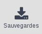
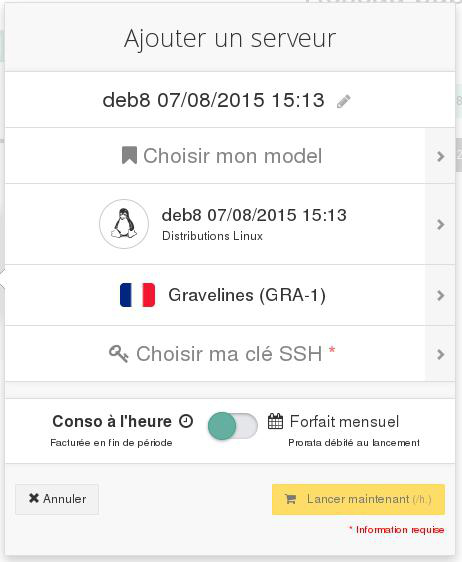
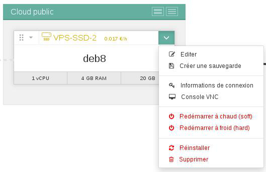
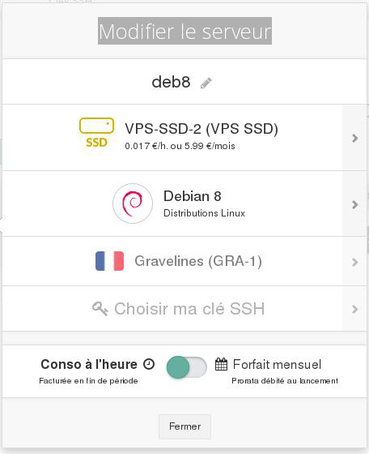
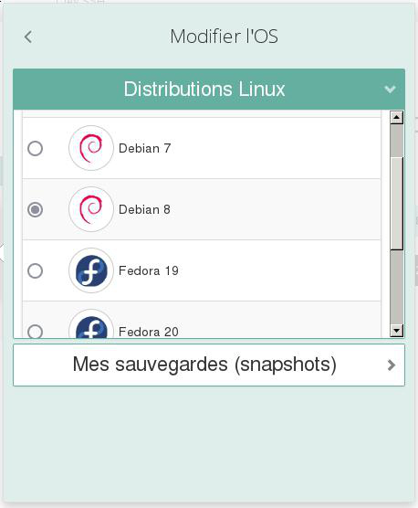
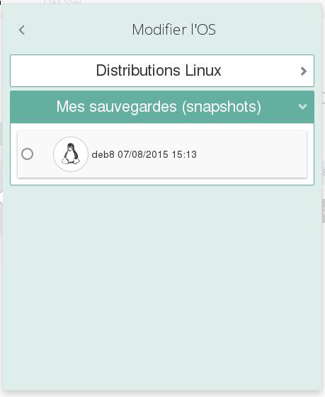

## Preambule
Dans certaines situations, vous serez probablement amené à restaurer votre instance à un moment ultérieur grâce à une sauvegarde que vous avez effectué, car une mauvaise manipulation a été effectué sur la configuration de votre instance par exemple. Ou encore, vous souhaitez simplement créer une nouvelle instance grâce à cette même sauvegarde, car vous avez besoin de dupliquer votre instance pour effectuer de la répartition de charge, ou encore de la haute disponibilité.

Cela est tout à fait possible, et ce guide vous explique comment utiliser vos sauvegardes pour recréer, dupliquer, ou encore restaurer vos instances.

### Prérequis
- Disposer d'une sauvegarde d"une instance Public Cloud
- Disposer d'un serveur virtuel déjà créé

## Créer une instance a partir d'une sauvegarde
- Se connecter à l'espace client Public Cloud OVH
- Cliquer sur Sauvegardes

{.thumbnail}

- Cliquer sur l'icône "créer un serveur à partir de cette sauvgegarde" à droite sur la ligne du backup à restaurer
- On obtient la fenêtre suivante :

{.thumbnail}

- Personnaliser le nom du VPS si besoin
- Choisir son modèle

Actuellement, depuis l'espace client, la restauration est possible uniquement dans le datacentre d'où provient la sauvegarde. Pour transférer cette sauvegarde dans un autre datacentre, il faut actuellement utiliser l'api OpenStack

- Choisir la clé SSH
- Choisir le mode de facturation
- Cliquer sur Lancer maintenant
- Le serveur virtuel est disponible quelques secondes plus tard.

## Restaurer un serveur virtuel a partir d'une sauvegarde
- Se connecter à l'espace client Public Cloud OVH
- Développer le menu suivant, cliquer sur Éditer :

{.thumbnail}

- on obtient la fenêtre suivante :

{.thumbnail}

- Personnaliser le nom du serveur si souhaité
- Choisir le modèle (caractéristiques égales ou supérieures à la machine virtuelle de départ)
- Cliquer sur distributions
- Les sauvegardes sont proposées :

{.thumbnail}

- Cliquer sur Mes sauvegardes :

{.thumbnail}

- Sélectionner la sauvegarde à restaurer
- Choisir le mode de paiement
- Cliquer sur Appliquer les modifications
- Le serveur virtuel est disponible quelques secondes plus tard.

> [!alert]
>
> Votre instance ne conservera pas les données qui ont été créées après la
> création de cette sauvegarde.
> 