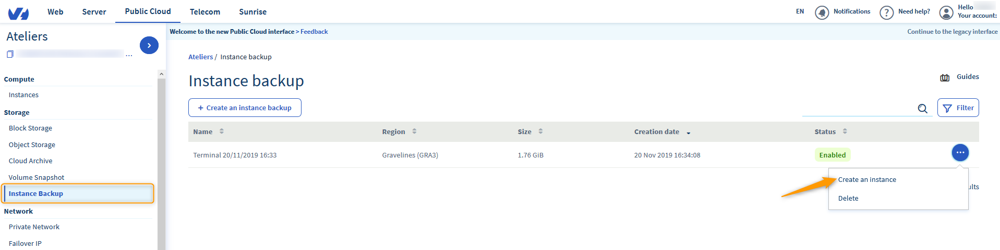
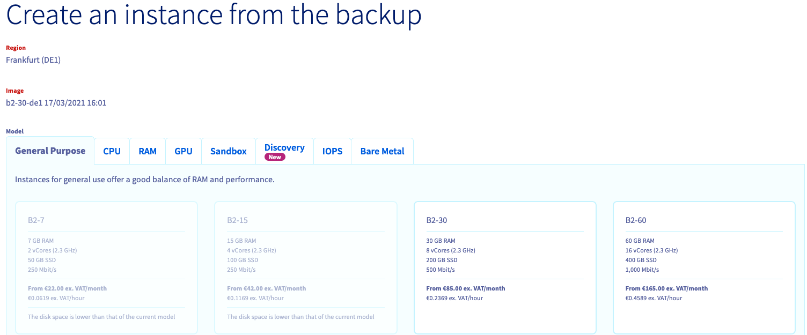
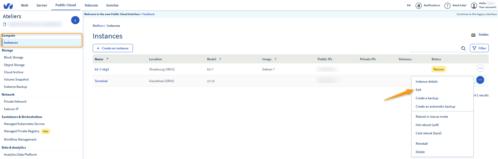

**Dernière mise à jour le 22/11/2019**

## Objectif
Vous pouvez être amenés à vouloir restaurer votre instance grâce à une sauvegarde, par exemple en cas de mauvaise manipulation effectuée sur la configuration de votre instance. 

Cette même sauvegarde pourrait également vous servir à créer une nouvelle instance, pour dupliquer la première et effectuer de la répartition de charge, ou encore bénéficier de la haute disponibilité.

Ce guide vous explique comment utiliser vos sauvegardes pour recréer, dupliquer, ou encore restaurer vos instances.

## Prérequis
- Disposer d'une sauvegarde d'une instance Public Cloud. À cet effet, consultez [le guide dédié à la création d'une sauvegarde](https://docs.ovh.com/fr/public-cloud/sauvegarder-une-instance/).
- Être connecté à l'espace client OVHcloud.

## En pratique

### Créer une instance a partir d'une sauvegarde

Connectez-vous à votre [espace client OVHcloud](https://www.ovh.com/auth/?action=gotomanager){.external} et sélectionnez `Public Cloud`{.action}. Sélectionnez ensuite la rubrique `Instance backup`{.action}.

Cliquez alors sur les `...`{.action} à droite de la sauvegarde choisie et enfin sur `Créer une instance`{.action}.

{.thumbnail}

La page de céation d'instance s'affichera.

{.thumbnail}

Certains éléments sont prédéfinis :

* La localisation : votre instance sera créée dans le même datacentre que votre sauvegarde.
* L'image : elle correspondra à votre sauvegarde.
* Les modèles : seuls ceux pouvant accueillir votre image seront disponibles, en fonction de votre quota.

Pour plus d'informations sur la création d'une instance, consultez [ce guide](https://docs.ovh.com/fr/public-cloud/creer-instance-espace-client/).

Pour créer une instance dans un autre datacentre que celui de la sauvegarde, il faudra transférer celle-ci vers la zone correspondante. Référez-vous alors au [guide sur la sauvegarde d'une instance d'un datacentre à l'autre](https://docs.ovh.com/fr/public-cloud/transferer-la-sauvegarde-dune-instance-dun-datacentre-a-lautre/).

### Restaurer une instance à partir d’une sauvegarde

Pour restaurer une instance à partir d'une sauvegarde, sélectionnez cette fois le menu `Instance`{.action} puis cliquez sur le bouton `...`{.action} à droite de l'instance que vous souhaitez restaurer et enfin sur `Editer`{.action}.

{.thumbnail}

La page d'édition d'instance s'affichera alors. Vous pourrez y modifier :

* Le nom de l'instance.
* L'image de l'instance.
* Le modèle de l'instance.
* La facturation de l'instance (uniquement depuis le modèle « Horaire » vers le modèle « Mensuel »).

Choisissez alors, dans la rubrique `Image`{.action}, celle de la sauvegarde à restaurer.

{.thumbnail}

> [!alert]
>
>Comme indiqué dans l'encadré jaune qui vous est alors précisé, aucune donnée ajoutée après la création de cette sauvegarde ne pourra être récupérée.
>

## Aller plus loin

Échangez avec notre communauté d'utilisateurs sur <https://community.ovh.com>
