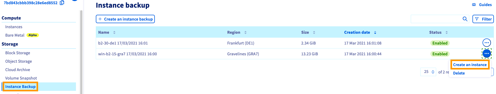
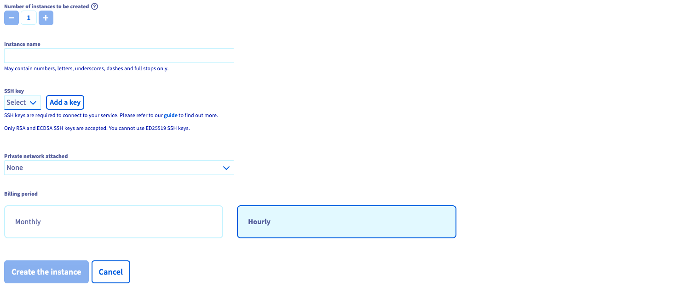
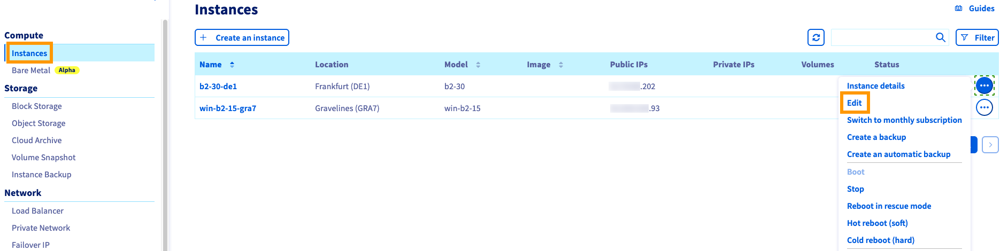
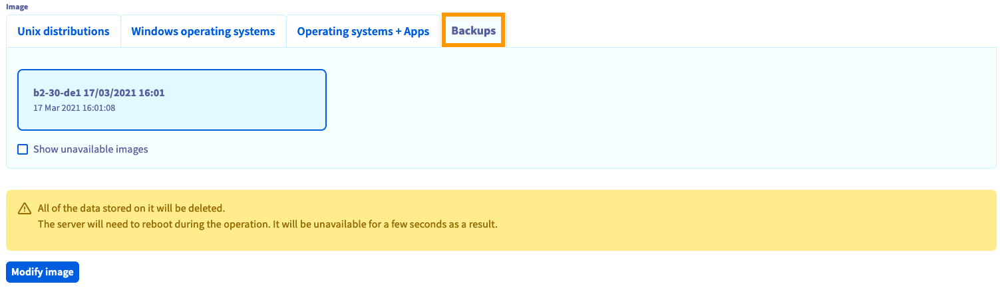

> [!primary]
> Tłumaczenie zostało wygenerowane automatycznie przez system naszego partnera SYSTRAN. W niektórych przypadkach mogą wystąpić nieprecyzyjne sformułowania, na przykład w tłumaczeniu nazw przycisków lub szczegółów technicznych. W przypadku jakichkolwiek wątpliwości zalecamy zapoznanie się z angielską/francuską wersją przewodnika. Jeśli chcesz przyczynić się do ulepszenia tłumaczenia, kliknij przycisk “Zaproponuj zmianę” na tej stronie.
> 

**Ostatnia aktualizacja z dnia 19-03-2021**

## Wprowadzenie

Panel klienta OVHcloud pozwala na tworzenie [kopii zapasowych instancji](../kopia_zapasowa_instancji/) za pomocą kilku kliknięć i zautomatyzowanie tego procesu.
Może zajść konieczność przywrócenia instancji z kopii zapasowej, np. w przypadku błędu podczas konfigurowania Twojej instancji. Kopie zapasowe instancji mogą być używane z dwóch powodów:

- Utwórz instancję na podstawie kopii zapasowej, aby duplikować oryginalną instancję. Na przykład, jeśli skonfigurujesz infrastrukturę równoważenia obciążenia (load balancing).
- Przywracanie instancji z kopii zapasowej. Na przykład, jeśli ostatnie zmiany uszkodziły krytyczne konfiguracje dla instancji.

**Dowiedz się, jak używać kopii zapasowych do duplikowania lub przywracania instancji.**

## Wymagania początkowe

- Posiadanie kopii zapasowej instancji Public Cloud. Należy zapoznać się w tym celu z [instrukcją tworzenia kopii zapasowej](../kopia_zapasowa_instancji/).
- Dostęp do [Panelu klienta OVHcloud]( https://www.ovh.com/auth/?action=gotomanager&from=https://www.ovh.pl/&ovhSubsidiary=pl).

## W praktyce

### Tworzenie instancji na podstawie kopii zapasowej

Zaloguj się do swojego [panelu klient  OVHcloud]( https://www.ovh.com/auth/?action=gotomanager&from=https://www.ovh.pl/&ovhSubsidiary=pl){.external} i kliknij opcję`Public Cloud`{.action}. Następnie kliknij `Instance backup`{.action} w menu po lewej stronie.

{.thumbnail}

Kliknij `...`{.action} z prawej strony wybranej kopii zapasowej i wybierz opcję `Create an instance`{.action} (Utwórz instancję).

Wyświetli się skrócona wersja strony tworzenia instancji, na której możesz zmienić niektóre opcje.

{.thumbnail}

Niektóre elementy są wstępnie określone:

- **Lokalizacja**: twoja instancja zostanie utworzona w tym samym centrum danych co Twoja kopia zapasowa.
- **Obraz**: będzie odpowiadać kopii zapasowej.
- **Model**: dostępne są tylko te, które mogą przyjąć Twój obraz, w zależności od limitu.

{.thumbnail}

Zdefiniuj nazwę nowej instancji, klucz SSH, vRack i okres rozliczeniowy, następnie kliknij przycisk `Utwórz instancję`{.action}.

Aby uzyskać więcej informacji na temat tworzenia instancji, zapoznaj się z [tym przewodnikiem](../tworzenie_instancji_w_panelu_klienta_ovh/).

> [!primary]
>
> Aby utworzyć instancję w innym centrum danych niż lokalizacja kopii zapasowej, konieczne będzie jej przeniesienie do odpowiedniej strefy. Aby to zrobić, należy postępować zgodnie z [instrukcją przenoszenia instancji do innego centrum danych](../przenoszenie_kopii_zapasowych_pomiedzy_centrami_danych/).
>

### Przywracanie instancji z kopii zapasowej

Zaloguj się do swojego [panelu klient  OVHcloud]( https://www.ovh.com/auth/?action=gotomanager&from=https://www.ovh.pl/&ovhSubsidiary=pl){.external} i kliknij opcję`Public Cloud`{.action}. Następnie w menu po lewej stronie kliknij `Instancje`{.action}.

{.thumbnail}

Kliknij przycisk `...`{.action} po prawej stronie przywróconej instancji i kliknij `Edytuj`{.action}.

Wyświetli się wówczas strona edycji instancji. Można tu zmienić:

- nazwę instancji,
- obraz instancji,
- model instancji.
- Sposób rozliczenia dla instancji (tylko od `Godzinowe` do `Miesięczne`).

Wprowadź niezbędne zmiany, a następnie wybierz zakładkę `Backup`{.action} w sekcji **Obraz**.

{.thumbnail}

Wybierz kopię zapasową z listy dostępnych kopii zapasowych. Kliknij `Zmień obraz`{.action}, jeśli chcesz zastąpić aktualny obraz kopią zapasową.

Instancja będzie miała status `Reinstalacja` do czasu zakończenia procesu. Może zajść konieczność aktualizacji strony w przeglądarce, aby zobaczyć obecny stan.

> [!warning]
>
> W żółtej ramce pojawi się informacja, że nie będzie możliwe przywrócenie żadnych danych dodanych po utworzeniu tej kopii zapasowej.
>

## Sprawdź również

[Tworzenie i logowanie do pierwszej instancji Public Cloud](../rozpoczecie_pracy_z_instancja_public_cloud/)

[Tworzenie kopii zapasowej instancji](../kopia_zapasowa_instancji/)

Dołącz do społeczności naszych użytkowników na stronie <https://community.ovh.com/en/>
