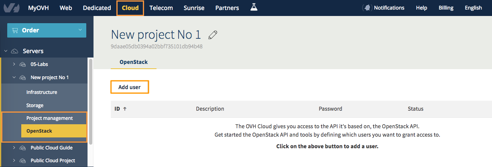
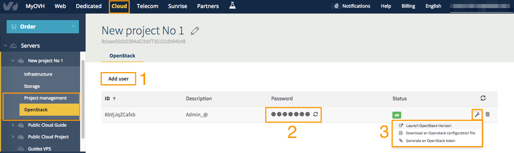
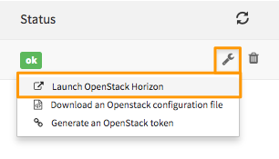
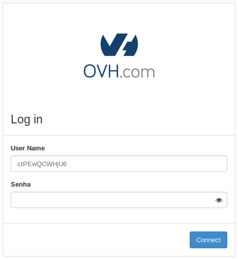
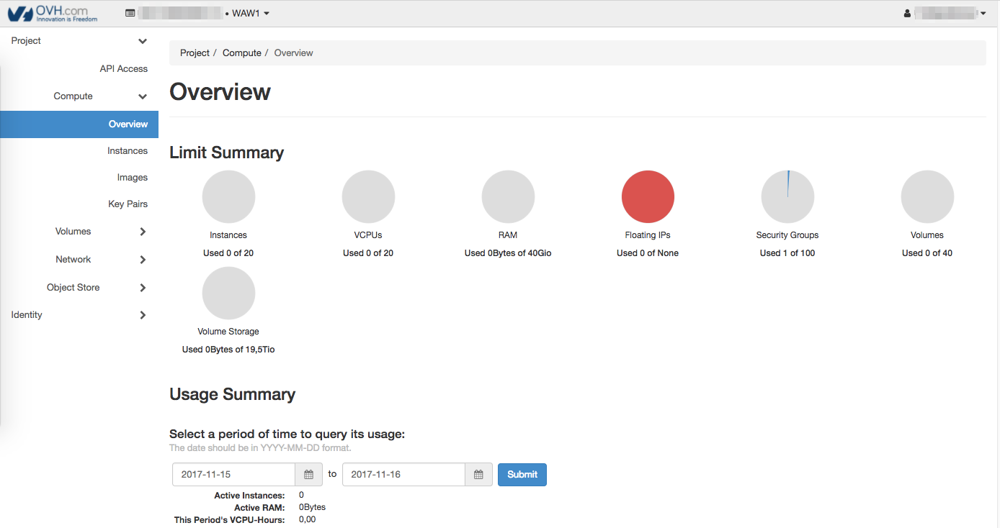

**Last updated 25th June 2018**

## Objective

Horizon is the graphical management interface for OpenStack. Certain features can only be accessed using this interface.

**This guide will show you how to access the Horizon interface.**

## Requirements

- a Public Cloud project activated
- access to the [OVH Control Panel](https://ca.ovh.com/auth/?action=gotomanager){.external}

## Instructions

### Create an OpenStack user account

First of all, to access the Horizon interface, you need to create an OpenStack user account. To do this, log in to your Control Panel. Go to the `Cloud`{.action} section, then `Servers`{.action}, and select the project concerned. Next, click on the `OpenStack`{.action} tab in the left-hand column:

{.thumbnail}

Click `Add user`{.action}, and choose a user description. The username and password are then generated automatically. Once the operation is complete, a message will open confirming that the account has been created.

The password will be visible in the Control Panel until you refresh the page. You can note down this password, and use it when you access the interface again. You can also generate a new password by clicking on the refresh icon, located next to your current password:

{.thumbnail}

### Log in to OpenStack Horizon

To open the menu, click on the three-dot icon at the end of the line (`...`{.action}). Next, click the `Open OpenStack Horizon`{.action} link. The [Horizon](https://horizon.cloud.ovh.net/auth/login/){.external} login page will then appear. To log in, enter your `User Name` and your password.

{.thumbnail}

{.thumbnail}

Once you have logged in, the OpenStack Horizon interface will appear:

{.thumbnail}

## Go further

Join our community of users on <https://community.ovh.com/en/>.