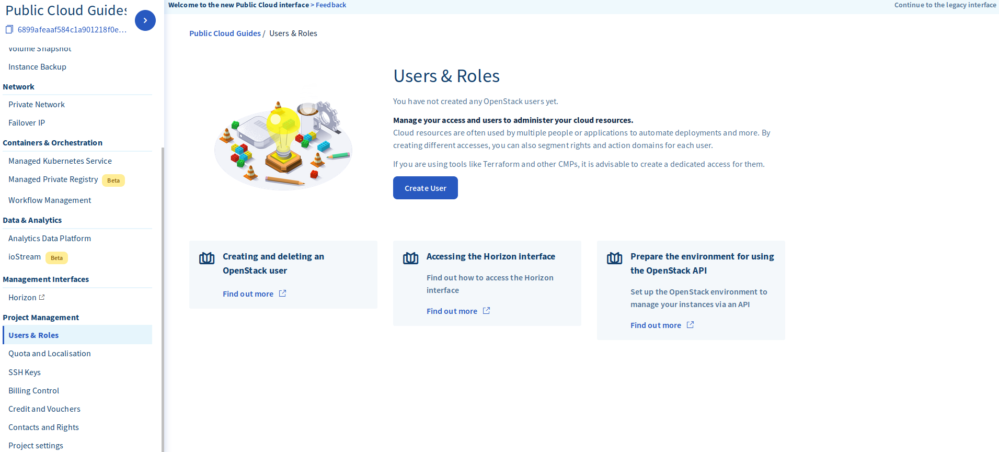
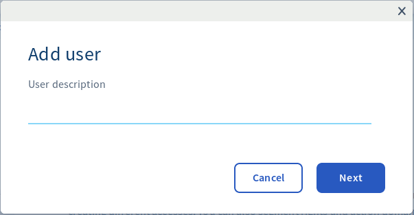
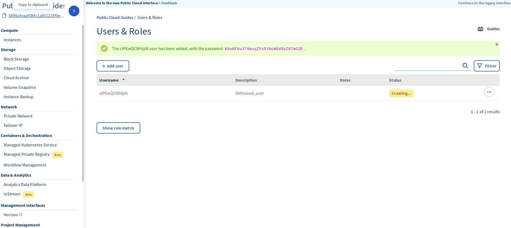

**Última actualización: 14 de noviembre de 2019**

## Objetivo

Horizon es la interfaz gráfica de gestión de OpenStack. Algunas funcionalidades solo están disponibles desde esta interfaz.

**Esta guía explica cómo conectarse a la interfaz de Horizon.**

## Requisitos

- Tener un proyecto Public Cloud activo
- Tener acceso al [área de cliente de OVHcloud](https://ovh.com/auth/?action=gotomanager){.external}

## Procedimiento

### Crear una cuenta de usuario de OpenStack

Para conectarse a Horizon, primero debe crear una cuenta de usuario de OpenStack. Para ello, acceda a la sección `Public Cloud`{.action} en la esquina superior izquierda del área de cliente. En la pantalla siguiente, haga clic en la `flecha`{.action} junto al nombre del proyecto en la esquina superior izquierda de la pantalla.

{.thumbnail}

En la parte «Gestión de proyectos» del menú de la izquierda, seleccione `Usuarios y Roles de usuario`{.action}.

{.thumbnail}

Haga clic en `Crear usuario`{.action} para generar la siguiente ventana emergente:

{.thumbnail}

La descripción del usuario no es el nombre de usuario. Solo es un término descriptivo para ayudarle a recordar el tipo de usuario. La siguiente pantalla le va a permitir conceder permisos de usuario. Por cada casilla de permisos que marque, el usuario obtendrá los privilegios correspondientes como se muestra en la tabla siguiente:

{.thumbnail}

Haga clic en `Confirmar`{.action} cuando haya terminado y aparecerá la siguiente pantalla:

{.thumbnail}

Asegúrese de guardar su contraseña ahora ya que será el único momento en el que esté visible. No obstante, si la pierde, siempre puede crear una nueva haciendo clic en los tres puntos (...) del siguiente menú y seleccionando `Generar una contraseña:`{.action}

{.thumbnail}

Una vez haya creado su usuario, puede utilizar estos datos de acceso para iniciar sesión en la interfaz de Horizon utilizando el `Botón Horizon`{.action} del menú de la izquierda.

### Conectarse a OpenStack Horizon

Para abrir el menú, haga clic sobre el icono con forma de tres puntos al final de la línea (`...`{.action}). A continuación, haga clic en el link `Abrir OpenStack Horizon`{.action}. Aparecerá la página de inicio de sesión de [Horizon](https://horizon.cloud.ovh.net/auth/login/){.external}. Para conectarse, introduzca su `nombre de usuario` y su contraseña.

{.thumbnail}

{.thumbnail}

Una vez conectado, aparecerá la interfaz de OpenStack Horizon.

{.thumbnail}

## Más información

Interactúe con nuestra comunidad de usuarios en <https://community.ovh.com/en/>.
