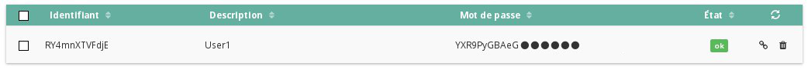
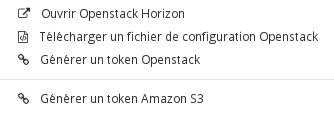

## 
Šiame puslapyje paaiškinama, kaip sukurti prieigą prie Horizon sąsajos. Horizon - tai OpenStack oficialiai siūloma valdymo sąsaja, beveik visos OpenStack funkcijos bus pasiekiamos tik per ją.

## 

- Prisijunkite prie [kliento paskyros](https://www.ovh.com/manager/cloud/), tuomet eikite į meniu Projekto valdymas ir naudojimas

{.thumbnail}

- Spragtelėkite Openstack

{.thumbnail}

- Spragtelėkite Sukurti naudotoją.

{.thumbnail}

- Įveskite "Naudotojo apibūdinimas".

## Pastaba:
Apibūdinimas padeda lengvai identifikuoti naudotojus iš visų naudotojų sąrašo, tačiau tai nėra prisijungimo vardas.

- Spragtelėkite "Sukurti naudotoją".

{.thumbnail}

- Naudotojas bus sukurtas. Išsaugokite automatiškai sugeneruotą slaptažodį, nes vėliau nebus galima jo gauti.

Naudotojų sąraše taip pat bus matoma:

{.thumbnail}
Matysite vardų, apibūdinimų ir trijų mygtukų eilučių sąrašą. Mygtukai leis:

- Generuoti naują slaptažodį

{.thumbnail}

## Dėmesio:
Atlikus šiuos veiksmus, jums nebus parodytas galiojantis slaptažodis, bet bus sukurtas naujas.

- Naudotojo trynimas

{.thumbnail}

## 

- Spragtelėkite rakto piktogramą

{.thumbnail}

- Spragtelėkite Open Openstack Horizon.

{.thumbnail}

- Atsidarys [šis langas](https://horizon.cloud.ovh.net/project/).
- Reikės įvesti naudotojo vardą ir slaptažodį, kuris buvo sugeneruotas anksčiau.

## 
[Grįžti į Cloud gidų sąrašą]({legacy}1785)

