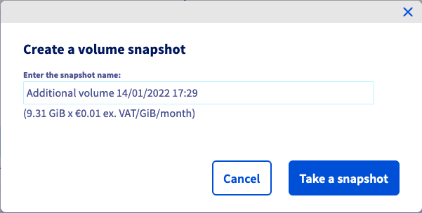

**Dernière mise à jour le 09/01/2023**

## Objectif

Créer un snapshot d’un volume additionnel correspond généralement à deux objectif :

- effectuer des sauvegardes en quelques clics et les conserver le temps nécessaire;
- utiliser le snapshot comme modèle pour des volumes identiques.

**Ce guide vous explique comment créer un snapshot d'un volume depuis votre espace client OVHcloud.**

## Prérequis

- Être connecté à votre [espace client OVHcloud](https://www.ovh.com/auth/?action=gotomanager&from=https://www.ovh.com/fr/&ovhSubsidiary=fr)
- Un volume [Block storage](../creer-et-configurer-un-disque-supplementaire-sur-une-instance/) créé dans votre projet [Public Cloud](https://www.ovhcloud.com/fr/public-cloud/)

## En pratique

Connectez-vous à votre [espace client OVHcloud](https://www.ovh.com/auth/?action=gotomanager&from=https://www.ovh.com/fr/&ovhSubsidiary=fr), rendez-vous dans la section `Public Cloud`{.action} et sélectionnez le projet Public Cloud concerné.
 Ouvrez ensuite le menu `Block Storage`{.action} dans la barre de navigation à gauche sous **Storage**.

{.thumbnail}

A droite du volume concerné, cliquez sur `...`{.action} puis sur `Créer un snapshot`{.action} (il n'est pas nécessaire de détacher d'abord le volume de son instance.)

{.thumbnail}

Dans la fenêtre qui apparaît, vous pouvez donner un nom différent au snapshot. Prenez connaissance des informations tarifaires, puis cliquez sur `Créer un snapshot`{.action}.

Le temps de création du snapshot dépend de la quantité de données présentes sur le volume, de l'utilisation des ressources de l'instance au moment du snapshot et d'autres facteurs spécifiques à l'hôte.

Nous vous recommandons donc d'effectuer vos snapshots en dehors de vos heures de production. 

D'autres bonnes pratiques incluent :

- éviter de créer des snapshots aux heures de pointe (22h00 - 04h00 heure de Paris)
- Installez l'agent qemu-guest si ce n'est pas fait ou essayez de le désactiver si nécessaire.
- essayer de ne pas trop "solliciter" le serveur pendant la phase de création du snapshot (limitation des I/O, consommation de RAM, etc.)

Un snapshot de volume étant un clone de l'ensemble du disque, il aura la taille maximale du volume d'origine, quelle que soit l'allocation réelle d'espace disque.

{.thumbnail}

Ouvrez la section `Volume Snapshot`{.action} dans la barre de navigation à gauche. Une fois le snapshot créé, il sera ajouté à ce tableau.

Cliquez sur le bouton `...`{.action} pour `Supprimer`{.action} un snapshot ou `Créer un volume`{.action} à partir du snapshot correspondant. Retrouvez plus d’informations sur [ce guide](../creer-volume-depuis-sauvegarde/).

## Aller plus loin

[Créer un volume à partir d’une sauvegarde](../creer-volume-depuis-sauvegarde/)

[Créer et configurer un disque supplementaire sur une instance](../creer-et-configurer-un-disque-supplementaire-sur-une-instance/)

[Augmenter la taille d’un disque supplémentaire](../augmenter-la-taille-dun-disque-supplementaire/)

Échangez avec notre communauté d'utilisateurs sur <https://community.ovh.com/>.