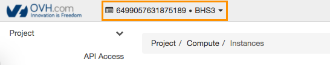

**Stand 16.08.2018**

## Einleitung

Sicherheitsgruppen sind Gruppen von IP-Adressen- und Port-Filterregeln, die für alle Instanzen eines bestimmten Projekts angewendet werden und den Netzwerkzugriff auf die Instanz festlegen. Die Regeln der Gruppe sind für ein bestimmtes Projekt definiert. Die Gruppenmitglieder können die Standardregeln für ihre Gruppe bearbeiten und neue Regelgruppen hinzufügen.

Alle Projekte verfügen über eine Standard-Sicherheitsgruppe, die für jede Instanz verwendet wird, für die keine eigene Sicherheitsgruppe definiert wurde. Die OVH Standardeinstellungen für Sicherheitsgruppen regeln sowohl den eingehenden als auch den ausgehenden Datenverkehr einer Instanz.

**In dieser Anleitung erfahren Sie, wie Sie eine Sicherheitsgruppe über das Horizon-Interface erstellen und löschen.**

## Voraussetzungen

- Sie haben Zugriff auf [Ihr Horizon-Interface](https://docs.ovh.com/de/public-cloud/erstellung_eines_zugangs_zu_horizon/){.external}.

## Beschreibung

Loggen Sie sich zunächst im [Horizon-Interface](https://horizon.cloud.ovh.net/){.external} ein. Wählen Sie dann im Menü ganz oben die Region aus, in der Sie eine Sicherheitsgruppe erstellen möchten:

{.thumbnail}

Die Sicherheitsgruppe wird dann in der ausgewählten Region erstellt. Wenn Sie eine Sicherheitsgruppe in mehreren Regionen verwenden möchten, muss diese für jede Region einzeln definiert werden.

Klicken Sie auf `Network`{.action}und dann auf `Security Groups`{.action}:

{.thumbnail}

Um eine Sicherheitsgruppe zu erstellen, klicken Sie auf `+ Create Security Group`{.action}. Benennen Sie die Gruppe und fügen Sie eine Beschreibung hinzu (optional):

{.thumbnail}

Bestätigen Sie, indem Sie auf `Create Security Group`{.action} klicken.

Um eine Sicherheitsgruppe zu löschen, setzen Sie im zugehörigen Feld ein Häkchen und klicken dann auf `Delete Security Groups`{.action}.

## Weiterführende Informationen

Für den Austausch mit unserer User Community gehen Sie auf <https://community.ovh.com/en/>.