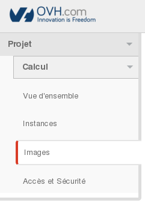
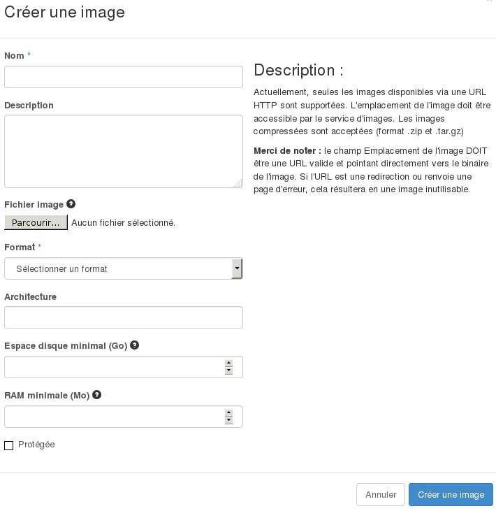
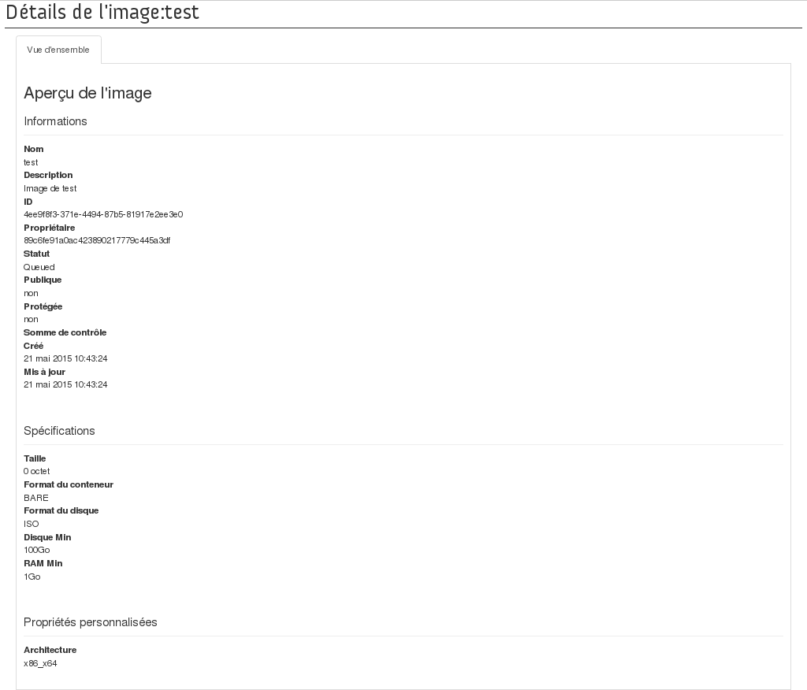

## Introduction
You can add custom images via the OpenStack Horizon interface. For example, you can use it to import images from your old virtual machines to the Public Cloud, provided that they are in a compatible format.

This guide explains the steps for creating, launching and deleting images in the Horizon interface, which is used to manage OVH Cloud services.

### Requirements
- access to the Horizon interface
- access to the Images menu in the OpenStack Horizon interface 

{.thumbnail}

## Manage the images.
- By default, if no images have been created, the list of default public images appears:

{.thumbnail}

- You can then launch an image from a URL, or create a custom image by clicking the Create Image button, which opens the following menu:

{.thumbnail}

- Image name (\*)
- Image description
- Image file (Send from your local desktop)
- Image format (\*):

|—|—|
|AKI|Amazon Kernel Image|
|AMI|Amazon Machine Image|
|ARI|Amazon Ramdisk Image|
|ISO|ISO 9660|
|QCOW2|QEMU Emulator|
|RAW|Raw Disk Image|
|VDI|VirtualBox format|
|VHD|Microsoft format|
|VMDK|VMware format|

- Architecture: x86_64
- Minimum disk space (in GB): if not specified, the default value will be 0.
- Minimum RAM (in MB): if not specified, the default value will be 0.

You can also define whether the image will be public, and whether its deletion will be protected. Once you have confirmed, the image is placed in a queue for creation:

{.thumbnail}

You can click on the image name for details:

{.thumbnail}

In the **Actions** column, you can:

- launch the image selected in order to create an instance - when you do this, the menu appears

{.thumbnail}

- edit the image details (only for images you have created)
- delete the image (only for the images you have created), and you are asked to confirm

{.thumbnail}