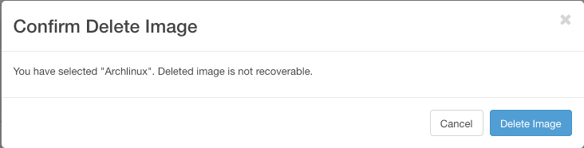

## 
Es posible añadir imágenes personalizadas en OpenStack Horizon.
Esto le permitirá, por ejemplo, importar imágenes de sus antiguas máquinas virtuales al Public Cloud, siempre y cuando tengan un formato compatible. 
Esta guía explica los distintos pasos para crear, lanzar y eliminar imágenes en Horizon, desde la que puede gestionar los servicios cloud de OVHcloud.

## Requisitos

- [Crear un acceso a Horizon](../crear_un_acceso_a_horizon/)
- Diríjase al menú «Imágenes» de OpenStack Horizon.

{.thumbnail}

## 
Si no se ha creado ninguna imagen, aparece por defecto la lista de imágenes públicas.

{.thumbnail}
Puede lanzar una imagen desde una URL o crear una personal haciendo clic en el botón «Crear imagen», en cuyo caso se abrirá el menú de la imagen.

{.thumbnail}

## Cumplimente el formulario. Los campos marcados con asterisco (*) son obligatorios:

- Nombre*
- Descripción
- Fichero de imagen: seleccione el archivo en el equipo local
- Formato*: seleccione uno del desplegable

|AKI|Amazon Kernel Image|
|AMI|Amazon Machine Image|
|ARI|Amazon Ramdisk Image|
|ISO|Imagen de disco óptico|
|QCOW2|Emulador QEMU|
|RAW|
|VDI|
|VHD|
|VMDK|

- Arquitectura: introduzca x86 o x64
- Disco mínimo (GB): si no indica nada, el valor por defecto es 0
- Memoria RAM mínima (MB): si no indica nada, el valor por defecto es 0

También es posible indicar si la eliminación de la imagen estará protegida marcando la casilla «Protegido».

Haga clic en el botón «Crear imagen». La imagen se pondrá en la cola de espera para la creación.

{.thumbnail}
Haciendo clic en el nombre de la imagen, se muestra el detalle.

{.thumbnail}
Utilizando el menú desplegable de la columna «Acciones» es posible:

- lanzar la imagen seleccionada para crear una instancia, en cuyo caso se abrirá el formulario de la siguiente imagen:

{.thumbnail}

- editar los detalles de la imagen (solo para las imágenes que haya creado usted);
- eliminar la imagen (solo para las imágenes que haya creado usted), en cuyo caso deberá confirmar la acción haciendo clic en el botón «Eliminar imagen».

{.thumbnail}
