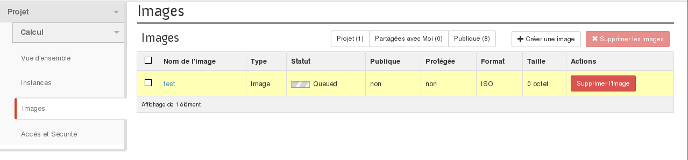
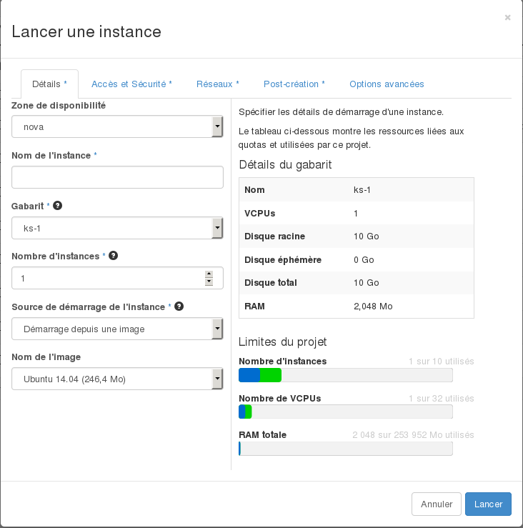

## 
Jūs galite pridėti asmeniniam naudojimui pritaikytus atvaizdus OpenStack Horizon sąsajoje.

Jūs galėsite, pavyzdžiui, importuoti savo ankstesnių virtualių mašinų atvaizdus į Public Cloud, su sąlyga, jei jų formatas bus suderinamas.

Šiame gide jums paaiškinami įvairūs atvaizdų kūrimo, paleidimo ir trynimo etapai Horizon sąsajoje, kurioje jūs valdote savo OVH Cloud paslaugas.

## Reikalavimai

- [Sukurti prieigą prie Horizon]({legacy}1773)
- Pasirinkti meniu Images prisijungus prie OpenStack Horizon sąsajos

{.thumbnail}

## 

- Pagal nutylėjimą, jei neturite sukurtų šablonų, matysite viešai prieinamų šablonų sąrašą:

{.thumbnail}

- Galite paleisti šabloną nurodydami URL arba sukurti savo šabloną (atvaizdą). Tai padarysite spragtelėję mygtuką Create image, kurį rasite šiame meniu:

{.thumbnail}

## Reikės užpildyti laukus, kai kurie iš jų būtini (*), kai kurie neprivalomi:

- Šablono/atvaizdo pavadinimas (*)
- Šablono/atvaizdo apibūdinimas
- Šablono/atvaizdo failas (siuntimas iš jūsų lokalios darbo vietos)
- Šablono/atvaizdo formatas (*):

|AKI|Amazon Kernel Image|
|AMI|Amazon Machine Image|
|ARI|Amazon Ramdisk Image|
|ISO|ISO 9660|
|QCOW2|Emulateur QEMU|
|RAW|
|VDI|
|VHD|
|VMDK|

- Architektūra: x86_64
- Mažiausia disko vieta (GB): jei nenurodyta, pagal nutylėjimą bus 0
- Mažiausias RAM kiekis (MB): jei nenurodyta, pagal nutylėjimą bus 0

Taip pat galima nurodyti, ar šablonas/atvaizdas bus prieinamas viešai ir ar bus galima jį ištrinti. 
Kai patvirtinsite šį žingsnį, šablonas bus patalpintas į kūrimo eilę:

{.thumbnail}
Spragtelėjus šabloną, matoma jo informacija:

{.thumbnail}
Stulpelyje Actions galite:

- Paleisti pasirinktą šabloną, kad sukurtumėte virtualią mašiną, tai atliekama šiame meniu:

{.thumbnail}

- Keisti šablono detales (tik savo sukurtų šablonų)
- Ištrinti šabloną (tik savo sukurtą), šį veiksmą reikės papildomai patvirtinti:

{.thumbnail}

## 
[Grįžti į Cloud gidų puslapį]({legacy}1785)

