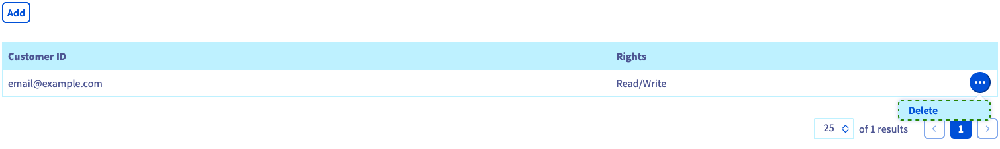

> [!primary]
> Esta traducción ha sido generada de forma automática por nuestro partner SYSTRAN. En algunos casos puede contener términos imprecisos, como en las etiquetas de los botones o los detalles técnicos. En caso de duda, le recomendamos que consulte la versión inglesa o francesa de la guía. Si quiere ayudarnos a mejorar esta traducción, por favor, utilice el botón «Contribuir» de esta página.
>

**Última actualización: 04/04/2022**

## Objetivo

En función del caso de uso, puede tener que dar acceso a su proyecto a otros usuarios, sin darles acceso total a sus servicios. 
Para ello, puede delegar en otras cuentas de cliente de OVHcloud permisos de lectura única o de lectura-escritura en sus proyectos.

**Esta guía explica cómo delegar permisos de acceso a un proyecto de Public Cloud desde el área de cliente.**

## Requisitos

- Tener una instancia de [Public Cloud](https://www.ovhcloud.com/es/public-cloud/) en su cuenta de OVHcloud.
- Tienes acceso a tu [Panel de configuración de OVHcloud](https://ca.ovh.com/auth/?action=gotomanager&from=https://www.ovh.com/world/&ovhSubsidiary=ws).

## Procedimiento 

Conéctese al [Panel de configuración de OVHcloud](https://ca.ovh.com/auth/?action=gotomanager&from=https://www.ovh.com/world/&ovhSubsidiary=ws) y abra su proyecto de `Public Cloud`{.action}. Haga clic en `Contacts and Rights`{.action} en la sección **Project Management**.

Esta página le permite ver los contactos asociados a su proyecto.

{.thumbnail}

Puede hacer clic en los botones `Editar`{.action} para cambiar los contactos actuales. Siga las indicaciones que le indicamos en la guía [Cambiar los contactos de un proyecto](../cambiar_los_contactos_de_un_proyecto/).

### Añadir contactos y permisos

Haga clic en el botón `Añadir`{.action} para añadir un usuario y asignarle permisos. Se abrirá una ventana en la que deberá introducir el identificador del usuario (email@example.com) y seleccionar `Sólo Lectura` o `lectura-escritura` en el menú desplegable.

{.thumbnail}

> [!primary]
>
> Tenga en cuenta que los permisos de `lectura-escritura` permiten realizar cambios en el proyecto que podrían afectar a la futura facturación.
>
 
Haga clic en `Añadir`{.action} para aceptar la delegación de acceso. Recibirá un mensaje de correo electrónico de confirmación, junto con el nuevo usuario, que podrá abrir el proyecto en la sección Public Cloud de su área de cliente.

Una vez recargada la página, se mostrarán en la tabla las cuentas de cliente de OVHcloud añadidas y sus respectivos permisos.

{.thumbnail}

Para desbloquear un acceso, haga clic en el botón `...`{.action} y seleccione `Eliminar`{.action}.

## Más información

[Empezar con una instancia de Public Cloud](https://docs.ovh.com/us/es/public-cloud/public-cloud-primeros-pasos/)

[Información sobre el modo de facturación de Public Cloud](https://docs.ovh.com/us/es/public-cloud/informacion-sobre-el-tipo-de-facturacion-cloud/)

[Parámetros de acceso y seguridad en Horizon](https://docs.ovh.com/us/es/public-cloud/access_and_security_in_horizon/)

Interactúe con nuestra comunidad de usuarios en <https://community.ovh.com/en/>.