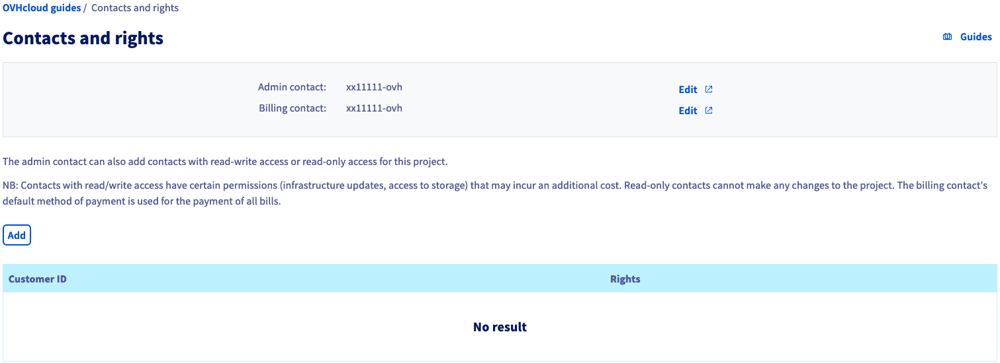
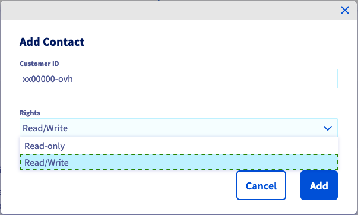

> [!primary]
> Questa traduzione è stata generata automaticamente dal nostro partner SYSTRAN. I contenuti potrebbero presentare imprecisioni, ad esempio la nomenclatura dei pulsanti o alcuni dettagli tecnici. In caso di dubbi consigliamo di fare riferimento alla versione inglese o francese della guida. Per aiutarci a migliorare questa traduzione, utilizza il pulsante "Modifica" di questa pagina.
>

**Ultimo aggiornamento: 04/04/2022**

## Obiettivo

In base alle tue modalità di utilizzo, potresti aver bisogno di concedere l'accesso al tuo progetto ad altri utenti, senza dare loro un accesso totale ai tuoi servizi. 
A questo scopo, è possibile delegare ad altri account cliente OVHcloud diritti in sola lettura o in lettura/scrittura sui propri progetti.

**Questa guida ti mostra come delegare i diritti di accesso a un progetto Public Cloud dallo Spazio Cliente.**

## Prerequisiti

- Disporre di un'istanza [Public Cloud](https://www.ovhcloud.com/it/public-cloud/) sul proprio account OVHcloud
- Avere accesso allo [Spazio Cliente OVHcloud](https://www.ovh.com/auth/?action=gotomanager&from=https://www.ovh.it/&ovhSubsidiary=it)

## Procedura 

Accedi allo [Spazio Cliente OVHcloud](https://www.ovh.com/auth/?action=gotomanager&from=https://www.ovh.it/&ovhSubsidiary=it) e apri il tuo progetto `Public Cloud`{.action}. Clicca su `Contacts and Rights`{.action} nella sezione **Project Management**.

Questa pagina ti permette di visualizzare i contatti associati al tuo progetto.

{.thumbnail}

Clicca sui pulsanti `Modifica`{.action} per modificare i contatti correnti. Per completare l'operazione, segui la procedura descritta nella guida [Modificare i contatti di un progetto](../change_project_contacts/).

### Aggiungi contatti e diritti

Clicca sul pulsante `Aggiungi`{.action} per aggiungere un utente e attribuirgli dei diritti. Nella nuova finestra inserisci l'identificativo dell'utente (nel formato xx00000-ovh) e seleziona `Lettura da sola` o `Lettura/Scrittura` nel menu a tendina.

{.thumbnail}

> [!primary]
>
> Ti ricordiamo che i diritti di `lettura/scrittura` consentono modifiche al progetto che potrebbero avere un impatto sulla fatturazione futura.
>
 
Clicca su `Aggiungi`{.action} per confermare la delega di accesso. Riceverai un'email di conferma insieme al nuovo utente che potrà aprire il progetto nella sezione Public Cloud del tuo Spazio Cliente.

Una volta ricaricata la pagina, gli account dei clienti OVHcloud aggiunti e i relativi diritti sono elencati nella tabella.

{.thumbnail}

Per rimuovere un accesso, clicca sul pulsante `...`{.action} poi seleziona `Elimina`{.action}.

## Per saperne di più

[Iniziare a utilizzare un'istanza Public Cloud](https://docs.ovh.com/it/public-cloud/primi-passi-public-cloud/)

[Informazioni sulle modalità di fatturazione Public Cloud](https://docs.ovh.com/it/public-cloud/analizza_i_tuoi_consumi_e_gestisci_la_tua_fatturazione/)

[Impostazioni di accesso e sicurezza in Horizon](https://docs.ovh.com/it/public-cloud/accesso_e_sicurezza_con_horizon/)

Contatta la nostra Community di utenti all’indirizzo <https://community.ovh.com/en/>.
