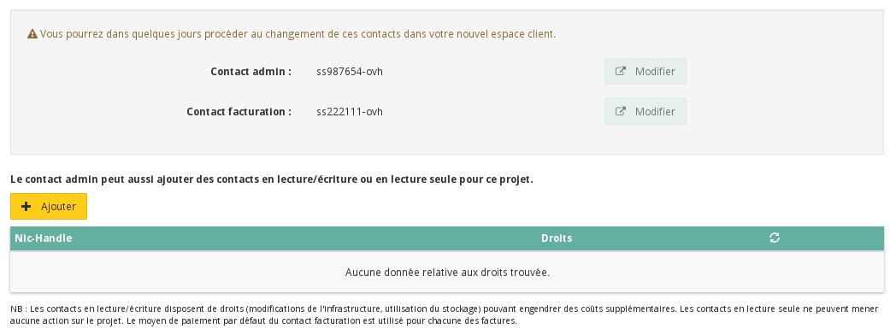
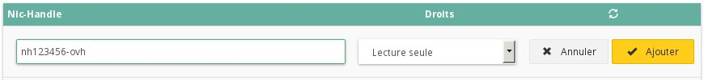
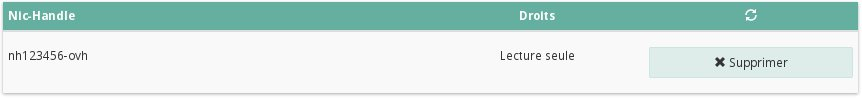
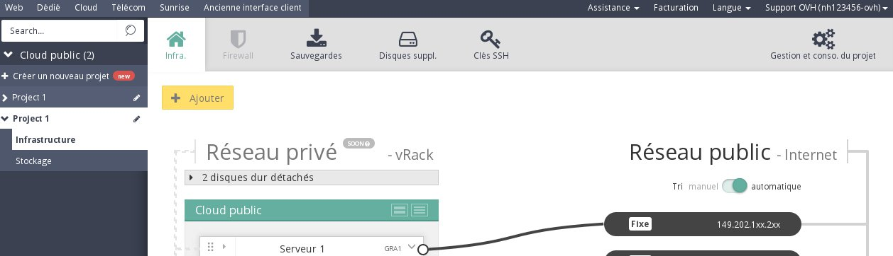

## 
Jums gali prireikti suteikti prieigą prie kai kurių projektų tretiesiems asmenims, tačiau saugumo sumetimais nenorėsite suteikti prieigos prie visų paslaugų.

Todėl sukūrėme galimybę priskirti vieną ar kelis projektus kitoms OVH paskyroms, tik skaitymo arba skaitymo ir rašymo režimu.

Šiame gide paaiškinama, kaip atlikti priskyrimą kitai paskyrai.

## Reikalavimai

- OVH paskyros

## 

- Prisijunkite prie OVH Public Cloud valdymo sąsajos
- Spragtelėkite „Projekto valdymas bei resursų naudojimas“

{.thumbnail}

- Spragtelėkite „Kontaktai ir teisės“

{.thumbnail}
Atsidariusiame meniu galėsite:

- Keisti administratoriaus ir sąskaitų kontaktus
- Priskirti projektus kitiems OVH klientams

{.thumbnail}

## Priskyrimo kūrimas

- Spragtelėkite „Pridėti“
- Įveskite paskyros ID

{.thumbnail}

- Pasirinkite teises

|Tiks skaitymas|Skaitymas / rašymas|

Kai patvirtinsite, matysite paskyrų, kurioms priskirti projektai, sąrašą, taip pat teisių tipą.

{.thumbnail}

## Prieiga prie projekto iš kitos paskyros
Kai projektas bus priskirtas, matysite jį savo valdymo sąsajoje:

{.thumbnail}

## 
[Grįžti į Cloud gidų sąrašą]({legacy}1785)

