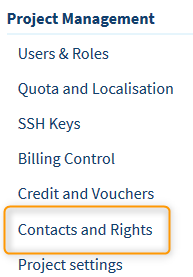
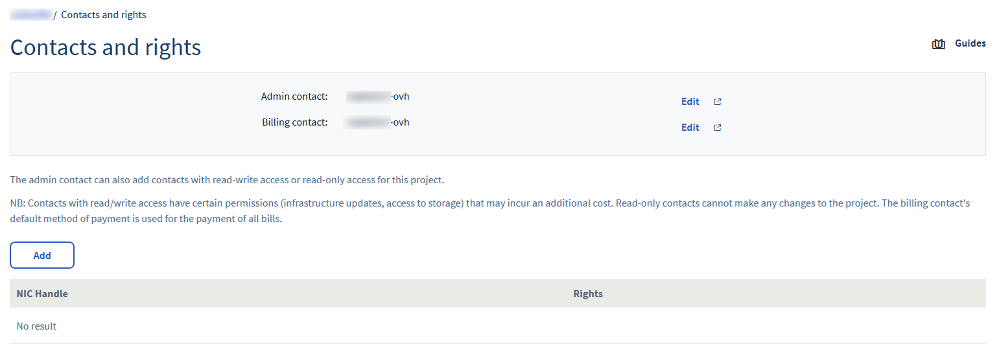
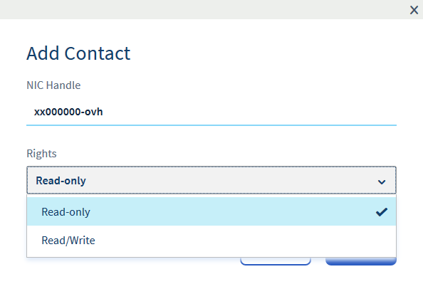
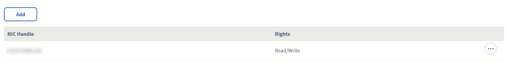

**Ostatnia aktualizacja z dnia 25-11-2019**
 
## Wprowadzenie

Może pojawić się sytuacja, w której będziesz musiał dać innym użytkownikom dostęp do niektórych projektów, bez nadawania dostępu do innych usług ze względów bezpieczeństwa. 

W takiej sytuacji można przypisać jeden lub więcej projektów do innego konta OVH w trybie samego odczytu lub odczytu i zapisu.

Niniejszy przewodnik wyjaśnia, jak to zrobić.

### Wymagania początkowe

- 2 konta OVH
- Projekt Public Cloud

## W praktyce 

### Delegowanie swojego projektu

Zaloguj się do swojego [panelu klienta](https://www.ovhtelecom.fr/manager/) i wybierz opcję`Public Cloud`{.action}. Kliknij pozycję`Contacts and Rights`{.action} (Kontakty i uprawnienia) w rubryce **Project Management** (Zarządzanie projektem).

{.thumbnail}

Z poziomu tego menu możesz:

* skonfigurować dane kontaktowe administratora i księgowości.

* delegować projekty innym kontom w OVHcloud.

{.thumbnail}

### Konfiguracja delegowania

Kliknij przycisk `Add contact`{.action} (Dodaj), a następnie podaj identyfikator (w formacie xx000000-ovh) dodawanego konta OVHcloud oraz określ jego uprawnienia.

{.thumbnail}

Po zatwierdzonym dodaniu konta i odświeżeniu strony możesz sprawdzić, jakie konta zostały dodane i jakie mają uprawnienia.

{.thumbnail}

Osoby z kontami OVHcloud dodanymi w ten sposób mogą zobaczyć projekt w swoich panelach klienta po przejściu do strefy Public Cloud.

## Sprawdź również

[Dostęp i bezpieczeństwo w interfejsie Horizon](https://docs.ovh.com/gb/en/public-cloud/access_and_security_in_horizon/)

[Zapewnienie dostępu do interfejsu Horizon](https://docs.ovh.com/pl/public-cloud/tworzenie_dostepu_do_interfejsu_horizon/)

[Pierwsze kroki z instancją Public Cloud](https://docs.ovh.com/pl/public-cloud/rozpoczecie_pracy_z_instancja_public_cloud/)

Dołącz do społeczności naszych użytkowników na stronie <https://community.ovh.com/en>